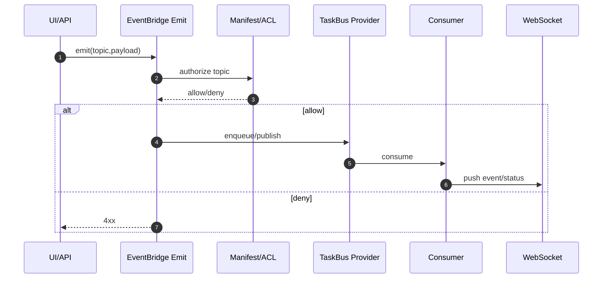

# Task 机制说明（插件侧）

## 1. 核心模型

1. `topic`：事件语义（发生了什么）
2. `subscriber`：消费逻辑（谁处理）
3. `taskbus_provider`：执行承载（`redis` / `host`）

## 2. 生命周期（插件实现）

## 3. 执行边界

1. WebSocket 只负责实时分发，不承担任务执行
2. 任务执行不由页面轮询触发
3. proxy 场景租户由底座按凭证解析，插件侧不注入 tenant

## 4. 模式映射

1. standalone：`taskbus_provider=redis`
2. standalone + proxy：`taskbus_provider=host`
3. Host：由 framework 统一封装，业务层无感知
