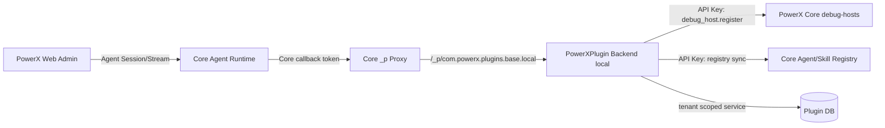
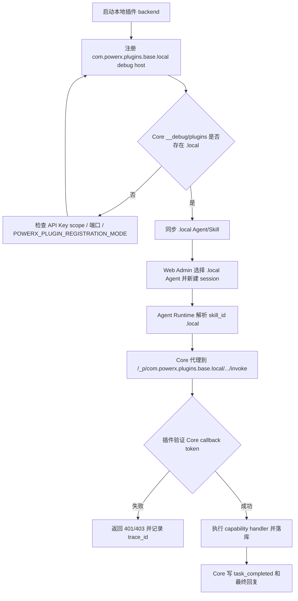
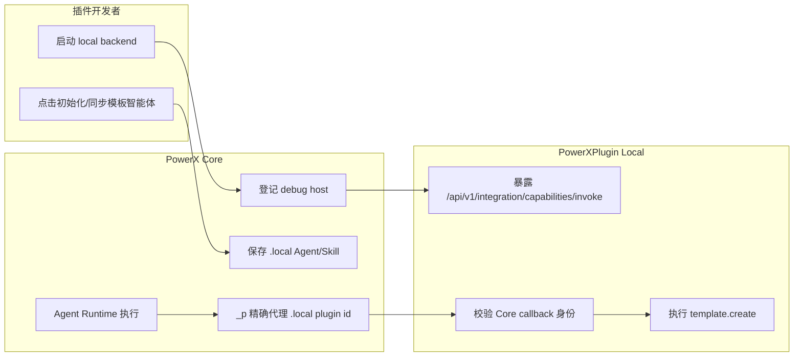

# PowerX Plugin Agent Skill 开发规范

本文是插件开发者接入 PowerX Agent Runtime 的统一入口文档。其他插件如果要提供智能体能力，必须按本文定义 `Agent + Skill + Capability`，不得自建一套独立 Agent 对话系统，也不得绕过 PowerX Agent Runtime 直接用本地业务接口模拟智能任务。

## 1. 核心结论

PowerXPlugin 只提供插件侧声明、Framework、同步代理和调试入口；PowerX Core 是运行时权威。

标准执行链路：

```text
用户消息
  -> PowerX Agent Session / Runtime
  -> 当前 Agent 已绑定 Skill
  -> Skill executor.prepare_capability
  -> ready_to_execute / missing_fields / capability_request
  -> PowerX Capability Invocation
  -> 插件 capability handler
  -> agent_run.* 状态事件
  -> 最终回复与任务状态展示
```

禁止路径：

- 插件前端直接调用 PowerX Admin/Agent API。
- 插件 Chat 直接调用插件业务 CRUD API 来假装智能体执行。
- 插件暴露独立 `/api/v1/plugin/skills/invoke` 作为业务执行入口。
- PowerX Core 写死某个插件的业务字段、话术或行业流程。
- 没有真实 `agent_run.task_completed` 和 result/links 时展示“已创建/已完成”。

## 2. 职责边界

| 层 | 负责什么 | 不负责什么 |
| --- | --- | --- |
| PowerX Core | Agent Runtime、Planner、Response Planner、上下文、Skill 状态、Trace、权限、租户、Capability Invocation | 插件业务字段规则、插件专属回复话术、插件本地数据模型 |
| PowerXPlugin Framework | Skill 包加载、插件侧 Registry、PowerX API 代理、Agent Stream Client、调试 UI、Capability Handler 封装 | 取代 PowerX Runtime、自行决定最终回答、绕过 Core 执行业务 |
| 插件业务代码 | `SKILL.md`、Agent persona/prompt_seed、capability handler、业务数据落库、prepare 逻辑 | 直接读写 PowerX Core DB、伪造 Agent 状态、把租户/用户身份放进 payload |

## 3. 插件必须提供什么

一个可被 Agent Runtime 使用的插件至少需要：

```text
skills/<skill_id>/
  SKILL.md
  schema.input.json
  schema.output.json
```

推荐结构：

```text
skills/<skill_id>/
  SKILL.md
  schema.input.json
  schema.output.json
  executor.yaml
  scripts/
  references/
  assets/
```

插件还需要：

- 插件 manifest 中声明 capabilities。
- 后端注册 capability handlers。
- 后端暴露 Skill 发现接口。
- 后端提供 PowerX Agent/Skill 同步代理。
- 前端调试页通过插件后端代理调用 PowerX Agent Session/Stream。

Skeleton 示例：

- `skeleton/skills/template/SKILL.md`
- `skeleton/backend/go-gin/internal/skills/package_loader.go`
- `skeleton/backend/go-gin/internal/transport/http/plugin/agent_registry/routes.go`
- `skeleton/web-admin/nuxt/app/pages/_p/com.powerx.plugins.base/admin/agent-skill-bridge/index.vue`

## 4. Skill 包规范

插件 Skill 的唯一长期源格式是 `SKILL.md` 目录包。Go struct、HTTP DTO、数据库记录都只能是解析后的运行态或治理态快照，不得作为唯一源定义。

`SKILL.md` 必须包含 YAML frontmatter 和 Markdown body：

```md
---
id: powerxplugin.template.basic
name: template
title: 模板对象基础能力
provider: com.powerx.plugins.base
version: 1.0.0
description: 管理基础模板对象。
intent_examples:
  - 帮我创建一个标题为测试模板的模板，描述是用于验证插件 CRUD，内容是这是一条测试内容
capability: powerxplugin.template
visibility: tenant
status: active
executor:
  type: capability
  capability: powerxplugin.template
  prepare_capability: com.powerx.plugins.base.template.prepare
  action_map:
    create: com.powerx.plugins.base.template.create
input_schema: ./schema.input.json
output_schema: ./schema.output.json
---

# 模板对象基础能力

## When To Use

当用户希望创建、查询、更新、删除或列出模板对象时使用。
```

### 4.1 必填字段

| 字段 | 说明 |
| --- | --- |
| `id` | Skill 全局稳定 ID，同一插件内 `id + version` 必须唯一 |
| `name` | Skill 短名 |
| `title` | 给用户和管理后台看的名称 |
| `provider` | 插件 ID，例如 `com.powerx.plugins.base` |
| `version` | Skill 版本 |
| `description` | 能力摘要 |
| `intent_examples` | 用户自然语言示例，用于识别意图 |
| `executor.type` | 必须是 `capability` |
| `executor.prepare_capability` | Skill 自己的准备/缺参/执行阀门 capability |
| `executor.action_map` | action 到业务 capability 的映射 |
| `input_schema` | 输入 schema 文件路径 |
| `output_schema` | 输出 schema 文件路径 |
| Markdown body | Skill 使用说明、输入说明、对话说明 |

### 4.2 执行与状态字段

创建、更新、删除等可执行动作必须声明这些字段：

```yaml
action_required_args:
  create:
    - template.title
    - template.description
    - template.content
action_optional_args:
  list:
    - q
    - page
    - page_size
slot_mapping:
  template.title:
    labels: ["标题", "名称", "模板标题"]
pending_task_policy:
  enabled: true
  merge_window_messages: 6
  merge_window_seconds: 900
  confirm_before_execute: false
state_contract:
  schema_version: "1.0"
  state_keys:
    template.create:
      action: create
      required_args:
        - template.title
        - template.description
        - template.content
      merge_policy:
        mode: skill_defined
        allow_cross_turn: true
        window_messages: 6
        window_seconds: 900
result_presentation:
  create:
    title: "模板已创建"
    primary_link: "template.detail_path"
    visible_fields:
      - template.id
      - template.title
      - template.detail_path
```

规则：

- `action_required_args` 是缺参判断的权威声明。
- `slot_mapping` 用自然语言标签帮助提取字段。
- `pending_task_policy` 决定是否允许跨轮补参和合并窗口。
- `state_contract` 定义 Skill 自己的业务状态键和状态推进约束。
- `result_presentation` 只定义结果怎么展示，不允许伪造业务结果。
- Core 不根据这些字段自行拼业务 payload 后直接执行；真正执行请求必须来自 `prepare_capability` 返回的 `capability_request`。

## 5. Agent Prompt 与 Skill Prompt 分层

Agent 与 Skill 的内容必须分层保存。

| 内容 | 保存位置 | 用途 |
| --- | --- | --- |
| Agent 身份 | `plugin_agents.persona` -> `agents.persona` | 这个 Agent 是谁，服务谁，说话边界是什么 |
| Agent 行为策略 | `plugin_agents.prompt_seed` -> `agents.prompt_seed` | 如何介绍已绑定能力、如何处理缺参、如何选择 Skill |
| Skill 使用说明 | `SKILL.md` body / `prompt_spec` | 某个 Skill 什么时候用、怎么提取 action/input |
| Skill 回复规范 | `SKILL.md response_guidance` | 某个 Skill 的介绍、how-to、缺参追问、结果表达 |
| Core 运行时规则 | PowerX Core 动态构建 | 安全、权限、response_mode、上下文、最终回复约束 |

不要把所有内容塞进一个系统提示词。

### 5.1 Agent persona 示例

```text
你是 PowerXPlugin 模板对象管理助手，服务对象是插件开发者和插件管理员。
你负责围绕模板对象进行自然语言对话、能力解释、参数澄清和任务执行。
回答时应先理解用户当前问题，再基于当前绑定 Skill 的真实 metadata 说明能力或发起执行。
不要编造未绑定能力，不要暴露内部 skill_id、executor path、schema 字段名。
```

### 5.2 Agent prompt_seed 示例

```text
当用户询问你是谁或能做什么时，请以模板对象管理助手身份回答，并只基于当前已绑定 Skill 的真实 metadata 介绍能力。
用户要求执行时，按 Skill response_guidance 和 input_schema 判断缺参并追问，参数足够后调用绑定 Skill。
```

### 5.3 Skill response_guidance 示例

```yaml
response_guidance:
  capability_intro:
    - 说明这是 PowerXPlugin 的基础模板对象能力。
    - 明确模板对象只有标题、描述和内容三个核心字段。
  capability_howto:
    - create 和 update 需要用户提供标题、描述和内容。
  clarify_params:
    - 只追问缺失信息，不要把缺参当成执行失败。
    - 不要输出 template.title、schema 或 JSON 术语。
  skill_execution:
    - 成功时说明业务对象 ID、标题和下一步可做什么。
  error_explain:
    - 把错误转成用户可操作的修正建议。
```

同步路径：

```text
skills/<name>/SKILL.md response_guidance
  -> PluginSkillManifest.response_guidance
  -> plugin_skills.prompt_spec.response_guidance
  -> PowerX skills_registry_records.manifest_json.prompt_spec.response_guidance
  -> PowerX Agent Runtime Final Response Context
```

## 6. prepare_capability 协议

`prepare_capability` 是 Skill 侧业务执行阀门。Core 只负责调用、校验和调度，不写插件业务判断。

prepare 必须能返回三类结果。

### 6.1 缺参

```json
{
  "ready_to_execute": false,
  "status": "collecting",
  "missing_fields": ["template.title", "template.description"],
  "message": "请补充这个模板的标题和描述。",
  "state_patch": {
    "action": "create",
    "collected": {
      "template.content": "这是一条测试内容"
    }
  }
}
```

### 6.2 可执行

```json
{
  "ready_to_execute": true,
  "status": "ready",
  "capability_request": {
    "capability_id": "com.powerx.plugins.base.template.create",
    "payload": {
      "action": "create",
      "name": "测试模板",
      "description": "用于验证插件 CRUD",
      "content": "这是一条测试内容"
    }
  }
}
```

### 6.3 失败

```json
{
  "ready_to_execute": false,
  "status": "failed",
  "message": "模板标题不能为空。",
  "error": {
    "code": "template.invalid_title",
    "message": "模板标题不能为空。"
  }
}
```

严格规则：

- `ready_to_execute=true` 时必须返回 `capability_request`。
- `capability_request.capability_id` 必须属于当前 Skill 的 `action_capabilities` 或 `executor.action_map`。
- 缺少 `tenant_uuid/user_uuid/agent_id/session_id/message_id/skill_id/trace_id` 必须 fail-fast。
- prepare 不允许把用户身份、租户身份从 payload 里推导出来；身份只信 PowerX Invocation Context。

## 7. PowerXPlugin 必须暴露的接口

### 7.1 Capability 契约是唯一接口定义

插件能力注册时必须同时提供机器可读的输入/输出契约。对 Agent Runtime、Workflow、MCP Tool、调试 UI 和其他插件来说，能力接口不是某个 Go handler 的临时结构，也不是 REST path 的参数拼接规则，而是 capability descriptor 中声明的 schema：

```text
contracts/capabilities/<capability_id>.yaml
  -> provides[kind=input].path
  -> provides[kind=output].path
  -> contracts/schema/input/<capability_id>.json
  -> contracts/schema/output/<capability_id>.json
```

调用方规则：

- `capability_id` 是能力入口的稳定 ID。
- `input_schema` 是请求 payload 的唯一字段定义。
- `output_schema` 是返回 data 的唯一字段定义。
- REST `path`、gRPC `method`、workflow `template` 只是 transport adapter，不是 Agent payload 结构。
- Agent Runtime 只能通过统一能力入口调用插件业务能力：`POST /api/v1/integration/capabilities/invoke`。
- `prepare_capability` 和 `executor.action_map` 指向的 action capability，descriptor 中的 `metadata.protocols.rest.path` 与 `metadata.protocols.agent_tool.endpoint` 必须都是 `/api/v1/integration/capabilities/invoke`。
- 页面/用户 REST API 不是 Agent 执行入口，例如 `/api/v1/templates` 只服务插件页面 CRUD，使用用户 JWT；Agent Runtime 调它会得到 `jwt Unauthorized`，这不是鉴权要放开的信号，而是 capability endpoint 配错。
- `plugin.d/exposure.yaml` 可以继续声明页面 REST 暴露；Core Agent/Capability sync 的权威来源是 `plugin.d/capabilities.yaml -> contracts/capabilities/*.yaml`。
- 不允许为了让 Agent 调通而移除页面 REST 的 JWT 中间件，也不允许把 Agent payload 直接拼成页面 REST path/body。
- Agent capability payload 不允许依赖 REST path 参数，例如 `/api/v1/templates/{id}` 的 `{id}` 不能变成 Agent payload 的 `id`。
- 同一个业务主键在 Agent payload 中必须使用同一个字段名；模板能力统一使用 `template_id`。
- handler 返回必须先满足 output schema；可以在 schema 明确允许时增加扩展字段，但不能让调用方依赖未声明字段。
- capability descriptor、schema、handler、测试必须同改。只改其中一处视为契约漂移。

模板能力的统一字段规则：

| 能力 | 输入主键字段 | 输出主结构 |
| --- | --- | --- |
| `template.list` | 无 | `{ "items": [...], "pagination": {...} }` |
| `template.read` | `template_id` | `{ "template": {...} }` |
| `template.create` | `name/description/content` | `{ "id": "...", "status": "...", "template": {...} }` |
| `template.update` | `template_id` | `{ "template": {...} }` |
| `template.delete` | `template_id` | `{ "id": "...", "deleted": true }` |
| `template.validate` | `template_id` | `{ "template_id": 1, "valid": true, "violations": [...] }` |
| `template.batch_clone` | `source_ids` | `{ "created_ids": [...], "failed": [...] }` |
| `template.review` | `template_id` | `{ "template_id": "...", "status": "...", "reviewer": "..." }` |
| `template.publish` | `template_id` | `{ "template_id": "...", "publish_status": "deployed", "published_at": "..." }` |

本地 handler 注册必须覆盖所有声明为 Agent/Workflow 可调用的 capability。声明了 schema 但没有注册 handler，会导致 local 模式落到 fallback/gateway 路径，表现为 404、403 或超时。

验证命令：

```bash
cd /private/var/www/html/ArtisanCloud/X/PowerX/Core/Plugins/PowerXPlugin
go test ./skeleton/backend/go-gin/internal/services/integration
```

该测试必须断言 capability 返回的是 schema shape，而不是服务内部 DTO shape。

## 7.2 PowerXPlugin 必须暴露的接口

Skill 发现接口：

```text
GET /api/v1/plugin/skills
GET /api/v1/plugin/skills/:skill_id/schema
```

这些接口只暴露源定义和 schema，不是业务执行入口。

插件调试 Chat 请求链：

```text
PowerXPlugin Web
  -> Plugin Backend Proxy
  -> PowerX Agent Session / Stream API
  -> PowerX Agent Runtime
  -> PowerX Capability Invocation
  -> Plugin capability handler
```

插件前端不得直接访问 PowerX Admin API，也不得直接访问插件业务 CRUD API 来生成“智能体执行结果”。

## 8. Plugin Registry 与同步

插件侧需要保存开发态 Agent/Skill 记录，PowerX Core 保存运行态治理记录。

### 8.1 注册身份

插件同步 Agent/Skill/Capability 前必须先确定注册身份，身份由 `POWERX_PLUGIN_REGISTRATION_MODE` 显式声明：

| 值 | 适用场景 | 注册出的 ID |
| --- | --- | --- |
| `installed` | 插件已通过 PowerX Core 安装并由 `/_p/<plugin_id>` 代理运行 | `com.powerx.plugins.base`、`powerxplugin.template.basic` |
| `local` | 本地联调进程要以独立 local 插件身份接入，由插件 backend 启动时自动向 Core 登记本地运行时 | `com.powerx.plugins.base.local`、`powerxplugin.template.basic.local` |

严格规则：

- `POWERX_PLUGIN_REGISTRATION_MODE` 只能是 `installed` 或 `local`，未配置或非法值必须 fail-fast。
- 安装包的 `plugin.yaml` 必须设置 `POWERX_PLUGIN_REGISTRATION_MODE=installed`。
- 本地调试如果要使用 `.local`，插件 backend 必须以 `POWERX_PLUGIN_REGISTRATION_MODE=local`、`POWERX_PROXY=1`、`POWERX_PROVIDER_MODE=local` 启动，并自动调用 Core `/api/v1/internal/plugins/debug-hosts` 登记 `com.powerx.plugins.base.local` 的 backend 端口。
- 不允许一边同步 `.local` Agent/Skill，一边调用已安装的非 `.local` 插件代理；这会导致 `TENANT_PLUGIN_DISABLED`。

### 8.2 本地 `.local` 调试链路与权限

本地调试不是把插件能力放开给任意用户调用，也不是要求所有 runtime invoke 都必须 root。它把三类权限明确拆开：

| 链路 | 调用方向 | 认证身份 | 权限要求 | 典型接口 |
| --- | --- | --- | --- | --- |
| Debug Host 注册 | Plugin -> Core | 插件 Gateway API Key | `_scope.plugin.debug_host.register` | `POST /api/v1/internal/plugins/debug-hosts` |
| Agent/Skill 同步 | Plugin -> Core | 插件 Gateway API Key | `_scope.plugin.agent_registry.sync`、`_scope.plugin.skill_registry.sync` | `/api/v1/admin/agents*`、`/api/v1/admin/skills/plugin-registry*` |
| 能力执行回调 | Core -> Plugin | Core callback / plugin runtime token | issuer 必须是 PowerX Core，audience 必须是当前 plugin id | `POST /_p/<plugin_id>/api/v1/integration/capabilities/invoke` |
| 插件管理调试 | User -> Plugin/Core | Root 用户 | `RequireRoot()` / AdminOnly | capability 注册、审核、debug 管理接口 |

本地调试推荐环境变量：

```env
POWERX_PLUGIN_REGISTRATION_MODE=local
POWERX_PROXY=1
POWERX_PROVIDER_MODE=local
PX_GATEWAY_AUTH_SCHEME=apikey
PX_GATEWAY_API_KEY=<tenant integration api key>
PX_GATEWAY_BASE_URL=http://127.0.0.1:8077/api/v1
```

含义：

- `POWERX_PLUGIN_REGISTRATION_MODE=local`：Agent/Skill/Capability 同步为 `.local` 身份。
- `POWERX_PROXY=1`：插件通过 PowerX Core 网关访问底座能力；这不等价于 delegated IAM。
- `POWERX_PROVIDER_MODE=local`：插件本地进程自己解析本地请求上下文，不由 Core 托管注入 delegated 身份。
- `PX_GATEWAY_API_KEY`：只用于 Plugin -> Core 的注册/同步，不用于 Core -> Plugin 的 runtime 回调。

Core debug host 注册必须使用新路径：

```bash
curl -sS -X POST "$PX_GATEWAY_BASE_URL/internal/plugins/debug-hosts" \
  -H "Authorization: ApiKey $PX_GATEWAY_API_KEY" \
  -H "Content-Type: application/json" \
  -d '{
    "pluginId": "com.powerx.plugins.base.local",
    "environment": "local",
    "httpPort": 8078,
    "ttlSeconds": 3600
  }'
```

注册成功后验证：

```bash
curl -sS http://127.0.0.1:8077/__debug/plugins \
  | jq '.apis["com.powerx.plugins.base.local"]'
```

预期结果：

```json
{
  "basePath": "/api/v1",
  "healthPath": "/healthz",
  "target": "http://127.0.0.1:8078"
}
```

模块关系：



主流程：



跨角色泳道：



执行验收 SQL：

```sql
select id, uuid, key, name, owner_plugin_id, status
from public.agents
where key like 'powerxplugin.template.agent%'
order by id;

select b.agent_id, a.key, a.owner_plugin_id, b.skill_id, b.enabled
from public.agent_skill_bindings b
join public.agents a on a.id = b.agent_id
where a.key like 'powerxplugin.template.agent%'
order by b.agent_id, b.priority;
```

正确 local trace 必须同时满足：

```text
agent.owner_plugin_id = com.powerx.plugins.base.local
skill_id = powerxplugin.template.basic.local
proxy path = /_p/com.powerx.plugins.base.local/api/v1/integration/capabilities/invoke
```

错误 installed trace 通常表现为：

```text
agent.owner_plugin_id = com.powerx.plugins.base
skill_id = powerxplugin.template.basic
proxy path = /_p/com.powerx.plugins.base/api/v1/integration/capabilities/invoke
```

如果看到 `root privileges required`，先判断路径：

- 路径是 `com.powerx.plugins.base`：当前 session/agent 仍然是 installed，不是 local。
- 路径是 `com.powerx.plugins.base.local`：检查插件侧 runtime invoke 是否错误挂了 `RequireRoot()`；runtime invoke 应使用 Core callback 身份校验，不使用 root 用户权限。

本地 Core -> 插件调用链必须是：

```text
Agent/Skill action
  -> capability_id com.powerx.plugins.base.local.template.create
  -> Core capability registry endpoint /_p/com.powerx.plugins.base.local/...
  -> Core _p router 精确匹配 com.powerx.plugins.base.local
  -> 本地 PowerXPlugin backend 端口
  -> 插件验证 Core 生成的 plugin runtime token
  -> capability handler 执行业务
```

本地模式只复用插件到 Core 的 Gateway/API key 做“启动登记”。业务 capability 执行时不能把插件 API key 当作 Core -> 插件鉴权；Core 代理必须生成 plugin runtime token，插件侧必须按 runtime token 校验。

验证本地运行时是否已登记：

```bash
curl -s http://127.0.0.1:8077/__debug/plugins | jq '.apis | keys'
```

结果必须包含 `com.powerx.plugins.base.local`，且不能把该 ID 折叠成 `com.powerx.plugins.base`。如果没有出现，检查：

- 插件 backend 端口，不是 Nuxt 端口。
- `POWERX_PLUGIN_REGISTRATION_MODE=local`。
- `POWERX_PROXY=1`。
- `POWERX_PROVIDER_MODE=local`。
- `PX_GATEWAY_BASE_URL` 指向 PowerX Core `/api/v1`。
- `PX_GATEWAY_API_KEY` 有调用 `/api/v1/internal/plugins/debug-hosts` 的权限和租户上下文。

Skill Plugin Definition 至少保存：

- `plugin_skill_id`
- `powerx_skill_id`
- `source_format=skill_package`
- `package_path`
- `package_checksum`
- `raw_markdown`
- `frontmatter_json`
- `body_markdown`
- `manifest`
- `prompt_spec`
- `input_schema`
- `output_schema`
- `executor`
- `capability`
- `sync_status`
- `sync_error`
- `last_sync_at`

Agent Plugin Definition 至少保存：

- `plugin_agent_id`
- `powerx_agent_uuid`
- `tenant_uuid`
- `agent_key`
- `name`
- `description`
- `persona`
- `prompt_seed`
- `model_profile_ref`
- `plugin_skill_ids`
- `powerx_skill_ids`
- `sync_status`
- `sync_error`
- `last_sync_at`

同步流程：

```text
读取 skills/<skill_id>/SKILL.md
  -> 解析并校验 Skill Package
  -> 读取插件 capability catalog / plugin manifest
  -> upsert 插件侧 Plugin Skill Definition
  -> 调 PowerX Skill Registry API
  -> PowerX 保存 source=plugin 的治理态 Skill
  -> 同步 capability registry 派生记录
  -> upsert 插件侧 Plugin Agent Definition
  -> 调 PowerX Agent Admin API
  -> PowerX 保存 Agent + AgentSkillBinding
  -> 回写 powerx_skill_id / powerx_agent_uuid / sync_status
```

PowerX 侧会保存两类数据：

| 类型 | 示例表 | 来源 | 什么时候刷新 |
| --- | --- | --- | --- |
| 治理态记录 | `skills_registry_records`, `agents`, `agent_skill_bindings` | `SKILL.md`、Agent Definition | 初始化/同步 Agent/Skill |
| 派生同步产物 | `capability_registry_records`, `capability_registry_adapter_endpoints` | 插件 capability catalog / manifest | 重新同步 capability catalog |

`capability_registry_adapter_endpoints` 是运行时真正选 adapter 的来源，但它是 registration version 的子表。排查当前生效 endpoint 时必须先定位 `capability_registry_registrations` 的最新 `version`，再按 `registration_id` 查看 adapter；不要直接按 `capability_id` 全表查询后把历史版本误判为当前版本。REST capability 必须带有 HTTP 方法，例如：

```json
{
  "source": "plugin_catalog",
  "method": "POST"
}
```

如果插件 capability protocol、adapter endpoint、HTTP method、channel、proxy path 或同步 worker 映射逻辑变更，必须重新同步 capability catalog。否则数据库里仍是旧 adapter 派生产物，运行时可能继续使用旧的 `labels`、旧 endpoint 或旧 transport。

fail-fast 规则：

- 未同步成功的 Skill 不能绑定到可运行 Agent。
- 未同步、失败、漂移或禁用的 Agent 不能出现在 Chat 可运行下拉框。
- 同步失败必须保存 `sync_error.code`、`sync_error.message`、`trace_id`。
- 不允许降级为本地 Plugin Agent Runtime。

### 8.2 migrate 与重新同步的区别

| 操作 | 什么时候需要 | 影响 |
| --- | --- | --- |
| `make migrate` | 插件本地数据库 schema 变化，例如新增/修改 Plugin Registry 表字段 | 修改插件数据库结构 |
| 重新同步 Agent/Skill | `SKILL.md`、Agent `persona/prompt_seed`、Skill response/state/result 合同变化 | 刷新 PowerX 的 Agent/Skill 治理态记录 |
| 重新同步 capability catalog | capability protocol、HTTP method、endpoint、channel、adapter 映射逻辑变化 | 刷新 PowerX 的 capability/adapter 派生记录 |

只改同步 worker 的映射逻辑时通常不需要 migrate，但必须重新同步 capability catalog，因为旧 DB 记录不会自动重算。

## 9. Agent Run State 展示规则

插件调试页和 PowerX 对话页都必须消费 PowerX `agent_run.*` 协议。

必须支持的事件：

```text
agent_run.started
agent_run.response_plan
agent_run.intent_detected
agent_run.plan_created
agent_run.task_started
agent_run.awaiting_params
agent_run.task_status
agent_run.task_completed
agent_run.task_failed
agent_run.final
agent_run.ended
agent_run.error
```

展示规则：

- `agent_run.final` / `agent_run.ended` 只代表本轮回复结束，不代表业务任务完成。
- 只有 `agent_run.task_completed` 且包含真实 `result` 或 `links`，才能显示业务任务完成。
- `response_planner`、`context_builder`、`final_response` 是内部运行阶段，不应该算作业务任务完成。
- 创建类任务失败时，必须展示失败原因和 `request_id/trace_id` 复制入口。
- 缺参时展示自然语言缺参提示，不要求用户输入 JSON。

## 10. 初始化与测试流程

修改 Agent/Skill 后按这个顺序验证。

1. 如果插件本地 Registry schema 变更，执行插件 migrate：

```bash
cd /private/var/www/html/ArtisanCloud/X/PowerX/Core/Plugins/PowerXPlugin
make migrate
```

2. 重启 PowerXPlugin backend。

3. 如果 PowerX Core Agent Runtime、Skill Registry 或 Agent Admin 合同变更，重启 PowerX Core backend。

4. 在 PowerXPlugin Web Admin 打开：

```text
PowerX底座能力 -> Agent 管理 -> 初始化/同步模板智能体
```

该操作必须是幂等 upsert：读取 `SKILL.md`，更新插件侧记录，同步 Skill 到 PowerX，同步 capability catalog 派生记录，再同步 Agent 和绑定关系到 PowerX。

5. 校验 PowerX Core Agent：

```sql
select key, name, description, persona, prompt_seed
from agents
where key = 'powerxplugin.template.agent';
```

6. 校验 PowerX Core Skill：

```sql
select
  skill_id,
  manifest_json #> '{action_required_args,create}' as req_create,
  manifest_json #> '{state_contract,state_keys,template.create,required_args}' as state_req,
  manifest_json #> '{pending_task_policy}' as pending_policy,
  manifest_json #>> '{executor,prepare_capability}' as prepare
from skills_registry_records
where skill_id = 'powerxplugin.template.basic';
```

7. 校验 capability：

```sql
select capability_id, plugin_id, status, protocols
from capability_registry_records
where capability_id in (
  'com.powerx.plugins.base.template.prepare',
  'com.powerx.plugins.base.template.create'
);
```

8. 校验 REST adapter method：

```sql
select capability_id, adapter_id, transport_type, endpoint, labels
from capability_registry_adapter_endpoints
where capability_id in (
  'com.powerx.plugins.base.template.prepare',
  'com.powerx.plugins.base.template.create'
)
  and transport_type = 'rest'
order by capability_id, updated_at desc;
```

期望 REST adapter 的 `labels` 至少包含：

```json
{"source":"plugin_catalog","method":"POST"}
```

9. 新开 Agent session 测试，不要复用旧失败 session：

```text
你是什么智能体？你能做什么？
```

期望：

- 只介绍当前 Agent 绑定的 Skill。
- 不编造平台通用能力。
- 不暴露 skill_id、executor path、schema 字段。

10. 测试缺参：

```text
帮我创建一个模板
```

期望：

- 追问标题、描述、内容。
- 不要求输入 JSON。
- 不显示“已创建”。

11. 测试执行：

```text
帮我创建一个标题为测试模板的模板，描述是用于验证插件 CRUD，内容是这是一条测试内容
```

期望：

- run state 里出现真实 Skill/Capability 任务。
- 成功后有 `agent_run.task_completed`。
- 插件数据库出现模板记录。

验证 SQL：

```sql
select id, name, description, content, tenant_uuid, created_at
from px_com_powerx_plugins_base.template
where name = '测试模板'
order by id desc
limit 10;
```

## 11. Delegated 鉴权

delegated 模式必须配置：

- `PX_GATEWAY_BASE_URL`
- `PX_GATEWAY_AUTH_SCHEME=bearer`
- `POWERX_STS_CLIENT_ID`
- `POWERX_STS_CLIENT_SECRET`

规则：

- 缺少 delegated 凭证时启动或调用必须 fail-fast。
- 不允许使用旧的 `PX_TOOL_TOKEN` 或 `PX_GATEWAY_API_KEY` 作为 delegated 凭证。
- capability handler 日志必须包含 `plugin_id/tenant_uuid/skill_id/session_id/trace_id/component`。

## 12. 排障清单

### 12.1 智能体回答像写死的

检查：

- Agent 是否同步了最新 `persona/prompt_seed`。
- Skill 是否同步了最新 `response_guidance`。
- Core DB 的 `skills_registry_records.manifest_json` 是否包含最新字段。
- 当前 session 是否是旧污染 session。

### 12.2 缺参后没有继续执行

检查：

- `prepare_capability` 是否返回 `ready_to_execute=true`。
- 是否返回了 `capability_request`。
- `capability_request.capability_id` 是否在 `action_capabilities/action_map` 中。
- `agent_session_skill_states` 是否保存了正确 state。

### 12.3 页面显示完成但数据库没有记录

这是错误状态。必须检查：

- UI 是否把 `agent_run.final/ended` 当成任务完成。
- UI 是否把 `response_planner/context_builder` 当成业务任务。
- 是否存在 `agent_run.task_completed`。
- task result/links 是否为空。

### 12.4 初始化后还是旧能力

检查：

- 是否重启了 PowerXPlugin backend。
- 是否重新点击了“初始化/同步模板智能体”。
- dist 包中是否包含 `skills/<skill_id>/SKILL.md`。
- PowerX Core 是否仍在跑旧进程。

## 13. 相关文档

PowerX Core 侧机制文档：

- `PowerX/docs/plan/ai_engineering/skills/agent_skill_bridge.md`
- `PowerX/docs/plan/ai_engineering/skills/skill_standard_definition.md`
- `PowerX/docs/plan/ai_engineering/skills/agent_runtime_standard_services.md`
- `PowerX/specs/024-ai-engineering-skills/spec.md`

PowerXPlugin 侧实现规格：

- `PowerXPlugin/specs/021-powerx-agent-skill-bridge/spec.md`
- `PowerXPlugin/specs/021-powerx-agent-skill-bridge/plan.md`
- `PowerXPlugin/specs/021-powerx-agent-skill-bridge/tasks.md`

标准样例：

- `PowerXPlugin/skeleton/skills/template/SKILL.md`
- `PowerXPlugin/docs/guides/develop/agent-skill-bridge/template_example/create.md`
