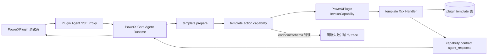

# Template Agent Skill Bridge 调试案例索引

本目录记录 `powerxplugin.template.basic.local` 这个本地调试 skill 的 CRUD 调试案例。它用于验证 PowerX Core Agent Runtime 如何通过 local plugin bridge 反向调用 PowerXPlugin 本地能力，并把业务结果返回到对话和任务卡片。

总规范见：

- `../README.md`

## 能力清单

| 场景 | 文档 | Skill action | Prepare capability | Action capability |
| --- | --- | --- | --- | --- |
| 创建模板 | `create.md` | `create` | `com.powerx.plugins.base.local.template.prepare` | `com.powerx.plugins.base.local.template.create` |
| 查询列表 | `list.md` | `list` | `com.powerx.plugins.base.local.template.prepare` | `com.powerx.plugins.base.local.template.list` |
| 读取详情 | `read.md` | `get` | `com.powerx.plugins.base.local.template.prepare` | `com.powerx.plugins.base.local.template.read` |
| 更新模板 | `update.md` | `update` | `com.powerx.plugins.base.local.template.prepare` | `com.powerx.plugins.base.local.template.update` |
| 删除模板 | `delete.md` | `delete` | `com.powerx.plugins.base.local.template.prepare` | `com.powerx.plugins.base.local.template.delete` |

## 共用前置条件

1. PowerX Core backend 运行在 `http://127.0.0.1:8077`。
2. PowerXPlugin backend 以 local 模式运行，且监听端口是本地 debug host target，例如 `http://127.0.0.1:8078`。
3. `__debug/plugins` 能看到 local plugin：

```bash
curl -sS http://127.0.0.1:8077/__debug/plugins \
  | jq '.apis["com.powerx.plugins.base.local"]'
```

期望：

```json
{
  "basePath": "/api/v1",
  "healthPath": "/healthz",
  "target": "http://127.0.0.1:8078"
}
```

4. Agent/Skill 已初始化为 local：

```text
agent key = powerxplugin.template.agent.local
skill_id = powerxplugin.template.basic.local
owner_plugin_id = com.powerx.plugins.base.local
```

5. 所有 template action capability 的 endpoint 必须是统一 invoke：

```text
/_p/com.powerx.plugins.base.local/api/v1/integration/capabilities/invoke
```

不能是：

```text
/_p/com.powerx.plugins.base.local/api/v1/templates
```

## 共用链路



## 统一输出约定

Core 不定义每个 skill 的业务话术。每个 capability 在自己的 contract 中定义 `metadata.agent_response`：

```yaml
metadata:
  agent_response:
    content: '已找到模板「{{ .template.name }}」。[查看模板](/templates/crud?template_id={{ .template.id }})'
    links:
      - id: '{{ .template.id }}'
        kind: template
        label: '查看模板「{{ .template.name }}」'
        href: '/templates/crud?template_id={{ .template.id }}'
```

handler 只返回结构化业务结果，例如 `template`、`items`、`pagination`。插件侧 renderer 根据 contract 生成：

- `content`：对话中展示的业务回复。
- `links`：任务卡片展示的业务链接。

如果 capability 被 Agent 调用但缺少 `metadata.agent_response.content`，应该明确失败，不做默认话术兜底。

## 共用排障命令

PowerX Core 日志：

```bash
rg -n "agent.skill.invoke|PROXY-BACKEND|/_p/com.powerx.plugins.base.local|<trace_id>" \
  /private/var/www/html/ArtisanCloud/X/PowerX/Core/PowerX/backend/logs -S
```

PowerXPlugin 日志：

```bash
rg -n "gateway stream agent sse|LOCAL-INVOKE|InvokeCapability|template\\.|<trace_id>" \
  /private/var/www/html/ArtisanCloud/X/PowerX/Core/Plugins/PowerXPlugin/skeleton/backend/go-gin/logs -S
```

Core registry endpoint 检查：

```sql
select r.capability_id, r.version, r.status, e.endpoint, e.labels
from public.capability_registry_registrations r
join public.capability_registry_adapter_endpoints e on e.registration_id = r.id
where r.capability_id like 'com.powerx.plugins.base.local.template.%'
order by r.capability_id, r.version desc;
```

