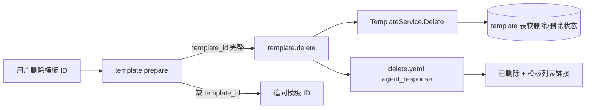

# Template Delete Local Agent 调试案例

本文描述 `powerxplugin.template.basic.local` 的删除能力。它根据 `template_id` 删除插件本地模板记录，并返回模板列表入口。

## 1. 目标链路

用户输入：

```text
删除 ID 为 123 的模板
```

最终必须调用：

```text
com.powerx.plugins.base.local.template.delete
```

流程：



## 2. 参数契约

```json
{
  "action": "delete",
  "template_id": 123
}
```

`template_id` 必填。不能根据列表序号或标题隐式删除；如果没有明确 ID，prepare 必须追问。

## 3. prepare 输出

成功时：

```json
{
  "status": "completed",
  "ready_to_execute": true,
  "missing_fields": [],
  "capability_request": {
    "capability_id": "com.powerx.plugins.base.local.template.delete",
    "payload": {
      "action": "delete",
      "template_id": 123
    }
  }
}
```

缺 ID 时：

```json
{
  "status": "awaiting_params",
  "ready_to_execute": false,
  "missing_fields": ["template_id"],
  "message": "请提供要删除的模板 ID。"
}
```

## 4. action capability 输出

handler 返回：

```json
{
  "id": "123",
  "deleted": true
}
```

`contracts/capabilities/com.powerx.plugins.base.template.delete.yaml` 渲染：

```text
已删除模板 #123。[查看模板列表](/templates/crud)
```

结构化链接：

```json
{
  "kind": "template_list",
  "label": "查看模板列表",
  "href": "/templates/crud"
}
```

## 5. 验收

业务验收：

```sql
select id, name, deleted_at, tenant_uuid
from px_com_powerx_plugins_base.template
where id = 123;
```

如果模型是软删除，期望 `deleted_at` 非空；如果查询默认排除 deleted rows，则通过 service `GetByID` 应返回 not found。

Agent trace：

```text
capability_id = com.powerx.plugins.base.local.template.delete
status = completed
```

前端回复：

```text
已删除模板 #123。查看模板列表
```

## 6. 常见错误

| 现象 | 原因 | 处理 |
| --- | --- | --- |
| 一直追问 ID | 用户未提供结构化 `template_id` | 补 ID 后继续，不要猜测标题 |
| 删除后仍显示 | 页面缓存或当前页未刷新 | 点击列表链接或刷新 `/templates/crud` |
| 删除了另一个租户的数据 | tenant context 错误 | 检查 `origin_tenant_uuid`、delegated/local identity |
| `root privileges required` | 调错 installed 或管理接口 | 检查 `.local` skill/capability 和 endpoint |

