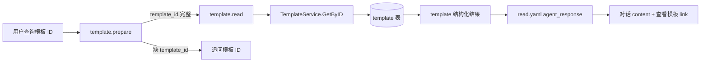

# Template Read Local Agent 调试案例

本文描述 `powerxplugin.template.basic.local` 的详情读取能力。它根据 `template_id` 读取单条模板，并返回可打开业务记录的链接。

## 1. 目标链路

用户输入：

```text
查询 ID 为 123 的模板
```

最终必须调用：

```text
com.powerx.plugins.base.local.template.read
```

流程：



## 2. 参数契约

read action 对应 skill action 是 `get`：

```json
{
  "action": "get",
  "template_id": 123
}
```

`template_id` 是必填字段。不能用模板标题、列表序号或自由文本作为隐式详情查询条件；如果没有 ID，prepare 必须追问。

## 3. prepare 输出

成功时：

```json
{
  "status": "completed",
  "ready_to_execute": true,
  "missing_fields": [],
  "capability_request": {
    "capability_id": "com.powerx.plugins.base.local.template.read",
    "payload": {
      "action": "get",
      "template_id": 123
    }
  }
}
```

缺 ID 时：

```json
{
  "status": "awaiting_params",
  "ready_to_execute": false,
  "missing_fields": ["template_id"],
  "message": "请提供要查询的模板 ID。"
}
```

## 4. action capability 输出

handler 返回：

```json
{
  "template": {
    "id": "123",
    "name": "合同模板",
    "description": "合同场景",
    "content": "...",
    "status": "draft"
  }
}
```

`contracts/capabilities/com.powerx.plugins.base.template.read.yaml` 渲染：

```text
已找到模板「合同模板」。[查看模板](/templates/crud?template_id=123)
```

结构化链接：

```json
{
  "id": "123",
  "kind": "template",
  "label": "查看模板「合同模板」",
  "href": "/templates/crud?template_id=123"
}
```

## 5. 前端详情入口

当前没有独立 `/templates/:id` 详情页。详情入口复用 CRUD 页：

```text
/templates/crud?template_id=123
```

页面行为：

- 调用 `GET templates/123`。
- 可写模式：打开编辑弹窗，展示当前记录。
- 只读模式：把该记录放到列表顶部，并提示已定位模板。

对应代码：

```text
skeleton/web-admin/nuxt/app/pages/templates/crud.vue
skeleton/web-admin/nuxt/app/composables/api/useTemplate.ts
```

## 6. 验收

SQL 验证：

```sql
select id, name, description, content, tenant_uuid, created_at
from px_com_powerx_plugins_base.template
where id = 123;
```

Agent trace 必须满足：

```text
capability_id = com.powerx.plugins.base.local.template.read
status = completed
```

对话必须出现业务回复和链接：

```text
已找到模板「...」。查看模板
```

## 7. 常见错误

| 现象 | 原因 | 处理 |
| --- | --- | --- |
| 一直追问模板 ID | `template_id` 没被 planner/prepare 提取 | 检查用户输入、slot mapping、prepare payload |
| 404/not found | 当前租户下没有该 ID | 检查 `origin_tenant_uuid` 和插件 DB |
| 链接打开列表但没定位 | 前端没有消费 `template_id` query 或 getTemplate 失败 | 看 `templates/crud.vue` 的 `focusTemplateFromRoute` 日志 |
| 返回内部完成文案 | read capability contract 缺 `agent_response.content` | 检查 read YAML |

