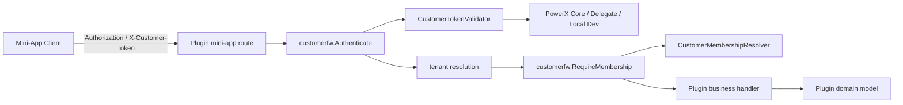
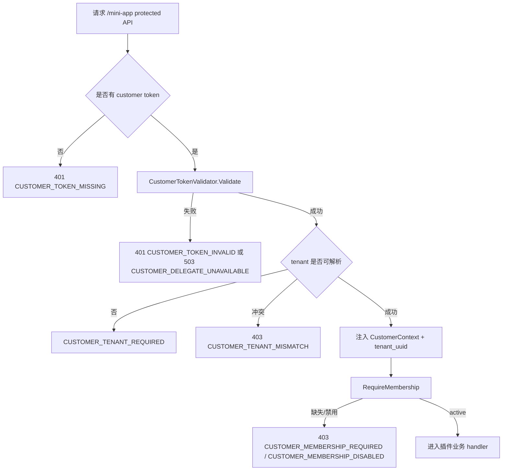
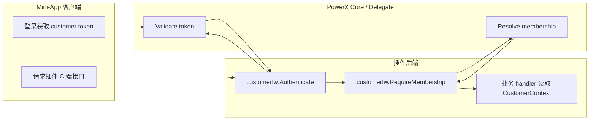
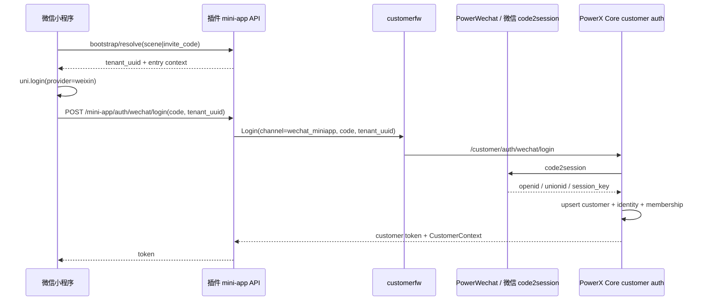

# Customer Identity/Auth 开发指南

## 功能背景与目标

Customer Identity/Auth 是 PowerXPlugin framework 提供给插件的通用 C 端身份能力。插件只依赖 framework 注入的 `CustomerContext`，不用在业务模块里重复解析 token、判断 tenant、校验 membership。

生产环境的 customer 主数据、登录身份、租户 membership、shared app 入口和 session 审计归属 PowerX Core。PowerXPlugin framework 不拥有生产 customer 表，只提供 runtime contract、middleware、delegated adapter、测试工具和 local dev mirror 规则。插件 local 模式里的 customer 表只是开发调试镜像，必须与 PowerX Core customer schema 保持兼容。

Framework 只负责这些通用能力：

- 解析 `Authorization: Bearer <token>` 或 `X-Customer-Token`
- 校验 customer token
- 解析并注入 `tenant_uuid`
- 注入 `CustomerContext`
- 阻断未登录、跨租户、缺少 membership 的请求
- 定义 delegated/core auth、bootstrap、membership resolver 合同

Framework 提供 customer identity 与基础展示属性契约。基础展示属性只包含 PowerX Core customer 主账号可通用表达的字段：`display_name`、`nickname`、`given_name`、`family_name`、`avatar_url`、`locale`、`timezone`。这些字段通过 `CustomerContext.profile` 传递，供列表、详情、登录态展示和跨插件基础识别使用。

Framework 不提供 SCRM 或行业 customer 模型。客户标签、客户跟进、客户归属员工、销售线索、球员、家长、学员、会员权益、训练目标、成长报告等都必须留在业务插件侧。

## 数据权威源与 local mirror

PowerX Core 是 Customer Identity/Auth 的生产权威源：

| 数据 | 生产权威源 | Framework 责任 | 插件责任 |
| --- | --- | --- | --- |
| customer 主账号 | PowerX Core `customer_accounts` | 映射为 `CustomerContext.customer_uuid` 和 `CustomerContext.profile` 基础展示属性 | 只引用 `customer_uuid`，需要展示时读取基础属性 |
| 登录身份/第三方绑定 | PowerX Core `customer_auth_identities` | 调用 delegated/core validator | 不保存登录密钥 |
| customer 租户关系 | PowerX Core `customer_tenant_memberships` | 映射为 `CustomerMembership` 并阻断无效 membership | 只做业务授权补充 |
| shared app 入口 | PowerX Core `mini_app_entries` | 通过 bootstrap client 解析 `tenant_uuid` | 不绕过合法入口 |
| session/refresh/audit | PowerX Core `customer_sessions`、`customer_login_events` | 统一错误码与诊断 | 不记录 raw token/secret |
| 行业档案 | 插件业务库 | 不承载 | 例如标签、跟进、归属销售、球员、家长关系、训练档案 |

插件 local 模式规则：

1. local customer 表只用于本地开发和调试，不是生产 schema 决策来源。
2. local 表必须镜像 PowerX Core customer 字段、状态枚举和 membership 语义。
3. PowerX Core customer schema 调整后，PowerXPlugin skeleton/scaffold 和插件 local mirror 必须同步。
4. 插件不得把家长、球员、学员、患者、粉丝等行业字段加入 framework customer 表。
5. 生产环境必须委托 PowerX Core 或平台级 identity source，禁止静默回退到 local/mock。

PowerX Core customer 权威模型见 PowerX Core 文档：

```text
docs/plan/iam/customer-identity-auth.md
```

## Framework / SCRM / 业务插件边界

结论：Framework 管身份和访问边界，SCRM 管客户业务关系，业务插件管自己的行业模型。

| 能力 | 归属 | 说明 |
| --- | --- | --- |
| member token 校验 | Framework IAM | 后台员工身份，不属于 `customerfw` |
| member context / RBAC | Framework IAM | 管理端权限与租户上下文 |
| customer token 校验 | `customerfw` | C 端外部用户身份校验 |
| customer context 注入 | `customerfw` | `tenant_uuid`、`customer_uuid`、`membership_uuid`、`profile`、roles、scopes、source |
| customer tenant membership 校验 | `customerfw` | 只判断 customer 是否可访问当前 tenant |
| customer register/login/validate 委托合同 | `customerfw` | 生产权威源通常是 PowerX Core 或平台身份源 |
| 基础展示属性 | `customerfw` + PowerX Core | `display_name`、`nickname`、`given_name`、`family_name`、`avatar_url`、`locale`、`timezone` |
| 客户业务档案 | SCRM 插件 | 标签、画像扩展、跟进属性、归属关系、业务属性 |
| 客户标签/分群 | SCRM 插件 | 通过 SCRM capability/API 调用 |
| 客户跟进/时间线 | SCRM 插件 | 不进入 framework |
| member 与 customer 的销售/服务关系 | SCRM 插件 | 例如归属销售、服务顾问、协作人 |
| 客户生命周期/线索/商机 | SCRM 插件 | SCRM 业务域 |
| 行业模型 | 业务插件 | 例如球员、患者、学员、粉丝、成长报告 |

SCRM 插件本身也应该使用 framework：

- SCRM 管理端使用 Framework IAM 识别后台 member / employee。
- SCRM C 端接口使用 `customerfw` 识别 customer、tenant 和 membership。
- SCRM 内部再维护自己的业务档案、标签、归属、跟进、时间线等业务模型。

其他插件如果只需要知道“当前 C 端用户是谁”或展示基础名称，直接读取 `customerfw.CustomerContext` 和 `CustomerContext.profile`。如果需要客户标签、客户归属员工、客户跟进记录、生命周期、线索商机等业务数据，应通过 SCRM 插件暴露的 capability/API 调用，不要要求 `customerfw` 增加这些行业字段。

## 角色与适用范围

| 角色 | 用途 |
| --- | --- |
| 插件后端开发 | 在 mini-app / C 端路由接入 customer 鉴权与 membership 校验 |
| 插件前端/小程序开发 | 确认 token、tenant、错误码和本地联调方式 |
| QA | 验证成功、未登录、跨租户、membership 拒绝等路径 |
| 平台/Framework 开发 | 实现或替换 `CustomerTokenValidator`、`CustomerMembershipResolver`、`CustomerAuthClient` |

当前实现面向 Go Gin skeleton。其他语言或框架应对齐 `docs/contracts/customer-auth.openapi.yaml` 的合同与错误码。

## 整体架构与模块关系



模块边界：

| 模块 | 责任 |
| --- | --- |
| `framework/backend/go/runtime/customerfw` | 通用 customer 身份、token、tenant、membership 合同与 middleware |
| Framework IAM | 后台 member / employee 身份、RBAC、管理端权限 |
| SCRM 插件 | 客户业务档案、标签、跟进、member-customer 业务关系 |
| `skeleton/backend/go-gin/internal/services/customer/*adapter.go` | skeleton 现有 auth 实现到 framework contract 的适配 |
| `skeleton/backend/go-gin/internal/transport/http/mini-app/routes.go` | mini-app protected group 接入 customerfw |
| 插件业务模块 | 只读取 `CustomerContext`，实现自己的业务模型 |

## 核心流程



## 跨角色协作流程



## 前置条件与依赖

- Go framework module 已包含 `framework/backend/go/runtime/customerfw`。
- Gin 插件后端通过 `go.work` 或已发布版本引用 framework。
- 生产环境应由 PowerX Core / delegated identity source 实现 customer token 校验。
- 本地开发可使用 local/dev validator 或 skeleton 现有 local JWT adapter。
- tenant-scoped C 端接口必须能解析到 `tenant_uuid`，来源可以是 token、header、query 或 bootstrap 结果。
- membership 校验必须在业务 handler 前执行。

## 操作步骤

### 页面操作步骤

当前 framework customer auth 是后端能力，没有固定管理端页面。插件前端或小程序需要做三件事：

| 动作 | 入口 | 预期结果 | 失败处理 |
| --- | --- | --- | --- |
| 登录或注册 customer | PowerX Core 或插件本地登录入口 | 获得 customer token | 查看登录接口响应错误码 |
| 保存 token | 小程序/移动端安全存储 | 后续请求可带 token | token 丢失会返回 `CUSTOMER_TOKEN_MISSING` |
| 请求受保护接口 | `/api/v1/mini-app/*` | 返回业务数据 | 根据错误码处理重新登录、选择 tenant 或提示无权限 |

### 微信小程序登录

Shared App 模式下，小程序 AppID/AppSecret 属于平台或共享小程序配置，不属于单个租户。租户识别必须来自合法入口解析结果，例如 `mini_app_entries` 返回的 `tenant_uuid`、`entry_code`、`scene` 或邀请链接上下文。没有 tenant 入口上下文的请求必须拒绝，不允许静默落到默认租户。

微信小程序登录流程：



Framework 提供的通用能力：

| 能力 | Framework 合同 |
| --- | --- |
| 微信换码 | `customerfw.NewPowerWeChatMiniAppExchanger()`，内部使用 PowerWechat `miniProgram.Auth.Session(ctx, code)` |
| 登录通道 | `customerfw.CustomerAuthChannelWeChatMiniApp` |
| 委托路径 | `/customer/auth/wechat/login` |
| customer 来源 | `CustomerAuthSourceWeChat` |

插件侧只做两件事：

1. 小程序端调用 `uni.login({ provider: "weixin" })` 获取 `code`。
2. 插件后端把 `code + tenant_uuid` 传给 `customerfw.LoginInput{Channel: customerfw.CustomerAuthChannelWeChatMiniApp}`。

PowerX Core 或 local dev mirror 负责：

1. 用 PowerWechat/code2session 换取 `openid`、`unionid`、`session_key`。
2. 以 `provider=wechat`、`provider_subject=openid` 绑定通用 customer。
3. 根据入口 `tenant_uuid` 创建或校验 `customer_tenant_memberships`。
4. 签发 customer token。

注意：家长、球员、学员、粉丝等行业身份不是 customer framework 字段。插件拿到 `customer_uuid` 后，再在自己的业务表里创建球员档案、家长关系或训练档案。

### 接口调用步骤

受保护接口请求：

```bash
curl -i \
  -H "Authorization: Bearer ${CUSTOMER_TOKEN}" \
  -H "tenant_uuid: 00000000-0000-0000-0000-000000000001" \
  http://localhost:8078/api/v1/mini-app/ping
```

成功响应示例：

```json
{
  "success": true,
  "data": {
    "tenant_uuid": "00000000-0000-0000-0000-000000000001",
    "customer": {
      "tenant_uuid": "00000000-0000-0000-0000-000000000001",
      "customer_uuid": "00000000-0000-0000-0000-000000000002",
      "membership_uuid": "00000000-0000-0000-0000-000000000002:00000000-0000-0000-0000-000000000001",
      "authenticated": true
    }
  }
}
```

常见失败响应：

```json
{
  "success": false,
  "error": {
    "code": "CUSTOMER_TENANT_MISMATCH",
    "message": "customer tenant mismatch"
  }
}
```

稳定合同见 [customer-auth.openapi.yaml](/private/var/www/html/ArtisanCloud/X/PowerX/Core/Plugins/PowerXPlugin/docs/contracts/customer-auth.openapi.yaml)。

### 本地命令步骤

运行 framework customer auth 测试：

```bash
cd framework/backend/go
go test ./runtime/customerfw
```

预期结果：

```text
ok github.com/ArtisanCloud/PowerXPlugin/framework/backend/go/runtime/customerfw
```

运行 Gin skeleton mini-app 回归：

```bash
cd skeleton/backend/go-gin
go test ./tests/integration/mini-app ./tests/unit
```

预期结果：

```text
ok github.com/ArtisanCloud/PowerXPlugin/skeleton/backend/tests/integration/mini-app
ok github.com/ArtisanCloud/PowerXPlugin/skeleton/backend/tests/unit
```

## 插件后端接入方式

Protected route 推荐写法：

```go
protected := base.Group(
	"",
	customerfw.Authenticate(coreCustomerClient, customerfw.RequireTenant()),
	customerfw.RequireMembership(membershipResolver),
	tenantfw.EnsureTenant(),
)
```

Handler 里只读 framework context：

```go
cc := customerfw.MustContextFromGin(c)
tenantUUID := cc.TenantUUID
customerUUID := cc.CustomerUUID
```

Service 层使用标准 `context.Context`：

```go
cc, ok := customerfw.ContextFrom(ctx)
if !ok {
	return customerfw.NewError(customerfw.CodeCustomerContextMissing, "customer context missing")
}
```

插件业务代码不要读取 raw token，也不要自己解析 customer claims。

## 预期结果与验收标准

- 有效 customer token 可以进入 protected mini-app handler。
- handler 和 service 能读取同一个 `CustomerContext`。
- 未携带 customer token 返回 `CUSTOMER_TOKEN_MISSING` 或兼容的 401 envelope。
- 多个 token 凭证解析到不同 customer 或 tenant 时，请求被拒绝。
- token tenant、request tenant、bootstrap tenant 不一致时，请求被拒绝。
- tenant-scoped 接口没有 tenant context 时，请求被拒绝。
- membership 缺失、禁用、删除、过期时，请求在业务 handler 前被拒绝。
- 日志、诊断、审计字段不得输出 raw token、password、secret。

## 代码实现映射

| 能力 | 文件 |
| --- | --- |
| CustomerContext 与 Gin/context helper | `framework/backend/go/runtime/customerfw/context.go` |
| 稳定错误码与 HTTP 映射 | `framework/backend/go/runtime/customerfw/errors.go` |
| token validator 与多 token 一致性 | `framework/backend/go/runtime/customerfw/validator.go` |
| Authenticate middleware | `framework/backend/go/runtime/customerfw/middleware.go` |
| tenant resolution | `framework/backend/go/runtime/customerfw/tenant.go` |
| membership contract/middleware | `framework/backend/go/runtime/customerfw/membership.go` |
| membership cache | `framework/backend/go/runtime/customerfw/membership_cache.go` |
| mock/local resolver | `framework/backend/go/runtime/customerfw/membership_mock.go` |
| bootstrap contract | `framework/backend/go/runtime/customerfw/bootstrap.go` |
| delegated/core auth client contract | `framework/backend/go/runtime/customerfw/auth_client.go` |
| skeleton authenticator adapter | `skeleton/backend/go-gin/internal/services/customer/framework_adapter.go` |
| skeleton membership adapter | `skeleton/backend/go-gin/internal/services/customer/membership_adapter.go` |
| skeleton mini-app route wiring | `skeleton/backend/go-gin/internal/transport/http/mini-app/routes.go` |
| skeleton integration tests | `skeleton/backend/go-gin/tests/integration/mini-app/customer_*_test.go` |

## 常见问题与排障

| 问题 | 表现 | 处理 |
| --- | --- | --- |
| 没带 token | 401，`CUSTOMER_TOKEN_MISSING` | 检查 `Authorization` 或 `X-Customer-Token` |
| token 无效 | 401，`CUSTOMER_TOKEN_INVALID` | 确认 token 签发方、过期时间、issuer/audience |
| tenant 冲突 | 403，`CUSTOMER_TENANT_MISMATCH` | 对比 token、header/query、bootstrap 的 `tenant_uuid` |
| 没有 tenant | `CUSTOMER_TENANT_REQUIRED` | tenant-scoped route 必须提供 tenant 或使用含 tenant 的 token |
| membership 不可用 | 403，`CUSTOMER_MEMBERSHIP_REQUIRED` / `CUSTOMER_MEMBERSHIP_DISABLED` | 检查 resolver 是否返回 active membership |
| delegate 不可用 | 503，`CUSTOMER_DELEGATE_UNAVAILABLE` | 检查 PowerX Core/delegate endpoint、网络、超时和凭证 |

排查命令：

```bash
rg -n "CUSTOMER_|customerfw|CustomerContext" framework/backend/go/runtime/customerfw skeleton/backend/go-gin/internal
```

安全检查：

```bash
rg -n "log\\.(Info|Warn|Error|Debug)|slog\\.|logrus\\." \
  framework/backend/go/runtime/customerfw skeleton/backend/go-gin/internal \
  -g '!**/*test*' | rg -n "token|password|secret|refresh_token|access_token"
```

预期不出现新增 raw token/password/secret 日志。

## 测试工具

Framework 提供标准测试 helper，插件测试不需要手写 token parser 或 context 注入：

```go
validator := customerfw.NewMockCustomerValidator(&customerfw.CustomerContext{
	TenantUUID:    "tenant-a",
	CustomerUUID:  "customer-a",
	Authenticated: true,
})

resolver := customerfw.NewMockMembershipResolver(customerfw.CustomerMembership{
	TenantUUID:     "tenant-a",
	CustomerUUID:   "customer-a",
	MembershipUUID: "membership-a",
	Status:         customerfw.CustomerMembershipActive,
})

token := customerfw.TestToken("customer-a", "tenant-a")
ctx := customerfw.WithCustomerContext(context.Background(), &customerfw.CustomerContext{
	TenantUUID:    "tenant-a",
	CustomerUUID:  "customer-a",
	Authenticated: true,
})
```

建议每个插件至少覆盖：

- 有效 customer token 成功进入 handler。
- 缺少 token 返回未登录。
- tenant mismatch 被拒绝。
- membership disabled/missing 被拒绝。
- delegate unavailable 返回稳定错误。

## 回滚与风险控制

- 插件业务 handler 应只依赖 `CustomerContext`，不要耦合 skeleton local auth 结构。
- 若 delegated identity source 暂不可用，本地开发可以使用 local/dev validator；生产环境不能静默 fallback 到 mock/local。
- membership cache TTL 必须短于 token 有效期，membership 变更后应支持失效或保守拒绝。
- 回滚 skeleton 接入时，只需要从 protected route 移除 `customerfw.Authenticate` / `customerfw.RequireMembership`，但不建议在 tenant-scoped C 端接口上线后这么做。

## 变更记录

| 日期 | 版本 | 变更 |
| --- | --- | --- |
| 2026-06-24 | 0.1.0 | 整理为 framework customer identity/auth 对外开发指南，覆盖本地调试、合同、接入与排障 |
