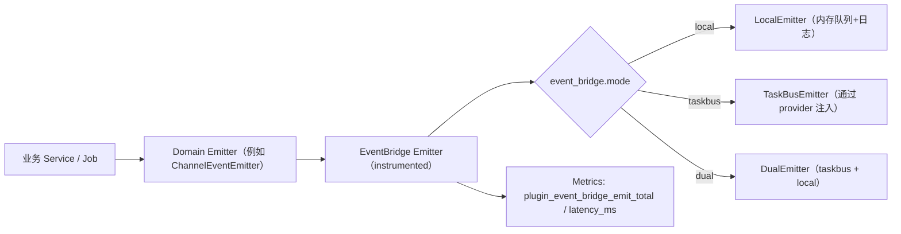
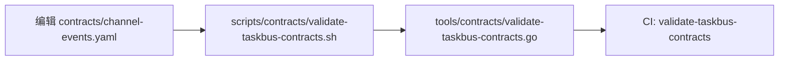

# EventBridge / TaskBus 测试指南（008-framework-task-bus）

本指南面向插件开发者，用于在本仓库中验证并理解 `008-framework-task-bus` 的交付：事件契约校验、EventBridge 指标、以及 Skeleton 后端回归测试；同时说明“外部插件项目”在接入 PowerXPlugin Framework 时，如何通过统一事件接口发事件并对接宿主 TaskBus（当 SDK 就绪时）。

## 0) 前置说明

- 事件契约与实现：`specs/008-framework-task-bus/`
- 开发态 manifest：`skeleton/plugin.yaml`（如需覆盖路径，使用 `POWERX_PLUGIN_MANIFEST_PATH`）
- 本仓库的 EventBridge 指标会通过 Skeleton Admin 指标端点暴露：`GET /api/v1/admin/runtime/metrics`

## 0.1) 使用流程图（开发者视角）

### 事件发布链路（local / taskbus / dual）



### 契约治理（PR/CI）与本地验证



## 0.2) 外部插件项目如何“调用 framework 事件接口”

当前仓库的实现策略是：**插件侧先固化稳定的事件抽象（Emitter/Consumer/Meta/Contracts），TaskBus 通过 provider 适配器对接 Framework**（见 `specs/008-framework-task-bus/research.md` Decision 1）。  
这意味着在“外部插件项目（独立仓库）”里，你的 Go 后端应当：

1. 复用同一套抽象（`event.Event` + `event_bridge.Emitter` + `event.MetaBuilder` 的形态不变）。
2. 在 bootstrap 时注入一个 `TaskBusProvider`（当 Framework/宿主提供 SDK 后实现；未就绪时可先走 local/dual + stub）。

关键调用点在 `framework/backend/go/eventbridge/emitter.go` 的 `Factory.WithTaskBusProvider(...)`：外部插件项目需要实现的就是一个“把 Framework TaskBus SDK 包装成 `eventbridge.Emitter` 的适配器”。

路径对照（便于你在外部插件仓库里找文件）：

- 本仓库：`skeleton/backend/go-gin/...` + `skeleton/plugin.yaml`
- 外部插件仓库（由模板生成的典型形态）：`backend/...` + `plugin.yaml`

## 1) 契约校验（必做）

### 1.1 一键校验（推荐）

在仓库根目录执行：

```bash
./scripts/contracts/validate-taskbus-contracts.sh
```

默认校验文件为 `specs/008-framework-task-bus/contracts/channel-events.yaml`；若要校验其他路径：

```bash
TASKBUS_CONTRACTS=/abs/path/to/channel-events.yaml ./scripts/contracts/validate-taskbus-contracts.sh
```

### 1.2 直接跑 make 目标

```bash
make validate-taskbus-contracts
```

## 2) 本地回归：Go 测试（必做）

### 2.1 macOS/受限环境的缓存建议

若遇到 Go build cache 权限问题，可把 `GOCACHE` 指到仓库内目录：

```bash
mkdir -p tmp/gocache
GOCACHE="$PWD/tmp/gocache" go test ./skeleton/backend/go-gin/...
```

### 2.2 仅跑 EventBridge 相关测试（快速）

```bash
mkdir -p tmp/gocache
GOCACHE="$PWD/tmp/gocache" go test ./skeleton/backend/go-gin/... -run 'EventBridge|event_bridge' -v
```

其中会覆盖：

- 事件发布/消费的指标更新（success/error）
- TaskBus stub 的端到端集成测试（publish → subscribe）

## 3) 手工验证：指标输出（推荐）

### 3.1 启动 Skeleton 后端

```bash
cd skeleton/backend/go-gin
# 如只是本地联调/排障，可临时关闭鉴权以便 curl 调试（仅限本地/开发环境）
export POWERX_AUTH_OPTIONAL=true
go run ./cmd/plugin
```

### 3.2 访问 metrics 端点

```bash
curl -sSf http://127.0.0.1:8078/api/v1/admin/runtime/metrics | rg 'plugin_event_bridge_'
```

期望包含（至少）以下指标名：

- `plugin_event_bridge_emit_total{plugin_id,tenant_uuid,topic,result}`
- `plugin_event_bridge_consume_total{plugin_id,tenant_uuid,topic,result}`
- `plugin_event_bridge_latency_ms{plugin_id,tenant_uuid,topic,op}`

说明：

- `result`：`success|error`
- `op`：`emit|consume`
- `plugin_event_bridge_latency_ms` 为“最近一次观测到的延迟（ms）”

## 4) REST 接口测试：触发一次 emit（推荐）

EventBridge 的“发事件”通常发生在 service/job 内部。本仓库为了便于验证，提供了一个 **仅在 `runtime.internal_routes_enabled=true` 时注册** 的调试端点：

- `POST /api/v1/admin/runtime/event-bridge/emit`

### 4.1 发送请求（成功路径）

```bash
curl -sSf -X POST http://127.0.0.1:8078/api/v1/admin/runtime/event-bridge/emit \
  -H 'Content-Type: application/json' \
  -d '{
    "tenant_uuid": "00000000-0000-0000-0000-000000000001",
    "topic": "powerx.channel.master.credential_inspection.v1",
    "payload": { "channel_id": "c1", "status": "ok" }
  }'
```

随后检查 metrics（计数应增加，且会出现对应 topic/tenant_uuid 的 series）：

```bash
curl -sSf http://127.0.0.1:8078/api/v1/admin/runtime/metrics | rg 'plugin_event_bridge_(emit_total|latency_ms)'
```

### 4.2 验证权限拒绝（可选）

若 manifest 未声明该 topic 的 publish 权限，端点会返回错误（并在日志中记录 deny）。请检查 `skeleton/plugin.yaml` 的 `events.publish` 是否包含对应 topic（精确到版本号）。

## 5) 外部插件项目接入步骤（Go 后端）

本节给外部插件项目一个“可落地的最小步骤”，用于把业务代码迁移到统一发事件，并为未来对接 Framework TaskBus 做好接口准备。

### 5.1 声明事件权限（manifest）

在插件仓库的开发态 manifest（等价于本仓库的 `skeleton/plugin.yaml`）里声明最小权限：

```yaml
events:
  publish:
    - powerx.channel.master.credential_inspection.v1
  subscribe: []
```

运行时会读取 manifest 并对 publish 做边界控制（deny + log；并可通过 `POWERX_PLUGIN_MANIFEST_PATH` 指定路径）。

### 5.2 配置开关（event_bridge）

`event_bridge.enabled` 与 `event_bridge.mode` 的语义：

- `enabled=false`：强制走 local（即使 mode 写了 taskbus/dual）
- `enabled=true`：
  - `mode=local`：只走 local
  - `mode=taskbus`：走 TaskBus（不可用时按 `fallback_to_local` 决定是否降级）
  - `mode=dual`：双写（先 taskbus，成功后再写 local）

### 5.3 bootstrap：创建并注入 Emitter（关键）

外部插件项目在 bootstrap 时需要做两件事：

1) 通过 `Factory` 创建 emitter（local/taskbus/dual）  
2)（可选但推荐）用 manifest 权限把 emitter 包一层 permission enforcement

对应实现参照：

- `framework/backend/go/eventbridge/emitter.go`（Factory + dual/fallback + metrics）
- `skeleton/backend/go-gin/internal/security/event_permissions.go`（manifest 权限 enforcement）

如果你是在“外部插件独立仓库”里做接入：

- 若是由本仓库模板生成：通常会有同名代码目录（只是路径从 `skeleton/backend/go-gin/...` 变为 `backend/...`）。
- 若不是模板生成：建议优先直接依赖 framework（避免复制代码造成漂移）：
  - `github.com/ArtisanCloud/PowerXPlugin/framework/backend/go/event`
  - `github.com/ArtisanCloud/PowerXPlugin/framework/backend/go/eventbridge`
  - 权限 enforcement 可参考：`skeleton/backend/go-gin/internal/security/event_permissions.go`

当 Framework TaskBus SDK 就绪后，实现一个 adapter（示意）：

```go
// TODO: 用 framework 的 TaskBus SDK 替换这里的 bus/client
type TaskBusEmitterAdapter struct{ /* bus */ }

func (a *TaskBusEmitterAdapter) Emit(ctx context.Context, ev event.Event) error {
	// 1) 转换 topic/meta/payload
	// 2) 调用 framework TaskBus publish
	return nil
}
```

然后通过 `WithTaskBusProvider` 注入：

```go
factory, _ := eventbridge.NewFactory(eventbridge.Config{
  Enabled: true,
  Mode: "taskbus",
  FallbackToLocal: true,
})
factory.WithTaskBusProvider(func() (eventbridge.Emitter, error) {
  return &TaskBusEmitterAdapter{/* ... */}, nil
})
```

### 5.4 业务侧：只发“领域事件”

业务层建议只依赖“领域 emitter”（例如本仓库的 `ChannelEventEmitter`），不要在 handler 里拼 topic/拼 meta：

- 示例 emitter：`skeleton/backend/go-gin/internal/observability/channel/event_emitter.go`
- 示例 topic：`powerx.channel.master.credential_inspection.v1`

## 6) 常见问题（FAQ）

### 6.1 为什么 metrics 里没有 EventBridge 指标？

只有当进程内发生过 emit/consume 时，相关 series 才会出现。你可以先跑一次测试（见 2.2），或触发一条会发事件的业务路径后再查看。

### 6.2 publish/subscribe 权限导致事件被拒绝怎么办？

确保开发态 manifest `skeleton/plugin.yaml` 中 `events.publish` / `events.subscribe` 声明了对应 topic（精确到版本号）。也可以用环境变量指定 manifest 路径：

```bash
POWERX_PLUGIN_MANIFEST_PATH=./skeleton/plugin.yaml go run ./skeleton/backend/go-gin/cmd/plugin
```

## 8) 外部插件迁移清单（一次性对齐）

> 适用于从“自定义 taskbus.Event”迁移到 framework `event.Event` 的插件项目。

### 8.1 依赖与版本

- [ ] 升级到包含 Host Provider 的 framework 版本（建议 `v0.0.3-alpha+`）。
- [ ] 清理旧 taskbus 私有 SDK 直接依赖（保留 adapter 层）。

### 8.2 代码接入

- [ ] 在 bootstrap 里统一通过 `eventbridge.NewFactory(...)` 创建 emitter。
- [ ] 注入 `WithTaskBusProvider(...)`（由宿主/runtime 提供真实 provider）。
- [ ] 业务层统一调用领域 emitter，避免在 handler 中手拼 topic/meta。

### 8.3 契约与权限

- [ ] 在 manifest 声明最小权限 `events.publish/subscribe`（精确到 topic + version）。
- [ ] 确认 payload 不含敏感字段（通过 contracts validator）。

### 8.4 回归验证

- [ ] `mode=local`：本地路径正常，emit/consume 指标增长。
- [ ] `mode=taskbus`：宿主链路成功。
- [ ] `mode=dual`：主成功后写本地；主失败短路。
- [ ] `fallback_to_local=true`：provider 异常时自动回落，不影响主流程。

## 9) 发布检查清单（Framework / 插件）

### 9.1 Framework 发布

- [ ] 变更说明（breaking/non-breaking）已写入 release notes。
- [ ] 对外 API（event/eventbridge）兼容策略明确（至少保留 1 个小版本）。
- [ ] 提供最小示例（provider 注入 + emit + consume）。

### 9.2 插件发布

- [ ] `go test ./...` 通过（允许排除明确的非本功能 flaky 用例）。
- [ ] 契约校验通过：`./scripts/contracts/validate-taskbus-contracts.sh`。
- [ ] 观测就绪：`plugin_event_bridge_emit_total/consume_total/latency_ms` 可见。
- [ ] 回滚方案明确：可切 `event_bridge.enabled=false` 回本地实现。
