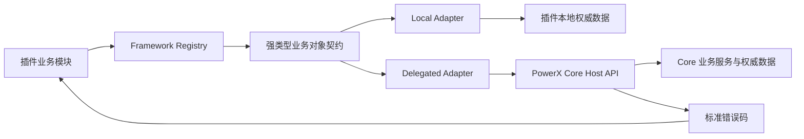
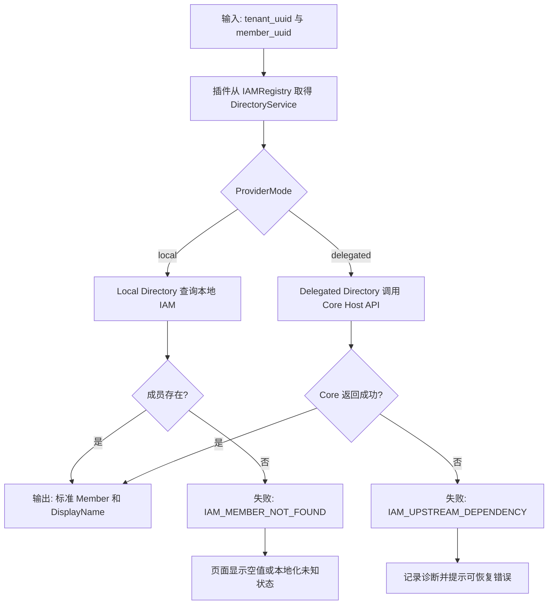
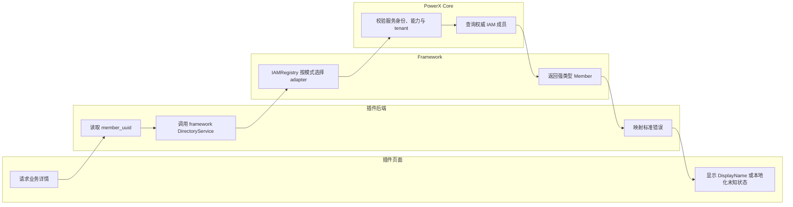

# Framework 业务对象模块开发指南

## 1. 功能背景与目标

PowerXPlugin framework 是插件访问 PowerX 业务对象的唯一边界。插件业务代码应依赖 framework 提供的强类型模块和 Registry，而不是直接查询 PowerX Core 数据库、拼接 Core 内部 URL，或解析 Gateway 的 `map[string]any`。

本指南的目标是让插件开发者能够判断一个业务对象模块是否已经可用，并以一致的方式接入 IAM 等正在建设的模块。模块存在接口、Registry 或 mock 不代表可用于生产；只有完成契约、传输、模式装配和合同测试的模块才可标记为可用。

当前完整审计台账见 [PowerX Core 开放面与 Framework 覆盖台账](../../contracts/powerx-core-framework-coverage.md)。新增模块或改变覆盖状态时，必须同步更新该台账。

## 2. 角色与适用范围

| 角色 | 使用本指南的目的 | 不应承担的职责 |
|---|---|---|
| 插件业务开发者 | 从 framework Registry 获取业务对象服务，并处理标准错误 | 直连 Core 数据表、调用未封装的内部接口 |
| framework 维护者 | 补齐 DTO、服务接口、local/delegated adapter 与测试 | 把空实现标为已支持 |
| PowerX Core 维护者 | 提供有能力声明、鉴权和租户隔离的稳定宿主接口 | 让插件依赖 Core 内部服务或数据库模型 |
| QA/联调人员 | 用合同、错误路径和本地命令验证模块状态 | 以 HTTP 连通或空列表作为功能成功依据 |

适用范围是 PowerX Core 权威开放面所对应的业务对象模块，例如 IAM、Media、Knowledge、Agent 和 AI。本指南不把 scheduler、wsbus、taskqueue 等运行时基础设施误归类为业务对象模块。

## 3. 整体架构与模块关系

插件只依赖 framework 的领域契约。framework 根据 `ProviderMode` 选择 local 或 delegated adapter；delegated adapter 只调用 Core 已声明的宿主能力，local adapter 只访问插件本地、由该模式权威维护的数据。



### 模块状态的判定

| 状态 | 含义 | 插件是否可直接依赖 |
|---|---|---|
| `implemented` | DTO、服务、transport、模式装配、合同测试均完成 | 可以 |
| `ready_for_integration` | 同上，真实已安装插件的 capability/授权联调尚未执行 | 可以；安装后须完成对应联调 |
| `partial` | 只有部分业务对象或操作完成 | 仅限台账明确列出的操作 |
| `contract_only` | 只有契约、Registry 或测试 stub | 不可以 |
| `generic_only` | 只有通用 Gateway/capability 调用底座 | 不可以 |
| `not_started` | 尚未形成 framework 业务对象模块 | 不可以 |

IAM 成员目录目前处于实施与联调阶段：插件只能在该链路的 Core 契约、能力声明和合同测试全部完成后，通过 `IAMRegistry` 获取 `DirectoryService`。不得绕过它自行增加 MemberDirectory。

## 4. 核心流程

以“按成员 UUID 显示创建人名称”为例，`created_by` 保存稳定的 `member_uuid`，读取时使用 `DirectoryService.GetMember` 或 `BatchGetMembers` 取得 `DisplayName`。成员不存在和上游不可用必须向调用方返回可区分的错误；不得把 UUID 回填为显示名称。



## 5. 跨角色协作流程



## 6. 前置条件与依赖

1. 目标模块必须在覆盖台账中有对应条目，并且所需操作的状态为 `implemented`、`ready_for_integration` 或明确允许的 `partial`。
2. 所有跨边界业务对象引用必须使用 UUID；不得传递数值主键、用户名或显示名代替 `member_uuid`、`role_uuid`、`department_uuid` 等业务标识。
3. delegated 模式必须拥有 Core 为该接口声明的服务身份、租户上下文和 capability；HTTP 可访问但返回 `401/403` 不构成可用。
4. local 模式必须完成对应本地模型迁移，且本地数据确实是该模式下的权威数据源。
5. 人类可读文本由页面 i18n 处理；framework 返回结构化字段与机器可识别错误码，不负责把 UUID 伪装为名称。

## 7. 操作步骤（按场景拆分）

### 7.1 页面操作：在插件页面显示成员名称

**动作**：打开插件自身的业务详情页（路径形如 `/_p/<plugin-id>/admin/<business-object>/<uuid>`），触发显示创建人、负责人或审批人的区域。

**入口**：使用插件已注册的 Admin 菜单进入详情页；页面字段必须绑定服务端返回的 `display_name`，不得把 `member_uuid` 放入可见标签、表格或空状态文案。

**预期结果**：成员存在时显示其名称；成员不存在时显示本地化的“未知成员”状态或空值；上游不可用时显示可恢复的本地化错误状态。

**失败处理**：检查插件后端是否收到 `IAM_MEMBER_NOT_FOUND` 或 `IAM_UPSTREAM_DEPENDENCY`。不要把任一错误转换成 UUID 字符串。

### 7.2 接口调用：验证 Core 成员目录宿主接口

**动作**：用 delegated 服务身份调用按 UUID 查询成员接口。

**命令/入口**：将下列占位符替换为联调环境的地址、服务令牌、租户 UUID 与成员 UUID。

```bash
curl --fail-with-body \
  -H "Authorization: Bearer ${PX_SERVICE_TOKEN}" \
  "${PX_CORE_BASE_URL}/api/v1/tenant/iam/members/${PX_MEMBER_UUID}"
```

**预期结果**：租户上下文来自服务令牌，成功响应中的 `data` 包含稳定 UUID 与显示名；示例：

```json
{
  "data": {
    "member_uuid": "7e3c8a30-8574-4f9d-9f60-7afcc87758ac",
    "display_name": "Example User",
    "status": 1
  }
}
```

**失败处理**：`404` 应映射为成员不存在；`401/403` 先检查服务身份、能力声明和租户上下文；其他 `5xx` 视为上游依赖错误，不得返回虚构成员或空成功响应。

### 7.3 本地命令：验证 IAM framework 合同

**动作**：在 framework Go 模块内运行 IAM 和中间件测试。

**命令/入口**：

```bash
cd framework/backend/go
go test ./iam/... ./middleware
```

**预期结果**：测试通过，覆盖 `DirectoryService` 的 `GetMember`、`BatchGetMembers`、Registry 注册和 UUID identity context。

**失败处理**：若编译提示 adapter 未实现新接口，先补齐该模式的 adapter；若测试只有 mock 能通过，不能据此把模块提升为 `implemented`。

## 8. 预期结果与验收标准

一个业务对象模块可以对插件开放前，必须同时满足：

- 框架服务接口与 DTO 使用稳定 UUID，并有明确的单条和批量读取语义；
- local 与 delegated 的支持范围均有实现或明确拒绝，不以空集合表示未实现；
- delegated transport 对应正式 Core 路由、能力声明、服务身份和租户隔离；
- 成员不存在、权限不足和上游故障可以由错误码区分；
- 插件业务代码仅通过 framework Registry 使用服务，不直接访问 Core IAM 表或 Gateway 原始数据；
- 合同测试覆盖成功、成员不存在、无权限和上游故障路径；
- 覆盖台账状态已更新，并且没有把未完成能力标记为可用。

## 9. 代码实现映射

| 关注点 | 代码或文档位置 |
|---|---|
| IAM 目录契约与标准 Member | `framework/backend/go/iam/contracts/interfaces.go`、`framework/backend/go/iam/contracts/types.go` |
| IAM Registry 与模式装配 | `framework/backend/go/iam/adapters/registry.go` |
| IAM 本地目录实现 | `skeleton/backend/go-gin/internal/services/iam/local_store.go`、`skeleton/backend/go-gin/internal/services/iam/adapters/local/directory_adapter.go` |
| IAM delegated 目录实现 | `skeleton/backend/go-gin/internal/services/iam/adapters/delegated/directory_adapter.go`、`skeleton/backend/go-gin/internal/services/authproxy/delegated_client.go` |
| Media 业务对象客户端 | `framework/backend/go/media/client.go` |
| AI 业务对象客户端 | `framework/backend/go/runtime/powerx/ai/client.go` |
| Capability Registry 业务接口 | `framework/backend/go/runtime/powerx/capability/client.go` |
| Skills 业务接口 | `framework/backend/go/runtime/powerx/skills/client.go` |
| Notifications 业务接口 | `framework/backend/go/runtime/powerx/notifications/client.go` |
| Knowledge QA Bridge 业务接口 | `framework/backend/go/runtime/powerx/knowledge/client.go` |
| Plugin Runtime 业务对象客户端 | `framework/backend/go/runtime/powerx/pluginruntime/client.go` |
| Core 成员目录路由 | `/private/var/www/html/ArtisanCloud/X/PowerX/Core/PowerX/backend/internal/transport/http/openapi/iam/routes.go` |
| Core capability 声明 | `/private/var/www/html/ArtisanCloud/X/PowerX/Core/PowerX/backend/config/platform_capabilities/iam.yaml` |
| IAM 宿主契约 | [IAM Directory Host Contract](../../contracts/iam-directory-host-contract.md) |
| 覆盖状态审计 | [PowerX Core 开放面与 Framework 覆盖台账](../../contracts/powerx-core-framework-coverage.md) |

## 10. 常见问题与排障

### 只有 `IAMRegistry`，为什么插件还不能直接接入？

Registry 只解决服务发现；它不能证明 adapter 已具备真实 transport、鉴权和数据查询。先检查覆盖台账和该操作的合同测试。

### 为什么不能让插件自己查 `iam_members`？

插件本地表只在 local 模式才可能是权威数据。delegated 模式下成员由 PowerX Core 权威维护；直查会造成跨库耦合、租户隔离绕过和显示数据漂移。

### 查不到名称时，为什么不能显示 UUID？

UUID 是机器标识而非人类可读信息。显示 UUID 会掩盖数据或权限问题，也违反 UI 的对象显示规则。页面应显示空值或本地化未知状态，并保留错误码用于诊断。

### `BatchGetMembers` 返回空数组是否表示全部不存在？

不是。对请求中的任一成员不存在，应返回明确的成员不存在错误；空数组不能被用作“未实现”“上游失败”或“全部找不到”的静默替代。

### Core 返回 403，应该在插件里换成 local 查询吗？

不应该。该情况表示 delegated 链路的能力、服务身份或租户上下文没有配置正确，应修复授权配置后重试。不得跨模式静默降级。

## 11. 回滚与风险控制

- 新接口尚未完成合同测试前，不将其状态提升为 `implemented`，也不要求插件切换到该接口。
- 迁移到 UUID 时不新增 numeric ID 或显示名的兼容入口；缺少 UUID 应明确失败并由数据迁移修复。
- 如需回滚插件显示层变更，只能恢复为本地化错误状态，不能恢复 UUID 显示或本地 SQL 直查。
- Core 路由、capability 或 DTO 有破坏性变化时，先下调覆盖台账状态并通知依赖插件，再进行版本发布。

## 12. 变更记录

| 版本 | 日期 | 责任人 | 说明 |
|---|---|---|---|
| 1.0 | 2026-08-29 | PowerXPlugin framework | 建立业务对象模块统一入口、覆盖状态判定和 IAM Directory 联调规范。 |
