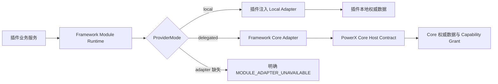
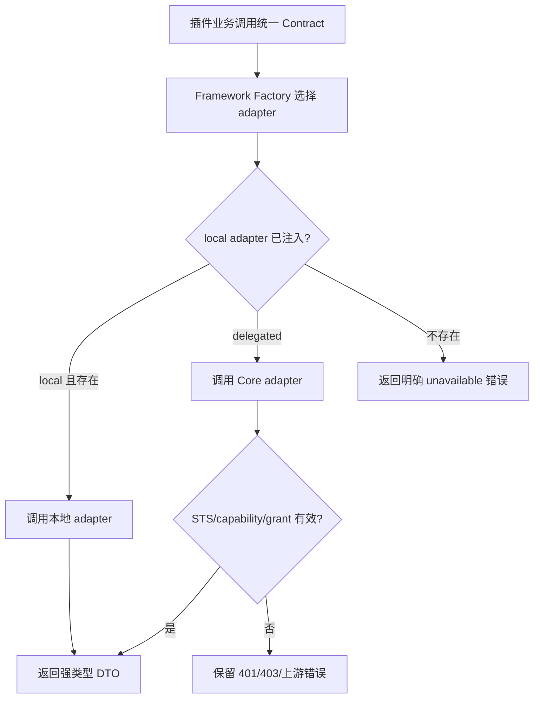
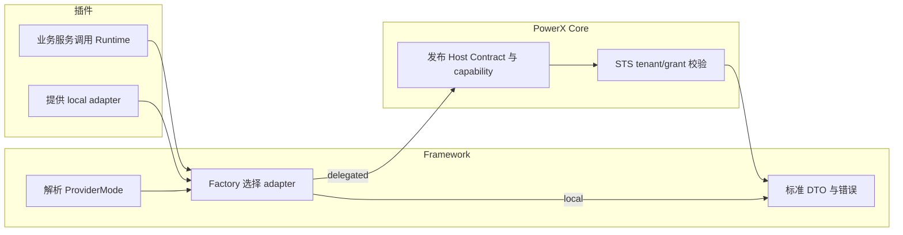

# Framework 双模式业务模块规范

本文只维护架构约束，不维护独立完成状态表或第二套教程。插件统一从 [Framework 业务模块接入指南（local / delegated）](../features/009-consume-powerx-capability/guide.md)接入，包含 13 类 contract、构造入口、最小能力声明、可编译示例与逐项验收。

## 1. 功能背景与目标

PowerX 插件既可独立运行，也可安装到 PowerX Core。业务代码不能因运行位置不同而分别读取本地表、拼接 Core URL 或自行选择 Gateway 调用。本规范定义唯一的双模式边界：插件只调用 Framework 模块 Runtime；Runtime 根据可信 `ProviderMode` 选择 adapter。

本文是 IAM、Knowledge、Customer、Media、AI、Agent、Capability Registry、Skills、Notifications 等业务模块的共同规范。typed Core client 存在不代表模块已经完成双模式支持。

## 2. 角色与适用范围

| 角色 | 责任 |
|---|---|
| 插件业务开发者 | 只依赖模块 contract/Runtime，不判断模式。 |
| 插件 adapter 开发者 | 为 local 模式实现并注入 local adapter；本地数据由插件维护。 |
| Framework 维护者 | 定义 DTO、Factory、错误语义、装配验证与跨模式合同测试。 |
| PowerX Core 维护者 | 为 delegated adapter 发布 Host Contract、capability、STS grant、租户隔离及稳定错误。 |

不适用于 wsbus、scheduler、taskbus 等运行时基础设施；它们是 Framework Runtime 本身，不是可切换的业务数据模块。

## 3. 整体架构与模块关系



模块 Factory 只接受 bootstrap 解析的可信 ProviderMode。业务请求不得覆盖 tenant 或 mode；普通业务入口不能允许用户自由指定 capability ID 或 Core endpoint。受控 Capability Lab 按自身 allowlist 诊断，不作为绕过 typed contract 的入口。

## 4. 核心流程



禁止把 `401`、`403`、对象不存在或上游失败转换为 local 查询、空集合或 UUID 显示。

## 5. 跨角色协作流程



## 6. 前置条件与依赖

1. delegated 模块必须有正式 Core Host Contract、capability 声明、tenant registration 与插件凭证 grant；`sts_direct` 或 HTTP 可达均不替代 grant。
2. local 模块必须注入符合 contract 的 adapter；未注入即失败，不能回退到 mock、Gateway 或另一套插件业务实现。
3. 所有业务对象及关联都使用 UUID；显示名仅是输入或展示数据。
4. 模块 capability 必须在 `skeleton/plugin.d/capabilities.yaml` 的 `required` 中声明，安装升级或重新启用后才会同步 STS grant。

## 7. 操作步骤

### 7.1 插件开发者：接入一个业务模块

**动作**：业务服务依赖模块 Runtime 接口，而非 adapter 或 Gateway。

**入口**：在插件 bootstrap 构造 Runtime，并把 local adapter 作为可选依赖注入。

**预期结果**：相同业务调用在 local/delegated 返回同形 DTO；仅数据来源不同。

**失败处理**：收到 `*_ADAPTER_UNAVAILABLE` 时补 adapter 或明确该部署模式不支持该功能；不得绕过 Framework。

### 7.2 Framework 维护者：新增模块

**动作**：按“contract → local adapter interface → Core adapter → Factory → bootstrap → tests”顺序实现。

**命令/入口**：

```bash
go test ./framework/backend/go/... -count=1
cd skeleton && make check-capability
```

**预期结果**：local/delegated contract tests 均通过；缺 adapter、401、403、404、上游失败均可区分。

**失败处理**：Core 没有正式 Host Contract 时，把模块标记为 `ready_for_contract`，不创建伪 client。

### 7.3 QA：安装态验证

**动作**：安装或升级插件后，执行对应 Host Contract Lab probe。

**入口**：管理端“PowerX 底座能力 → 底座合同调试”。

**预期结果**：页面显示 provider mode、capability、trace 与稳定 reason code；API-Key 成功不能替代 STS 安装态成功。

**失败处理**：403 检查 capability grant；401 检查服务身份；424/5xx 检查 Core 依赖，均不得切换 local。

## 8. 预期结果与验收标准

每个模块只有同时满足以下条件才可标记为 `implemented`：

- 强类型 contract 与 UUID DTO；
- Factory 负责模式选择；
- local contract 与注入点已定义，缺依赖明确拒绝；真实 local adapter 和数据验收由消费插件负责；
- delegated adapter 只走 Core Host Contract；
- bootstrap 已装配；
- 双模式合同测试与错误测试通过；
- manifest capability、Core grant 和覆盖台账一致。

## 9. 实现与验收状态的唯一来源

当前状态只维护在 [Core 与 Framework 覆盖台账](../../contracts/powerx-core-framework-coverage.md)，具体接入按 [主指南](../features/009-consume-powerx-capability/guide.md)。本节不复制状态表，避免将早期 Customer Auth、Media 写接口和 Agent Session 缺口误当作当前事实。

Framework 代码完成、插件 local 实现完成、真实安装态验收完成分别记录。插件未填充 local 持久化不是 Framework delegated 缺口；Skeleton 页面存在也不证明第三方插件业务已经迁移。

## 10. 代码实现映射

| 关注点 | 位置 |
|---|---|
| 可信模式解析 | `framework/backend/go/runtime/provider/mode_resolver.go` |
| IAM 双模式 Registry | `framework/backend/go/iam/adapters/registry.go` |
| Knowledge Local/Delegated Provider | `framework/backend/go/runtime/knowledge/local_provider.go`、`delegated_provider.go` |
| Customer contract 基础 | `framework/backend/go/runtime/customerfw/` |
| Media 完整 Service / 只读消费 Runtime | `framework/backend/go/runtime/media/runtime.go` |
| Agent 生命周期与独立 Session Runtime | `framework/backend/go/runtime/agent/runtime.go` |
| AI 双模式生成 Runtime | `framework/backend/go/runtime/ai/runtime.go` |
| Skills 双模式调用 Runtime | `framework/backend/go/runtime/skills/runtime.go` |
| Notifications 双模式发布 Runtime | `framework/backend/go/runtime/notifications/runtime.go` |
| Capability Registry 双模式 Runtime | `framework/backend/go/runtime/capability/runtime.go` |
| Integration Gateway 双模式 Runtime | `framework/backend/go/runtime/integration/runtime.go` |
| Plugin Runtime 双模式 Runtime | `framework/backend/go/runtime/pluginruntime/runtime.go` |
| Core typed clients | `framework/backend/go/runtime/powerx/` |
| Host Contract Lab | `framework/backend/go/runtime/powerx/hostcontract/`、`skeleton/backend/go-gin/internal/transport/http/admin/host_contract/` |

## 11. 常见问题与排障

| 现象 | 原因与处理 |
|---|---|
| delegated 返回 403 | capability 未授予；升级/重新启用插件同步 grant。 |
| local 返回 adapter unavailable | 插件没有注入 local adapter；补实现或明确本地不支持。 |
| 同一业务有两条身份/数据路径 | 插件自行判断 mode；迁移到 Framework Runtime。 |
| 页面显示 UUID | 展示层没有解析业务名称；修复业务 DTO/目录查询，不要显示 UUID。 |

## 12. 回滚、风险控制与变更记录

- 不兼容的新 contract 不增加旧协议 fallback；未完成的 delegated adapter 保持明确 unavailable。
- 回滚只允许回到旧版本的完整 Runtime，不允许恢复插件直查 Core DB。
- 2026-09-04：建立统一双模式模块规范，并以现有 IAM/Knowledge/Customer/Media 实现状态作为基线。
- 2026-09-08：统一主指南入口，删除过时状态表，分离插件 local 持久化与 Framework 完成责任。
