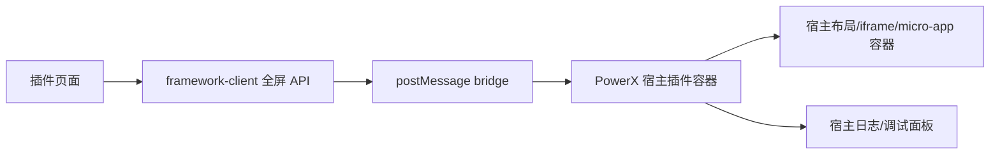
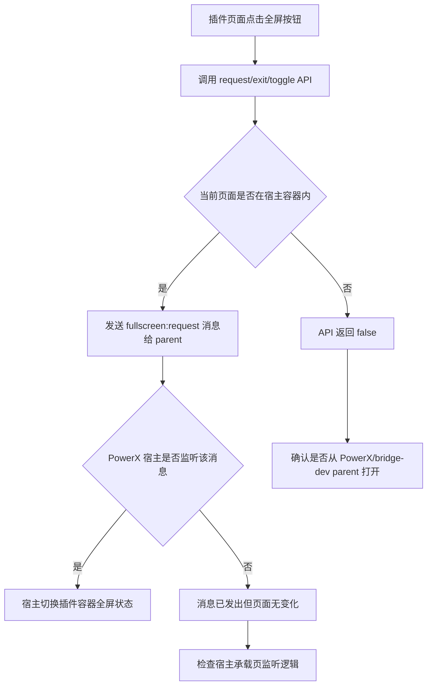
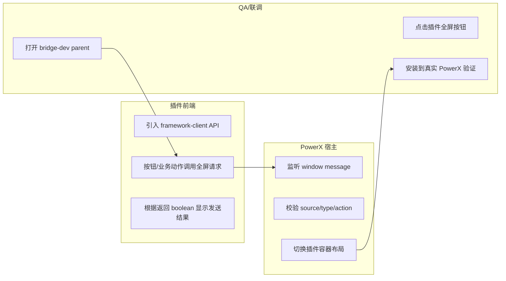

# 插件请求 PowerX 宿主全屏接入说明

## 功能背景与目标

结论：插件侧通过 `@artisan-cloud/plugin-framework-client` 向 PowerX 宿主发送全屏请求；插件不直接改宿主布局，也不在 iframe 内偷偷调用浏览器 Fullscreen API。真实是否进入全屏由 PowerX 宿主监听 `fullscreen:request` 后决定。

这个能力用于插件页面需要更大工作区的场景，例如编辑器、设计器、大屏看板、地图、流程编排器等。插件只表达意图：

- `enter`：请求进入全屏
- `exit`：请求退出全屏
- `toggle`：请求切换全屏状态

## 角色与适用范围

本文给插件前端开发、PowerX 宿主联调、QA 使用。

适用范围：

- Nuxt 插件前端
- iframe 承载插件
- 后续 micro-app 承载插件时也可以复用同一消息协议

不适用范围：

- 插件后端接口
- 浏览器原生 `requestFullscreen()` 的直接封装
- 宿主侧最终布局方案，宿主需要按 PowerX 自己的页面结构实现

## 整体架构与模块关系



代码落点：

- 插件侧 API：`framework/frontend/nuxt/framework-client/bridge.ts`
- 插件侧导出：`framework/frontend/nuxt/framework-client/index.ts`
- skeleton re-export：`skeleton/web-admin/nuxt/app/bridge/powerx-bridge-client.ts`
- 本地验证父页：`skeleton/web-admin/nuxt/app/pages/bridge-dev/parent.vue`
- 本地验证插件页：`skeleton/web-admin/nuxt/app/pages/bridge-dev/plugin.vue`

## 核心流程



## 跨角色协作流程



## 前置条件与依赖

插件侧需要能访问 framework-client 导出。skeleton 内推荐从本地 bridge re-export 引入：

```ts
import {
  exitPowerXHostFullscreen,
  requestPowerXHostFullscreen,
  togglePowerXHostFullscreen,
} from '~/bridge/powerx-bridge-client'
```

真实 PowerX 验证需要宿主承载页已经实现 `fullscreen:request` 监听；否则插件侧只能证明消息发送成功，页面不会真正全屏。

## 操作步骤

### 场景一：插件页面接入全屏按钮

动作：在需要全屏的插件页面中调用 framework-client API。

示例：

```vue
<script setup lang="ts">
import { useRoute } from '#imports'
import {
  exitPowerXHostFullscreen,
  requestPowerXHostFullscreen,
  togglePowerXHostFullscreen,
} from '~/bridge/powerx-bridge-client'

const route = useRoute()
const pluginId = 'com.powerx.plugins.base'
const instanceId = 'default'

function enterFullscreen() {
  return requestPowerXHostFullscreen(pluginId, {
    instanceId,
    route: route.fullPath,
    reason: 'workspace',
  })
}

function exitFullscreen() {
  return exitPowerXHostFullscreen(pluginId, {
    instanceId,
    route: route.fullPath,
    reason: 'workspace',
  })
}

function toggleFullscreen() {
  return togglePowerXHostFullscreen(pluginId, {
    instanceId,
    route: route.fullPath,
    reason: 'workspace',
  })
}
</script>
```

预期结果：

- 页面在 PowerX 宿主 iframe/micro-app 内运行时，API 返回 `true`，表示消息已发送给 parent。
- 页面单独打开、没有宿主容器时，API 返回 `false`。

失败处理：

- 返回 `false`：确认页面是否从 PowerX 或 `/bridge-dev/parent` 打开。
- 返回 `true` 但没有全屏：确认 PowerX 宿主是否已经实现 `fullscreen:request` 监听。

### 场景二：本地二层验证

动作：启动 skeleton Nuxt，然后打开宿主模拟页。

命令：

```bash
cd skeleton/web-admin/nuxt
npm run dev
```

入口：

```text
http://127.0.0.1:3131/bridge-dev/parent
```

预期结果：

- 页面中 iframe 加载 `/bridge-dev/plugin`。
- 点击插件页的“请求全屏 / 退出全屏 / 切换全屏”按钮。
- 父页日志出现 `source:"powerx-plugin"`、`type:"fullscreen:request"`。
- 父页 iframe 高度和状态发生变化。

失败处理：

- iframe 没加载：确认 Nuxt 服务是否在 `3131`。
- 日志没有 `fullscreen:request`：检查插件页是否从 parent 页打开，不要单独打开 `/bridge-dev/plugin`。

### 场景三：安装到真实 PowerX 测试

动作：把插件安装/加载到 PowerX，进入需要全屏的插件页面，点击插件侧全屏入口。

预期结果：

- 插件侧 API 返回 `true`。
- PowerX 宿主收到消息：

```json
{
  "source": "powerx-plugin",
  "type": "fullscreen:request",
  "action": "toggle",
  "pluginId": "com.powerx.plugins.base",
  "instanceId": "default",
  "route": "/your/plugin/route",
  "reason": "workspace"
}
```

- 宿主隐藏或压缩自己的 header/sidebar，并把对应插件容器切到全屏展示。
- 再次调用 `exit` 或 `toggle` 后恢复原布局。

失败处理：

- 插件侧返回 `true` 但宿主无变化：这是宿主未接监听或未按 `pluginId/instanceId` 找到容器。
- 宿主收到消息但切错容器：检查宿主侧插件实例映射逻辑。
- 退出后布局没恢复：检查宿主侧是否保存了进入全屏前的布局状态。

## 宿主侧协议要求

宿主侧应监听插件消息：

```ts
window.addEventListener('message', (event) => {
  const data = event.data
  if (data?.source !== 'powerx-plugin') return
  if (data.type !== 'fullscreen:request') return

  // data.action: 'enter' | 'exit' | 'toggle'
  // data.pluginId / data.instanceId / data.route / data.reason
  // 根据插件实例找到对应 iframe 或 micro-app 容器，然后切换宿主布局
})
```

安全要求：

- 真实宿主不要无条件信任 `*` 来源，应结合插件注册信息校验 `event.origin`。
- 宿主应按 `pluginId`、`instanceId` 定位容器，不要直接操作当前页面里第一个 iframe。
- 宿主应提供退出全屏路径，例如 ESC、宿主工具栏按钮或插件调用 `exit`。

## 预期结果与验收标准

插件侧验收：

- `requestPowerXHostFullscreen(pluginId, options)` 能发送 `action:"enter"`。
- `exitPowerXHostFullscreen(pluginId, options)` 能发送 `action:"exit"`。
- `togglePowerXHostFullscreen(pluginId, options)` 能发送 `action:"toggle"`。
- 无宿主容器时返回 `false`，不静默伪装成功。

本地联调验收：

- `/bridge-dev/parent` 能收到完整 payload。
- 父页能根据 action 切换 iframe 展示状态。

真实 PowerX 验收：

- 插件安装到 PowerX 后，全屏请求能被宿主监听到。
- 宿主只切换目标插件实例容器。
- 进入、退出、切换三种动作都能恢复到正确布局。

## 代码实现映射

| 行为 | 文件 |
| --- | --- |
| 定义 `PowerXFullscreenAction` 和 payload | `framework/frontend/nuxt/framework-client/bridge.ts` |
| 提供 `requestFullscreen/exitFullscreen/toggleFullscreen` class 方法 | `framework/frontend/nuxt/framework-client/bridge.ts` |
| 提供函数式 API | `framework/frontend/nuxt/framework-client/bridge.ts` |
| 对外导出 API 和类型 | `framework/frontend/nuxt/framework-client/index.ts` |
| skeleton 插件侧 re-export | `skeleton/web-admin/nuxt/app/bridge/powerx-bridge-client.ts` |
| 本地宿主模拟监听 | `skeleton/web-admin/nuxt/app/pages/bridge-dev/parent.vue` |
| 本地插件调用示例 | `skeleton/web-admin/nuxt/app/pages/bridge-dev/plugin.vue` |

## 常见问题与排障

### API 返回 `false`

说明当前页面没有可用 parent，通常是直接打开了插件页面。请从 PowerX 宿主或 `/bridge-dev/parent` 打开。

### API 返回 `true`，但页面没变化

说明插件消息已经发给 parent，但真实宿主可能还没实现 `fullscreen:request` 监听，或者监听到了但没有切换容器样式。

### 本地模拟页能全屏，PowerX 里不能

这说明插件侧 bridge 链路是通的，问题在真实 PowerX 宿主承载页。检查宿主是否过滤了 `event.origin`、是否识别 `source:"powerx-plugin"` 和 `type:"fullscreen:request"`。

### 要不要直接调用浏览器 Fullscreen API

不要。插件运行在 iframe/micro-app 里，直接调用浏览器 Fullscreen API 只能影响插件内部文档，不能可靠控制 PowerX 宿主 header/sidebar/容器布局，也会绕过宿主权限和状态管理。

## 回滚与风险控制

插件侧回滚方式：

- 移除页面里对 `requestPowerXHostFullscreen`、`exitPowerXHostFullscreen`、`togglePowerXHostFullscreen` 的调用。
- 保留 framework-client API 不影响既有主题、语言、token bridge。

宿主侧风险控制：

- 全屏状态应绑定到具体插件实例。
- 路由切换、插件卸载、iframe 销毁时应自动退出该实例的全屏状态。
- 宿主应记录收到的 `pluginId`、`instanceId`、`action`，方便联调定位。

## 变更记录

| 版本 | 日期 | 说明 |
| --- | --- | --- |
| 0.1 | 2026-07-19 | 新增插件请求 PowerX 宿主全屏接入说明 |
