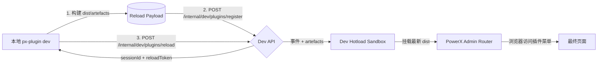

# Go CLI 热加载与发布指南

本指南面向 PowerX 插件开发者，说明如何使用 `px-plugin` CLI 进行 **发布（package/publish/install）** 与 **Dev 热加载（dev --watch）**。重点回答：什么时候用 package/publish、什么时候用 dev、热加载如何落地到 PowerX Dev Sandbox，以及常见命令/排障。

---

## 1. 概览

| 命令 | 作用 | 说明 |
|------|------|------|
| `px-plugin package` | 本地构建 artefacts | 将前端/后端/dist + metadata 写入 `<plugin>/.px-plugin/build/`，不会触碰 PowerX 宿主。 |
| `px-plugin publish` | 向 PowerX Registry 上传包 | 根据你在 `px auth`/配置文件中指定的 PowerX Registry 基址，把包 POST 到该实例；该实例的 Marketplace/插件管理后台随后会显示“待审核版本”供管理员处理。 |
| PowerX 安装/启用 | 在宿主后台审批、安装、启用 | 管理员通过 PowerX UI 选择 publish 上来的版本或上传本地包，写入 `backend/plugins/installed`、更新菜单/权限。 |
| `px-plugin dev` | 热加载/快速预览 | 针对已安装启用的插件，把本地构建 artefacts 推到 Dev API Sandbox，不改宿主文件。`--watch` 可持续 reload。 |

只有安装/启用后，PowerX 的 Admin Router 才会有插件菜单。热加载是在此基础上的增量替换，不会自动生成菜单或写入 `plugins/installed`。

---

## 2. 发布链路 vs. 热加载

### 2.1 正式发布（默认流程）

1. **package** → 本地 `px-plugin package` 生成 `package.tar.gz`、manifest、hash。
2. **publish** → `px-plugin publish` 将上一步产物 POST 到当前 PowerX 实例的 Registry（接口基址/凭证来自 `px auth configure` 或 `~/.px-plugin/config.json`）。
3. **install** → PowerX 管理后台/Marketplace 看到该版本后进行安装（或管理员直接上传包），宿主写入 `backend/plugins/installed`、更新 DB。
4. **enable** → 管理员决定哪些租户能启用插件，控制菜单/权限。

### 2.2 Dev 热加载（针对已安装插件）

- `px-plugin dev` 在你的插件仓库内构建 dist，并将 artefacts 推送到 Dev API 沙盒；沙盒挂载到 `/plugins/<id>/admin/*`，浏览器通过 PowerX Admin Router 访问时会读取这些 artefacts。
- **不会** 修改宿主 `plugins/installed` 或 Registry；`--watch` 模式下 CLI 会持续上传增量结果，CTRL+C 后会话终止、沙盒回退。

---

## 3. 准备步骤

1. **构建 CLI**
   ```bash
   cd /path/to/PowerXPlugin/tools/cli
   go build -o px-plugin ./cmd/px-plugin
   # 可选：安装到 GOPATH/bin
   go install ./cmd/px-plugin
   px-plugin --version
   ```
2. **申请 mTLS**
   ```bash
   cd /path/to/PowerX/backend
   ./bin/px auth configure --api http://127.0.0.1:8077/api/v1
   ```
   > 此命令会把证书写入 `~/.powerx/cli/`，也可以在 `~/.px-plugin/certs/` 中手动维护。`--api` 必须与后续 `px-plugin dev --dev-api` 匹配。
3. **写入 `~/.px-plugin/config.json`**
   ```bash
   cd /path/to/your-plugin
   px-plugin dev --auth \
     --tenant default \
     --dev-api http://127.0.0.1:8077/api/v1 \
     --dev-api-token <PowerX_API_TOKEN> \
     --mtls-cert ~/.powerx/cli/client.crt \
     --mtls-key  ~/.powerx/cli/client.key \
     --mtls-ca   ~/.powerx/cli/ca.crt
   ```
   > `--auth` 会把 Dev API baseUrl、tenant、certPath、API token 等默认值写入 `~/.px-plugin/config.json`，后续 `px-plugin dev` 无需重复传参。

   生成的配置可按需补充 `publishApi`，如下：
   ```json
   {
     "devApi": {
       "baseUrl": "http://127.0.0.1:8077/api/v1",
       "apiKey": "<dev-api-token>",
       "certPath": "/Users/<you>/.px-plugin/certs/client.crt"
     },
     "publishApi": {
       "baseUrl": "http://127.0.0.1:8077/api/v1",
       "apiKey": "<registry-token>"
     }
   }
   ```
   Publish API 字段同样可由环境变量覆盖：`PX_PUBLISH_API_BASE`、`PX_PUBLISH_API_TOKEN`。缺失时 `px-plugin publish` 会立即报错并提示补齐配置。
4. **（可选）自检**
   ```bash
   px-plugin doctor --check-devapi --entry .
   px-plugin doctor --check-mtls
   ```

---

## 4. 发布操作步骤（package → publish → install）

热加载只负责“快速预览”，正式上线仍需走完整的发布链路。以下以单体插件仓库为例，列出每一步的命令/动作：

### 4.1 本地打包（package）

1. 确认 manifest、能力契约（capabilities）、lint/test 均通过；必要时运行 `make lint && make test`。
2. 在插件仓库根目录执行：
   ```bash
   px-plugin package \
     --entry . \
     --output .px-plugin/build
   ```
   > 默认会在 `<plugin>/.px-plugin/build` 下生成 `package.tar.gz`、`metadata.json`、`manifest.json`、hash/signature 等 artefact。可根据需要调整 `--entry`、`--output` 或 `--channel` 等参数（具体以 CLI 版本为准）。
3. 用 `ls .px-plugin/build`、`jq` 等命令检查 artefact 是否包含前端 dist、后端 bin、manifest、RBAC、Telemetry 结构。

### 4.2 上传到 PowerX Registry（publish）

1. 确保 `px auth configure` 或 `~/.px-plugin/config.json` 中已经配置了 publish/registry 基址与 Token（例如 `publishApi.baseUrl`、`publishApi.apiKey`，或环境变量 `PX_PUBLISH_API_BASE`、`PX_PUBLISH_API_TOKEN`）。
2. 执行：
   ```bash
   px-plugin publish \
     --tenant <tenant-uuid> \
     --entry . \
     --channel dev \
     --notes "feat: 支持新的审批流"
   ```
   - CLI 会读取上一步的 `.px-plugin/build/package.tar.gz` 与 metadata，并把 artefact POST 到 **当前配置的 PowerX Registry**。
   - Registry 接收后，该实例的 Marketplace/插件管理后台会出现“待审核版本”，包含版本号、channel、提交备注、hash 等。
3. 查看输出中的 `publishId` 或回执链接，确保上传成功；如失败，按 CLI 提示修复（常见原因：Token 过期、未配置 publishApi.baseUrl）。

### 4.3 在 PowerX 后台安装/启用

1. 登录 PowerX Admin（宿主环境），打开 **插件管理 / Marketplace**：
   - 如果走 publish：在“待审核版本”中找到刚提交的版本 → 审核通过 → 指定安装租户。
   - 如果走手动导入：点击 “上传包”/“本地安装”，选择 `.px-plugin/build/package.tar.gz`。
2. 完成安装后，版本会出现在 `plugins/installed`、数据库 registry 中；管理员可在 UI 中启用/禁用、绑定租户。
3. **必须完成这一步，插件菜单/权限才会存在**。后续的 `px-plugin dev`/热加载都是在此基础上替换沙盒资源。

（可选）安装完成后，可在 PowerX Admin 中打开插件页面确认基础功能正常，再开始热加载调试。

---

## 5. 热加载工作机制



1. CLI 在本地构建，整理出 manifest/changedFiles/artifacts。
2. 注册会话 → Dev API 返回 `sessionId` + `reloadToken`（JWT）。
3. 上传 artefact → Dev API 记录事件，通知 Dev Sandbox 解包到隔离目录。
4. Admin Router 通过插件 router 把 `/plugins/<id>/admin/*` 代理到对应的 Sandbox。浏览器刷新即可看到最新 UI/后端。
5. `--watch` 时循环执行步骤 1~3；`--once` 在 reload 成功后自动 `DELETE /register/{session}`，session 状态变为 `terminated`（正常行为）。

---

## 6. 实操流程（热加载）

1. **确认插件已安装/启用**：只有 PowerX 管理端安装并启用后，系统才有插件菜单/权限。热加载只替换菜单后的资源。
2. **运行命令**
   ```bash
   # 单次构建 + reload + stop
   px-plugin dev --tenant default

   # 持续 watch
   px-plugin dev --watch --tenant default

   # 恢复已有 session（默认单次；如需 watch 再加 --watch）
   px-plugin dev --resume <session-id>
   px-plugin dev --resume <session-id> --watch
   ```
3. **管理会话/日志**
   ```bash
   px-plugin dev --list-sessions                # 仅 active/pending
   px-plugin dev --list-sessions --list-status all
   px-plugin dev --logs <session-id> --logs-level debug
   px-plugin dev --force-stop <session-id>
   px-plugin dev --delete-session <session-id>
   px-plugin dev --clear-sessions --clear-sessions-force
   ```
   - `--list-sessions` 默认隐藏 terminated，若需要查看历史记录请加 `--list-status all`。
   - `--force-stop`/`--delete-session` 会调用 Dev API 删除远端会话；`--clear-sessions` 会批量删 terminated，会在输出中注明真实删除数量。
4. **浏览器验证**：打开 PowerX Admin 的插件菜单或 Dev Console，访问顺序为：浏览器 → PowerX Admin → 插件 router → Dev Sandbox → 最新 artefact。

---

## 7. 常用命令速查

| 命令 | 说明 |
|------|------|
| `px-plugin package --entry .` | 在 `<plugin>/.px-plugin/build/<timestamp>/` 下生成 `package.tar.gz`、`metadata.json`、payload；支持 `--skip-frontend`、`--skip-backend`。 |
| `px-plugin publish --channel <name>` | 读取最近一次 package 产物并上传到 `publishApi.baseUrl`；需要在 `~/.px-plugin/config.json` 或 `PX_PUBLISH_API_BASE/_TOKEN` 中配置凭据。 |
| `px-plugin dev --tenant <id>` | 默认单次模式（register → build → reload → delete → exit）。退出后 session 状态为 terminated。 |
| `px-plugin dev --watch --tenant <id>` | 持续 watch，session 保持 active，Ctrl+C 触发 DELETE 并退出。 |
| `px-plugin dev --resume <session-id> [--watch]` | 复用 Dev API 上的 session（需与原插件目录匹配）。默认单次；如需 watch 再加 `--watch`。 |
| `px-plugin dev --list-sessions [--list-status all]` | 查看远端会话。默认只显示 active/pending。 |
| `px-plugin dev --force-stop <session-id>` | 调用 Dev API 直接 DELETE，适合删除残留 session。 |
| `px-plugin dev --clear-sessions --clear-sessions-force` | 批量删除（默认 terminated；`--force` 会传 `status=all&force=true&confirm=true`）。 |
| `px-plugin dev --logs <session-id>` | 订阅指定会话的 SSE 日志，可配合 `--logs-level` 和 `--logs-file`。 |
| `px-plugin doctor` | 检查 Go/Node、Dev API、mTLS、watch 限额等。 |

所有命令均会自动读取以下配置来源（优先级：命令行 > 环境变量 > `~/.px-plugin/config.json`）：
- `dev.entryPath`、`dev.tenant`
- `devApi.baseUrl`、`devApi.apiKey`（Publish/Dev API Token）
- `dev.ignore[]`、`watch.maxFiles`
- `security.certDir` / `devApi.certPath/keyPath/caPath`

---

## 8. FAQ

- **为什么 `--list-sessions` 看到 terminated？** 单次模式在 reload 完成后会自动 `DELETE /register/{session}`，session 状态变为 terminated 是正常现象，说明 CLI 已经释放会话。
- **为什么 Admin 菜单里没有插件？** 菜单来源于 plugin manager 的安装记录。必须先完成 install/enable，热加载无法生成菜单。
- **热加载会写 `backend/plugins/installed` 吗？** 不会。沙盒只暂存 artefacts；退出或 session 结束后会回退到安装版本。要更新正式版本需要 package/publish/install。
- **如何彻底清理会话？** 使用 `px-plugin dev --clear-sessions --clear-sessions-force`，CLI 会调用 Dev API 的批量删除接口，并在本地清除缓存。
- **`Dev API did not return reload token` 警告？** 表示 Dev API 返回的 register 响应缺少 `reloadToken`。CLI 会尝试用 `devApi.apiKey` 兜底，但仍建议修复后端确保 `sessionId`/`reloadToken` 按规范返回（PowerX Dev API 默认返回 JWT）。

---

## 9. 术语对照

| 名称 | 说明 |
|------|------|
| **Session** | CLI 与 Dev API 之间的热加载会话，包含 `sessionId`、`reloadToken`，记录在 `dev_hotload_sessions`。 |
| **Dev Sandbox** | PowerX 在 Dev 环境中启动的隔离沙盒，负责接收 artefacts、挂载 `/plugins/<id>/admin/*`。不会影响宿主安装目录。 |
| **Plugin Registry** | PowerX 宿主的插件发布/版本管理服务。`px-plugin publish` 将 package 上传到这里，Marketplace/插件管理后台据此展示待审核版本。 |
| **Marketplace / 插件管理后台** | PowerX UI 中的安装/启用界面，管理员在此操作 install/enable/disable。publish 不会跳过这一步。 |

---

通过以上流程，你可以在一次正式安装后，利用 `px-plugin dev --watch` 在本地高速迭代，而无需频繁 package/publish/install；当准备交付时，再回到 package → publish → install → enable 的正式链路即可。
