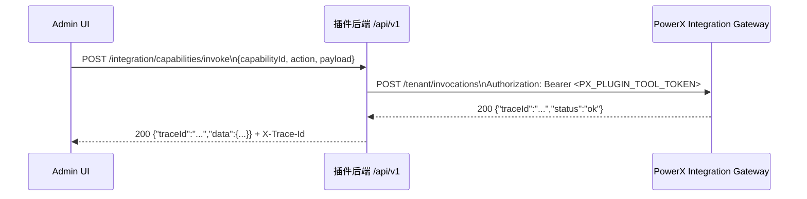

# Standalone / Delegated 总览

本目录提供 Standalone / Delegated 的统一说明与各技术栈的启动入口。

## 快速入口

- Go Gin 后端：`docs/guides/develop/standalone/gin.md`
- Python FastAPI 后端：`docs/guides/develop/standalone/fastapi.md`
- Nuxt 前端：`docs/guides/develop/standalone/nuxt.md`
- NextJS 前端：`docs/guides/develop/standalone/next.md`

下文保留原 Standalone / Delegated 说明（包含宿主模式、代理与排障）。

## 1. Standalone 模式

### 1.0 环境预检

在启动 Skeleton 前，先确认基础工具链就绪，并跑一次“后端 + 前端”自检命令：

| 工具 | 要求 | 检查命令 |
|------|------|----------|
| Go | 1.24+ | `go version`（期望输出 go1.24.x） |
| Node.js | 20.x | `node -v` |
| npm | 9.x+ | `npm -v` |
| Playwright 依赖 | 由 `npm install` 自动安装 | `npm --prefix skeleton/web-admin/nuxt run test:e2e -- --help` |

```bash
# 验证 backend 可以迁移 + 运行
cd skeleton/backend/go-gin
go run ./cmd/database/main.go setup
go run ./cmd/plugin &
PID=$!
curl -sSf http://127.0.0.1:8078/healthz && kill $PID

# 验证 web-admin 可以启动（Nuxt）
cd ../../web-admin/nuxt
npm install
npm run dev -- --help >/dev/null
```

若任一命令失败（例如 Go 版本过低或 npm 依赖缺失），请先升级本地环境再继续下面的步骤。

### 1.1 Skeleton 多栈目录结构

```
skeleton/
  backend/
    go-gin/
    python-fastapi/
  web-admin/
    nuxt/
    next/
  Makefile
  plugin.yaml
  make-files/
```

说明：

- 默认完整实现仍为 `backend/go-gin` + `web-admin/nuxt`。
- `python-fastapi` 与 `next` 当前为可运行最小空壳，用于技术栈接入与组合验证。
- 不同后端/前端可以自由组合，但功能对齐以 Go+Nuxt 为基准逐步迁移。

### 1.2 目录结构与分层

```
backend/
└─ internal/
   ├─ bootstrap/         # 配置、依赖注入、进程生命周期
   ├─ config/            # YAML/环境变量解析
   ├─ entity/
   │  ├─ models/{domain} # 领域实体、值对象
   │  └─ repository/{domain} # 仓储接口与默认实现
   ├─ services/{domain}  # 应用服务，编排业务用例
   ├─ transport/
   │  ├─ http/admin/{domain}   # Web Handler，DTO 到实体转换
   │  └─ grpc/...              # gRPC Handler（可选）
   ├─ manifestx/         # 插件清单（菜单、权限）
   ├─ router/            # 注册 Gin 引擎、PowerX 框架路由
   ├─ observability/     # 指标、日志、链路追踪
   ├─ middleware/        # 跨域、RBAC、审计中间件
   └─ shared/            # 共用工具、常量
```

分层职责：

- **传输层** (`transport/http|grpc`)：只做协议转换，调用同域的服务层。
- **服务层** (`services/{domain}`)：封装业务流程，依赖实体与仓储接口。
- **领域层** (`entity/models` + `entity/repository`)：定义聚合根、值对象及仓储抽象。
- **基础设施**（仓储默认实现、DB、外部 API）：位于 `entity/repository/{domain}` 与 `transport` 的适配层。

Manifest 通过 `internal/manifestx/manifest.go` 暴露插件 ID、菜单、权限，供宿主读取。

### 1.3 启动流程

Skeleton 入口位于 `cmd/plugin/main.go`，关键步骤如下：

1. 读取配置：`config.Load()` 支持 `CONFIG_PATH` / `POWERX_PLUGIN_CONFIG_DIR`。
2. 初始化依赖：`bootstrap.BootstrapPlugin` 注入数据库、缓存、PowerX gRPC 客户端等。
3. 构建 Gin 引擎：`internal/router.NewRouter` 装配中间件与业务路由。
4. 挂载框架路由：
   ```go
   fwrouter.AttachHTTPServer(app)
   fwrouter.RegisterFrameworkRoutes(app)
   fwrouter.RegisterPluginRoutes(app, func(r bootstrap.Router) {
     httpserver.RegisterGinRoutes(r, engine)
   })
   ```
5. 注册 Manifest：`manifest.Register(app, manifestx.Plugin())`。
6. 启动 HTTP/gRPC、周期任务等，并监听退出信号安全关闭。

### 1.4 本地运行

```bash
# 1. （可选）复制示例配置
cp skeleton/backend/go-gin/etc/config.example.yaml skeleton/backend/go-gin/etc/config.yaml
#    指向默认的 skeleton/.cache/powerxplugin.db（需提前创建目录）
#    若放在其他目录，请通过 CONFIG_PATH 指向该目录

# 2. 初始化数据库（setup = migrate + seed）
cd skeleton/backend/go-gin
export POWERX_PROXY=0
export POWERX_RBAC_DELEGATE=false
export PLUGIN_IAM_TENANT_KEY=00000000-0000-0000-0000-000000000001
export PLUGIN_IAM_TENANT_NAME="Local Tenant"
export PLUGIN_IAM_ADMIN_EMAIL=admin@local.test
export PLUGIN_IAM_ADMIN_PASSWORD='S3cret!!'
go run ./cmd/database/main.go setup
#    上述环境变量可选；若未设置，系统会使用 admin@local.test / S3cret!! 等默认值（仅限本地环境，生产务必覆盖）
#    本地接口也会强制校验 Authorization。若要临时跳过，可设置 POWERX_AUTH_OPTIONAL=true（仅限调试）。
#    如果需要单独执行，可替换为：
#    go run ./cmd/database/main.go migrate
#    go run ./cmd/database/main.go seed

# 3. 启动后端（默认使用 SQLite 文件 powerxplugin.db 保存数据）
go run ./cmd/plugin

# 4. 访问健康检查
curl http://127.0.0.1:8078/healthz

# 5. 启动前端管理端（使用本地管理员登录）
cd ../../web-admin/nuxt && npm install && npm run dev

# 6. （可选）运行本地 IAM E2E
cd ../../web-admin/nuxt
PLAYWRIGHT_LOCAL_IAM=1 \\
PLAYWRIGHT_LOCAL_EMAIL=admin@local.test \\
PLAYWRIGHT_LOCAL_PASSWORD='S3cret!!' \\
npm run test:e2e -- auth-local
```

常用调试端口：

- 后端 HTTP: `8078`（可通过 `PORT` 环境变量覆盖）
- 后端 gRPC: `8079`（通过 `POWERX_GRPC_PORT` 覆盖）
- 管理端 Nuxt: 默认 `3131`（冲突时自动寻找可用端口）
- FastAPI 后端: 默认 `8277`（`bash skeleton/backend/python-fastapi/scripts/dev.sh`）
- Next 管理端: 默认 `3231`（`npm --prefix skeleton/web-admin/next run dev`）

#### 1.3.1 FastAPI / NextJS 占位骨架

如果需要验证 FastAPI 或 NextJS 的最小骨架，可按下列方式启动：

```bash
# FastAPI backend
cd skeleton/backend/python-fastapi
python -m venv .venv
. .venv/bin/activate
python -m pip install -U pip
pip install -r requirements.txt
bash scripts/dev.sh

# NextJS admin
cd ../../web-admin/next
npm install
npm run dev
```

> FastAPI 默认 `8277`，NextJS 默认 `3231`。二者目前为最小空壳，用于技术栈接入与组合验证。

#### 1.4.1 模拟 `_p/<plugin-id>/admin` 访问

要在本地复刻宿主 iframe（`/_p/<plugin-id>/admin/**`），目前推荐直接让 Nuxt 以 `_p` 为基准运行。Skeleton 的 Go 进程不会自动把 `/_p/**` 代理到前端，因此如果没有外部反代，就必须在 Nuxt 启动参数里切换到“宿主模式”。

1. **前端开启宿主模式**：启动 dev server 前设置 `POWERX_PROXY=1`（或 `NUXT_PUBLIC_INSIDE_POWERX=1`）。Nuxt 会将 `app.baseURL` 与 `runtimeConfig.public.pluginAdminBase` 设为 `/_p/<plugin-id>/admin/`。为了避免本地 Dev Server 将 `_p/<plugin-id>/api` 当成静态路由，`runtimeConfig.public.apiBaseUrl` 会在开发模式下自动退回到 `/_p/<plugin-id>/api/v1`，从而始终命中 Vite 的代理。
2. **补齐 Vite 代理（已在 `skeleton/web-admin/nuxt/nuxt.config.ts` 内置）**：配置依赖以下环境变量，便于在需要时修改目标地址：
   - `NUXT_DEV_API_PROXY`：HTTP 代理目标（默认 `http://localhost:8078`）
   - `NUXT_DEV_WS_PROXY`：WebSocket 代理目标（默认 `ws://127.0.0.1:8078`）

   对应配置代码如下，`/_p/${pluginId}/api` 的条目仅在 `POWERX_PROXY=1` 时注入：
   ```ts
   const pluginId = 'com.powerx.plugin.base'
   const devApiProxyTarget = process.env.NUXT_DEV_API_PROXY || 'http://localhost:8078'
   const devWsProxyTarget = process.env.NUXT_DEV_WS_PROXY || 'ws://127.0.0.1:8078'

   const INSIDE_POWERX = process.env.POWERX_PROXY === '1'
   const devProxy: Record<string, any> = {
     '/api': { target: devApiProxyTarget, changeOrigin: true, ws: true }
   }
   if (INSIDE_POWERX) {
     devProxy[`/_p/${pluginId}/api`] = { target: devApiProxyTarget, changeOrigin: true }
   }
   ```
   如此前端直接访问 `http://localhost:3131/_p/com.powerx.plugin.base/admin/templates/crud` 时，所有 API/WS 请求都会被转发到本地 8078 实例，不会 404 或触发 CORS。
   同时在宿主模式下会自动关闭 Nuxt `appManifest`，避免 `manifest-route-rule` 在 `_p` 前缀下无法匹配路由而抛错。
3. **后端保持默认**：`POWERX_PROXY=0 go run ./cmd/plugin`，只需暴露 `/api/v1/**`。由于前端代理会把 `/_p/...` 请求映射回本地接口，后端无需额外改动。

配置完上述环境后，直接访问 `http://localhost:3131/_p/<plugin-id>/admin/...` 即可模拟宿主 iframe，Bridge/CTX/主题等行为与宿主一致。

#### 1.4.2 Standalone / Delegated 环境变量速查

| 变量 | 默认值 | 说明 |
|------|--------|------|
| `POWERX_PROXY` | `0` | `1` 表示运行在宿主 iframe 下；本地 Standalone 必须为 `0`，否则“组织与权限”菜单会隐藏。 |
| `POWERX_RBAC_DELEGATE` | `false` | 强制委托宿主 IAM；即使 `POWERX_PROXY=0` 也会禁用本地 IAM API。 |
| `POWERX_CORE_ENDPOINT` | `http://localhost:8077` | Delegated 模式访问宿主 Core API 的地址。 |
| `POWERX_AUTH_TOKEN` | N/A | 插件后端调用宿主 `/admin/user/auth/*` 时使用的服务 Token。 |
| `POWERX_AUTH_OPTIONAL` | `false` | 仅限调试。设为 `true` 时可跳过后端 Token 校验，不可用于生产。 |
| `PLUGIN_IAM_TENANT_KEY` / `NAME` | 示例值见 Quickstart | Standalone 运行时默认租户唯一键与名称。 |
| `PLUGIN_IAM_ADMIN_EMAIL` / `PASSWORD` | `admin@local.test` / `S3cret!!` | 本地管理员初始凭据，`setup` 会读取并写入数据库。 |
| `NUXT_PUBLIC_INSIDE_POWERX` | `0` | 前端 runtime 判定宿主模式用，`1` 时 baseURL 调整为 `/_p/<pluginId>/admin/`。 |
| `NUXT_PUBLIC_POWERX_PROXY` | `0` | 与上类似，供前端组件/Bridge 判断当前运行模式。 |
| `NUXT_DEV_API_PROXY` / `NUXT_DEV_WS_PROXY` | `http://localhost:8078` / `ws://127.0.0.1:8078` | Vite 代理目标，宿主模式下会额外注入 `/_p/<pluginId>/api`。 |

> 后端运行模式与配置加载说明：
>
> - **配置文件位置**：统一使用 `skeleton/backend/.env`（示例见 `skeleton/backend/.env.example`）。Go Gin 与 FastAPI 都会自动读取该文件。
> - **环境变量覆盖**：`.env` 会覆盖进程环境变量与 `config.yaml`，因此建议将 `POWERX_PROXY`、`IAMMode`、`PX_GATEWAY_*` 统一写在这里，避免 GoLand Run Config 里残留旧值。
> - **宿主模式（PowerX Core）**：必须同时设置 `POWERX_PROXY=1` **且** `PX_GATEWAY_BASE_URL/PX_TOOL_TOKEN`。
>   - WS Bus runtime 调试接口的租户优先从入站 token/上下文 `tid` 推导；若未携带，再回退 `PX_TOOL_TOKEN.tid`。
>   - 若两者都缺失 `tid`，WS Bus/Capability 调用会失败。
>
> **IAMMode / POWERX_PROXY / POWERX_RBAC_DELEGATE 优先级规则（从高到低）**：
>
> 1. `IAMMode` / `IAM_MODE`（显式指定 `delegated` 或 `local`）
> 2. `POWERX_RBAC_DELEGATE=true`（强制走宿主委派）
> 3. `POWERX_PROXY=1`（默认宿主模式）
>
> 结论：
> - 如果 `IAMMode=local`，即使 `POWERX_PROXY=1` 也会**强制本地 IAM**。
> - 如果 `IAMMode=delegated`，即使 `POWERX_PROXY=0` 也会**强制委派 IAM**。
> - 未设置 `IAMMode` 时，`POWERX_RBAC_DELEGATE=true` 会覆盖 `POWERX_PROXY`。

**完整组合速查（2x2x2）**

> 规则：`IAMMode` 的显式值优先级最高，其次 `POWERX_RBAC_DELEGATE`，最后 `POWERX_PROXY`。

| IAMMode | POWERX_PROXY | POWERX_RBAC_DELEGATE | IAM 结果 | WS/能力走向 | 典型场景 |
|---|---|---|---|---|---|
| local | 0 | false | 本地 IAM | 本地 | 纯 Standalone |
| local | 1 | false | 本地 IAM | 宿主（需 `PX_GATEWAY_*`） | **本地 IAM + 宿主联调** |
| local | 0 | true  | 本地 IAM | 本地 | 仍本地（IAMMode 覆盖） |
| local | 1 | true  | 本地 IAM | 宿主（需 `PX_GATEWAY_*`） | IAMMode 覆盖 RBAC_DELEGATE |
| delegated | 0 | false | 委派 IAM | 本地 | 仅 IAM 委派 |
| delegated | 1 | false | 委派 IAM | 宿主（需 `PX_GATEWAY_*`） | 宿主模式（标准） |
| delegated | 0 | true  | 委派 IAM | 本地 | IAMMode=delegated（显式） |
| delegated | 1 | true  | 委派 IAM | 宿主（需 `PX_GATEWAY_*`） | 宿主模式（显式） |

> 说明：WS/能力是否走宿主只由 `POWERX_PROXY=1` + `PX_GATEWAY_*` 是否完整决定，与 IAMMode 无关。

### 1.4.3 日志与内部调试路由开关（避免混淆）

为避免 `dev_mode` / `debug_mode` 混淆，建议按下面语义理解与配置：

| 配置项 | 作用 | 典型用途 |
|---|---|---|
| `logging.http_access`（或 `POWERX_HTTP_LOG`） | 是否输出 HTTP 访问日志（每个请求一条） | 看接口请求路径/状态码/耗时 |
| `logging.debug_mode`（或 `POWERX_DEBUG_MODE`） | 是否输出业务调试日志（例如 ws-bus 出站 token 来源） | 排查 token/tenant/模式决策 |
| `runtime.internal_routes_enabled`（或 `POWERX_INTERNAL_ROUTES`） | 是否注册内部调试路由（如 `/api/v1/admin/runtime/internal/ws-bus/*`） | 允许/禁止调试接口暴露 |
| `server.dev_mode`（或 `POWERX_DEV_MODE`） | 运行环境语义（开发/生产行为） | 生产安全校验、默认策略切换 |

说明：

- `gin_mode=release` 不会自动关闭 `logging.http_access`。
- 是否能访问 `/runtime/internal/*`，由 `runtime.internal_routes_enabled` 决定，而不是 `logging.debug_mode`。

### 1.4.4 WebSocket 联调步骤（本地 / 宿主）

#### A) Standalone（`local + POWERX_PROXY=0`）

1. 启动插件后端（确保 `runtime.internal_routes_enabled=true`，用于调试 publish）：

```bash
cd skeleton/backend/go-gin
POWERX_PROXY=0 IAMMode=local go run ./cmd/plugin
```

2. 准备本地管理员 token（示例变量名）：

```bash
export USER_TOKEN="<your-local-jwt>"
```

3. 连接插件 WS（唯一入口）：

```bash
wscat -c "ws://127.0.0.1:8078/api/v1/ws?authorization=Bearer $USER_TOKEN"
```

4. 在 wscat 内订阅 topic：

```json
{"type":"subscribe","topics":["template.update"]}
```

预期先收到 `ack`，随后触发 publish 时收到 `event`。

5. 通过 runtime 调试接口发布事件：

```bash
curl -X POST "http://127.0.0.1:8078/api/v1/admin/runtime/internal/ws-bus/publish" \
  -H "Authorization: Bearer $USER_TOKEN" \
  -H "Content-Type: application/json" \
  -d '{"topic":"template.update","payload":{"id":"demo","status":"running","progress":25}}'
```

> standalone 下 `register` 为 no-op，不是订阅前置条件。

#### B) 宿主联调（`local + POWERX_PROXY=1`）

1. 启动插件后端（需配置 `PX_GATEWAY_BASE_URL`、`PX_TOOL_TOKEN`）：

```bash
cd skeleton/backend/go-gin
POWERX_PROXY=1 IAMMode=local go run ./cmd/plugin
```

2. 连接 PowerX 底座 WS：

```bash
wscat -c "ws://127.0.0.1:8077/api/ws?authorization=Bearer $USER_TOKEN"
```

3. 订阅：

```json
{"type":"subscribe","topics":["template.update"]}
```

4. 调插件 runtime 接口触发 register/publish（插件会转发到底座）：

```bash
curl -X POST "http://127.0.0.1:8078/api/v1/admin/runtime/internal/ws-bus/register" \
  -H "Authorization: Bearer $USER_TOKEN" \
  -H "Content-Type: application/json" \
  -d '{"topics":["template.update"]}'

curl -X POST "http://127.0.0.1:8078/api/v1/admin/runtime/internal/ws-bus/publish" \
  -H "Authorization: Bearer $USER_TOKEN" \
  -H "Content-Type: application/json" \
  -d '{"topic":"template.update","payload":{"id":"demo","status":"running","progress":25}}'
```

预期：底座 `wscat` 收到 `event`。

### 1.4.5 WebSocket 联调失败排查速查

| 现象 | 常见原因 | 快速检查 |
|---|---|---|
| `wscat` 连接 `404` | 路径写错（插件仅支持 `/api/v1/ws`）或路由未加载 | 检查是否访问 `ws://127.0.0.1:8078/api/v1/ws`；确认后端启动日志包含 WS 路由注册 |
| 订阅后只有 `ack`，没有 `event` | `publish` 与 `subscribe` 租户不一致（`tid` 不同） | 打开 `logging.debug_mode=true`，确认日志中的 `resolved_gateway_tenant` 与 WS token `tid` 一致 |
| `permission_denied` / `topic not allowed` | 当前 token 无该 topic 的订阅权限 | 更换具备权限的 token，或先用管理员 token 验证链路 |
| `publish` 返回 200，但客户端无事件 | 发到了错误实例或错误模式链路（本地/宿主混用） | `POWERX_PROXY=0` 时应订阅 `8078 /api/v1/ws`；`POWERX_PROXY=1` 时应在底座 `8077 /api/ws` 订阅 |
| `response.Write on hijacked connection` | WS 握手被 HTTP timeout 中间件干扰 | 确认已包含“Upgrade 请求跳过 Timeout”实现（见 10 节说明） |

补充建议：

- 每次联调前先打印运行模式三元组：`IAMMode / POWERX_PROXY / POWERX_RBAC_DELEGATE`。
- 在宿主联调场景，优先验证 `register -> publish -> event` 的完整链路，再排查业务 topic 权限。

### 1.4.6 标准联调记录模板（提单/群沟通统一格式）

当出现 “连上了但收不到事件” 或 “宿主/本地结果不一致” 时，建议按下面模板提供信息，减少来回沟通：

```md
## WebSocket 联调记录

- 日期：YYYY-MM-DD HH:mm（时区）
- 环境：local / staging / prod
- 代码分支与提交：<branch> / <commit>

### 1) 运行模式
- IAMMode: local | delegated
- POWERX_PROXY: 0 | 1
- POWERX_RBAC_DELEGATE: true | false
- runtime.internal_routes_enabled: true | false

### 2) Token 与租户
- USER_TOKEN.tid: <uuid>
- PX_TOOL_TOKEN.tid: <uuid or empty>
- publish 请求体 tenant_uuid: <value or empty>

### 3) 连接与操作
- WS URL: ws://127.0.0.1:8078/api/v1/ws 或 ws://127.0.0.1:8077/api/ws
- subscribe payload: {"type":"subscribe","topics":["template.update"]}
- register 请求（如有）: <curl or screenshot>
- publish 请求: <curl or screenshot>

### 4) 实际结果
- subscribe 回包: ack / error（贴原文）
- 是否收到 event: yes / no（贴原文）
- HTTP 返回码: register=<code>, publish=<code>

### 5) 关键日志片段
- 插件日志：`WS bus gateway auth resolved` + `HTTP request completed`
- 底座日志（宿主模式）：`[ws-bus] register` / `[ws-bus] publish`
- 异常日志（如有）：`response.Write on hijacked connection` / `permission_denied`

### 6) 结论
- 预期：<一句话>
- 实际：<一句话>
- 初步判断：路径问题 / 权限问题 / 租户不一致 / 模式配置不一致
```

> ⚠️ 只有当 `POWERX_PROXY=0` **且** `POWERX_RBAC_DELEGATE` 未开启时，Web Admin 才会渲染“组织与权限”菜单与本地 IAM 页面；切换为 Delegated 后，菜单会自动隐藏，并提示管理员前往宿主 PowerX 进行组织管理。

> `skeleton/backend/go-gin/etc/` 目录内包含示例 `config.yaml` 与 `security_baseline.yaml`。默认 DSN 为 `file:../.cache/powerxplugin.db?cache=shared&_fk=1`，Loader 会把它解析成相对于 `config.yaml` 的路径，因此无论在仓库根目录还是 `skeleton/backend/go-gin` 执行命令，最终都会落在 `skeleton/.cache/` 下；若希望把文件放到仓库根目录，也可以把 DSN 改成 `file:../../.cache/powerxplugin.db?cache=shared&_fk=1` 或通过 `POWERX_DB_DSN` 环境变量覆盖。若改为纯内存 DSN（如 `file::memory:?cache=shared`），请在同一进程内连续执行 `migrate` 与 `seed`。示例配置同时关闭了 Marketplace 推荐和续费提醒的后台任务，避免在空表上触发告警。
>
> Loader 在解析 SQLite DSN 时会自动创建目标目录，无需手动 `mkdir`。如果路径中包含 `../.cache`，会基于配置文件目录进行展开。
>
> 也可以将 `runtime.run_migrate` 设为 `true` 或在启动命令前加 `POWERX_RUN_MIGRATE=true`，这样服务启动时会自动运行迁移。种子数据仍需手动执行 `go run ./cmd/database/main.go seed`。

> SQLite 下默认只迁移“核心/安全”表，目的是避免功能依赖与 FK/RLS 兼容性问题，方便做 IAM/启动层的最小验证。已经将 RSS 表加入白名单，本地可跑 RSS。若要开发完整业务，建议切到 Postgres（默认迁所有表，更接近上线），或者按需扩白名单再在 SQLite 上重跑 `go run ./cmd/database/main.go setup`。

> 默认导航栏左上角引用 `public/images/logo-s.png`。如果要替换 Logo，可在生成项目的 `public/images` 目录中用同名文件覆盖，或调整 `app/components/AppNavbar.vue` 中的 `` 引用。

### 1.5 扩展点示例：新增模板审批接口

1. **领域模型**：在 `internal/entity/models/template` 新增 `approval.go`，描述审批状态。
2. **仓储接口**：在 `internal/entity/repository/template` 添加 `approval_repository.go`，定义 `FindPending`、`Approve` 等方法，并提供最小内存实现。
3. **应用服务**：于 `internal/services/template/approval_service.go` 编排审批流程，处理幂等与事件上报。
4. **传输层 Handler**：在 `internal/transport/http/admin/templates/approval_handler.go` 实现接口，`POST /templates/:id/approve` 调用服务层。
5. **路由注册**：更新 `internal/router/templates.go` 或所在域的路由，将新 Handler 挂载到 `/api/v1/templates` 子路由。
6. **Manifest 更新**：在 `internal/manifestx/manifest.go` 增加菜单或权限项，并同步前端导航。
7. **同步模板**：完成修改后执行 `npm run sync:templates`，确保 Scaffold/CLI 模板保持一致。

> **模板权限提示**：自 005-plugin-auth Phase 8 起，模板 CRUD 路由会声明 `base.templates.read` / `base.templates.manage` 两个 RBAC 资源。Standalone 模式可在本地 IAM 中分配这两项权限；Delegated 模式下宿主会读取该映射并控制实际写权限，插件前端会在无权限时自动切换为只读并提示“宿主控制模板权限”。

### 1.6 常见问题

- **403 或 401**：确认 `POWERX_SECURITY_*` 安全上下文配置正确；独立模式下可在配置中关闭严格模式。
- **CORS 报错**：`internal/middleware/common.go` 中的 CORS 中间件需要加入前端 origin。
- **模板漂移**：忘记执行 `npm run sync:templates` 会导致脚手架与 Skeleton 不一致；CI 会在 PR 中执行 `npm run sync:templates -- --check` 给出提示。

### 1.7 相关文档

- [架构设计总览](../plan/001-init-project.md)
- [从 Base 插件迁移指南](migration/base-to-skeleton.md)
- [CLI 模板同步脚本](../../scripts/template-sync-config.yaml)

## 2. Delegated（宿主）模式

Delegated 模式指插件被 PowerX 宿主拉起后运行在 iframe + process 沙箱内，前端与宿主共享登录态、后端通过宿主代理访问 Core API。本节保留原《delegated-mode》文档的关键内容，方便与 Standalone 场景对照。

### 2.1 角色与进程

- **宿主 PowerX Core**：监听 `8077`（默认），提供 `/api/v1/**`。宿主登录后会把 token 写入浏览器 `localStorage` 供插件复用。
- **插件后端（process 模式）**：由宿主进程拉起，暴露 `/_p/<pluginId>/api/v1/**` 接口，但不会直接处理宿主登录。
- **插件前端（iframe 模式）**：宿主在 Admin Router 中以 iframe 渲染 `/_p/<pluginId>/admin/**`，静态资源来自插件包 `web-admin/.output`。
- **CLI 构建/打包**：`px-plugin package` 默认注入 `POWERX_PROXY=1`、`baseURL=/_p/<pluginId>/admin/`、`apiBaseUrl=/api/v1` 等宿主配置。

### 2.2 关键配置

- **前端 baseURL / assets**
  - `app.baseURL = /_p/<pluginId>/admin/`
  - `buildAssetsDir = 'assets/'`，避免被宿主解析为 `/assets`。
- **前端 API 基址**
  - 当 `INSIDE_POWERX=true`：`runtimeConfig.public.apiBaseUrl = /api/v1`，并复用宿主 token。
  - 本地/独立：回退到 `/_p/<pluginId>/api/v1` 或 `NUXT_PUBLIC_API_BASE`。
- **模式标记**
  - `POWERX_PROXY=1`：构建/后端判断是否委托宿主。
  - `NUXT_PUBLIC_POWERX_PROXY=1`：前端 runtimeConfig 可见，用于桥接/脚本调整。
- **安装路径**
  - 宿主将包解压到 `backend/plugins/installed/<pluginId>/<version>/`，其中包含 `payload/web-admin/.output` 与 `payload/backend/bin/*`。

### 2.3 运行顺序

1. 宿主登录并写入 token。
2. 管理员安装插件包。
3. 宿主拉起插件后端进程，并在 Admin Router 中加载插件前端。
4. 前端初次访问会请求：
   - 静态资源：`/_p/<pluginId>/admin/assets/...`
   - 会话检测：`/api/v1/admin/auth/me/context`（复用宿主 token）
   - 业务接口：依据实现决定走 `/api/v1/**`（宿主）或 `/_p/<pluginId>/api/v1/**`（插件自带）

### 2.4 常见症状与排查

- **仍看到登录页**：确认 `auth/me/context` 请求命中了 `/api/v1/...` 且附带宿主 token。若请求落在 `/_p/...`，说明前端仍携带本地构建。
- **静态资源 404**：核对包内 `web-admin/.output/public/assets/*` 是否存在，并确保 baseURL 以 `/_p/<pluginId>/admin` 开头。
- **i18n baseDir not found**：构建时未包含 `web-admin/i18n/locales`，需要重新 `npm run build`。
- **插件接口返回 404**：记得区分宿主与插件 API。需要访问插件自有 API 时，请求 `/_p/<pluginId>/api/v1/**`。

### 2.5 构建/打包要点

- 在插件根目录执行 `px-plugin package --entry .`（内部会自动 `npm --prefix web-admin run build`）。
- 打包后检查：
  - `web-admin/.output/server/index.mjs` 与 `public/assets` 是否存在。
  - `web-admin/.output/server/chunks/nitro/nitro.mjs` 中 `baseURL=/_p/<pluginId>/admin/`、`apiBaseUrl=/api/v1`、`insidePowerX=true`。
  - `backend/bin/plugin`、`backend/bin/migrate` 等二进制是否被打入。

### 2.6 宿主/插件接口版本

- 宿主 API 版本由 PowerX 控制（默认 `/api/v1`），宿主模式下固定指向该前缀。
- 插件自有 API 可以使用 `/_p/<pluginId>/api/<version>` 独立演进，升级时记得同步后端路由与前端配置。

### 2.7 快速自检清单

- 浏览器 Network：`/api/v1/admin/auth/me/context` 200 且携带宿主 token。
- 静态资源请求形如 `/_p/<pluginId>/admin/assets/...`。
- `nitro.mjs` 中 `insidePowerX=true`、`apiBaseUrl=/api/v1`。
- 宿主日志出现 `/_p/:id/admin/*filepath` 命中记录。

若上述检查均正常但依旧提示登录，多半是浏览器缓存旧前端，可清缓存后重新安装。

### 2.8 跨域会话传递

当宿主与插件不在同一 host（例如 `localhost:3030` vs `127.0.0.1:8077`）时，浏览器不会共享 Cookie。PowerX Admin 可通过 `postMessage` 注入 token：

```ts
iframe.contentWindow?.postMessage(
  {
    source: 'powerx',
    type: 'auth-token',
    accessToken: '<宿主 access_token>',
    refreshToken: '<可选>',
    tokenType: 'Bearer',
    expiresIn: 3600, // 或 expiresAt
    pluginId: '<可选>'
  },
  'http://127.0.0.1:8077'
)
```

插件前端只接受来自可信 `origin` 且 `source === 'powerx'` 的消息，并把 token 写入自身 localStorage，再调用 `/api/v1/admin/auth/me/context` 即可共享登录态。

### 2.9 常见参考链接

- [Auth 集成说明](auth.md)
- [CLI 发布/热加载指南](go-cli-dev-watch.md)
- [CLI 入门教程](cli-plugin-tutorial.md)

### 2.10 Delegated Token 失效提醒

- 宿主 Token 过期或刷新失败时，`useAuth.failClosed()` 不再将 iframe 跳转到 `/users/login`，而是触发全局 `DelegatedAuthBanner`。Banner 会提示“PowerX 会话已失效，请回到宿主重新登录”，并提供“重试请求”按钮向宿主广播 `auth-token:request` 消息。
- 当宿主重新注入 Token（`postMessage(type='auth-token')`）或开发者点击 Banner 的“关闭”按钮时，提示会自动消失，当前路由保持不变。
- Standalone 模式仍旧采用传统行为：缺少 Token 时立即携带 `redirect` 参数跳转到登录页，确保本地 IAM 体验不受影响。

### 2.11 Gateway 能力调用代理（宿主模式必走插件后端）

从 009 consume-capability 版本开始，**宿主模式的能力调用必须经过插件后端代理**，所有 `PX_*` 凭证仅注入给 Go 进程，前端永远通过插件自有 API 转发。这么做可以：

1. 统一注入 `PX_GATEWAY_BASE_URL`、`PX_PLUGIN_TOOL_TOKEN`，由 `bootstrap.NewAppFromEnv` 填入 Gateway Client；租户从 token `tid` 自动推导，避免额外维护 tenant 变量与浏览器暴露 Tool Token。
2. 通过 `framework/backend/go/router` 中的 `POST /api/v1/integration/capabilities/invoke` 统一做 action/payload 校验、traceId 记录与错误整形。
3. 让 Admin/Skeleton 前端和 CLI 共用一套 `usePowerXCapability()` 封装，既能获得 `traceId` 也能透传限流/鉴权提示。

#### 调用流程



- **前端**：在宿主模式中，`framework-admin` Layer 已挂载 `app/plugins/powerx-capability.client.ts` 与 `usePowerXCapability()`，仅需要向 runtimeConfig 设置 `public.powerx.apiBase = '/api/v1'`、`public.powerx.capabilityEndpoint = '/integration/capabilities/invoke'`。示例：

  ```ts
  const { invokeCapability } = usePowerXCapability()
  const { data, traceId } = await invokeCapability({
    capabilityId: 'com.corex.media.assets.manage',
    action: 'List',
    payload: { folder: 'inbox' }
  })
  ```

- **后端**：`capabilityinvoker.Service` 会将 `X-PowerX-Tenant`、`X-Request-ID` 透传到 Gateway（有则转发），成功时在响应体与 `X-Trace-Id` Header 写回 traceId。返回 JSON 结构：

  ```json
  {
    "traceId": "trace-media-success",
    "status": "ok",
    "data": { "mediaId": "media-1" }
  }
  ```

  前端拿到 traceId 后即可在 Kibana/日志中对照 `capability.invoke.success`。

#### 常见错误与排查

| 错误类型 (`error.type`) | HTTP | 典型原因 | 排查步骤 |
| --- | --- | --- | --- |
| `validation` | `400` | `capabilityId`/`action` 为空、payload 缺字段 | 检查入参是否符合能力契约；`tests/capabilities/media_invocation_test.go` 展示了最小 payload；必要时查看 router 打印的校验日志。 |
| `unauthorized` | `401/403` | `PX_PLUGIN_TOOL_TOKEN` 已过期或租户 UUID 不匹配 | 使用 `px-plugin login` 重新申请 Grant，或在宿主部署脚本中刷新环境变量；确认请求头 `X-PowerX-Tenant` 是否与运维配置一致。 |
| `rate_limited` | `429` | 能力 QPS 超限 | 响应会包含 `traceId` 与 `error.code=RATE_LIMIT`；先查看宿主 Gateway 仪表板或联系平台扩容，再在前端提示用户稍后重试。 |
| `upstream` | `502/504` | Gateway 不可达、action 未发布 | 查看插件后端日志 `capability.invoke.failure`，确认 `statusCode` 与 `message`；必要时将结果写入告警或切换 `PX_USE_MOCK`。 |

> ✅ 任何错误都会在响应头写入 `X-Trace-Id` 并包含 `traceId` 字段，便于与 Gateway 日志对齐。  
> ✅ 如需脚本化验证，可运行 `go test ./tests/capabilities`，该用例会启动 stub Gateway 校验成功与限流场景。

**不要**在 Nuxt `.env` 内保留 `PX_GATEWAY_BASE_URL` / `PX_PLUGIN_TOOL_TOKEN`。宿主构建 (`POWERX_PROXY=1 npm run build`) 会忽略这些变量，仅保留 `NUXT_PUBLIC_POWERX_API_BASE` 等“可公开”字段；若检测到遗留 `PX_*`，请立即移除并重新构建。

## 3. 打包与环境变量注意事项

- 给宿主发布的资产必须保持 `POWERX_PROXY=1` 且不要附带任何 `NUXT_PUBLIC_API_BASE=http://localhost:8078`、`NUXT_DEV_*` 之类的本地值，否则构建产物会把 API 指向你的本地端口，安装到宿主后无法加载。
- 本地/Standalone 调试可以在 `.env` 中覆盖这些变量，但在执行 `npm run build` 之前请确认环境已清理。推荐将宿主构建命令放在脚本中显式设置：`POWERX_PROXY=1 npm run build`。
- `px-plugin package` 默认注入正确的宿主配置；若你在构建前修改 `.env`，CLI 不会覆盖这些值，因此务必在包发布前检查 `web-admin/.output/server/chunks/nitro/nitro.mjs` 中的 `baseURL` 与 `apiBaseUrl`。
