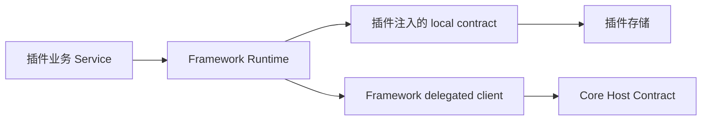
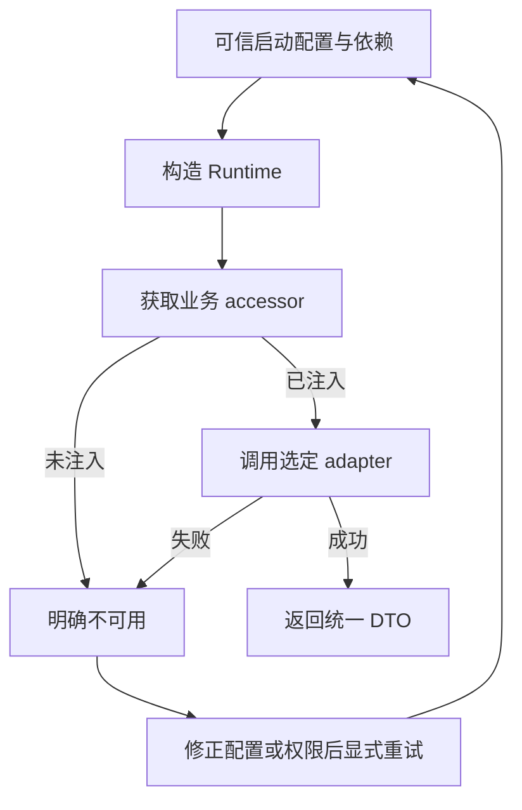
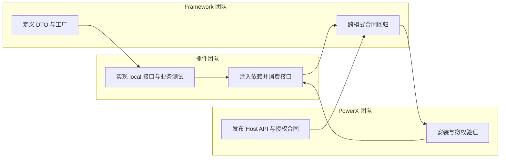
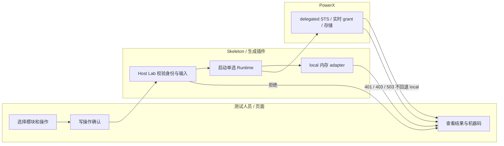

# Framework 业务模块接入指南（local / delegated）

> **插件团队唯一接入入口。** 本文基于 2026-09-08 当前工作树，文档基线不等于 npm/Go 已发布版本。首次接入先完成 §6.0 版本检查，再按 §7 操作；不要直接复制历史 specs 的 Gateway 示例。

## 1. 功能背景与目标

插件现在可以开始实现下表中的 local contract。Framework 负责 DTO、工厂和 Core delegated client；插件负责本地业务规则、存储、迁移与事务。业务 Service 只消费工厂返回的接口，不再判断 local/delegated。

这是当前源码的接入基线，不是所有 Core 接口的安装态验收证书。Agent Session 已接入 Core P1 正式合同；Core P3 已交付，Framework 安装态撤权验证仍后置，P2 非全量验收。稳定模块可以开始 local 开发。

**2026-09-08 消费者审计更新：不能把模块名等同于完整业务支持。** Media 已接入 Asset 与 preview Variant 上传/完成/下载 ticket 合同，详见 §7.4；Core 尚需迁移、seed 和重启；IAM 仅支持目录、授权与身份上下文，不支持组织写入或后台登录会话管理。Capability/Integration 已有 typed client 和单选工厂，Core 已交付八项实时授权规则，真实安装验收后置。具体缺口、责任和交付要求见 [消费者缺口任务单](../../../contracts/framework-consumer-contract-gaps.md)。依赖缺失操作的业务不得强制迁移，也不得回退旧 Gateway；不依赖这些操作的模块继续接入。

## 2. 角色与适用范围

- 插件开发者：实现 local adapter、可信上下文、数据隔离和插件业务测试。
- Framework：维护共用接口、单选工厂、typed delegated transport 和合同测试。
- PowerX：维护能力发布、租户 registration、凭证 grant、服务态身份与资源隔离。

范围为下表的业务边界及 §7.5 新增 Cache/TaskCenter，不包含所有 Core 管理 API。Realtime/TaskBus 属于基础设施，不要求插件复制 Framework 的实现。

### 文档职责与 Use Case 索引

本页集中说明规则、模块入口与验收。以下附件属于同一指南，可独立执行；对外只需发送本页链接。

| 文档 | 适用角色 | 独立验收口径 |
|---|---|---|
| [local adapter 实施步骤](usecase-local-adapter.md) | 插件后端开发 | 接口编译通过、真实 local 数据与隔离测试通过、不调用 Core |
| [Skeleton 本地 AI／Agent](usecase-skeleton-local-ai-agent.md) | Skeleton 开发与 QA | 本地模型配置、会话执行／取消与租户隔离；明确当前驱动和未实现范围 |
| [Skeleton 本地能力目录／集成网关](usecase-skeleton-local-capability.md) | Skeleton 开发与 QA | 模板 UUID 迁移、声明能力执行、幂等及租户隔离；不模拟 Core grant |
| [delegated 装配与安装验收](usecase-delegated-runtime.md) | 插件后端、部署与 QA | 可信 STS、最小 grant、真实成功/拒绝/撤权，且不访问 local 表 |
| [可编译装配示例](examples/bootstrap.go)及[示例测试](examples/bootstrap_test.go) | 插件后端开发 | 使用真实 Framework 工厂与客户端验证 local/delegated 单选、grant 失败；不依赖运行中的 Core |

其他文档各司其职：[双模式规范](../../develop/framework-dual-mode-business-modules.md)维护架构规则；[覆盖台账](../../../contracts/powerx-core-framework-coverage.md)是实现范围和验收状态的唯一来源；[specs/tasks](../../../../specs/009-consume-powerx-capability/tasks.md)保留实施与历史记录。本文不另维护一套完成百分比。发现代码、指南与 Core 合同不一致时，应停止该操作并向 Framework 提交差异，不由插件增加旧协议兼容。

## 3. 整体架构与模块关系



图中两条 adapter 路径是启动期单选，不是同时调用。业务不能把远程 API-key 客户端注入 local 参数来冒充本地实现。

## 4. 核心流程



恢复路径不是自动回退。请求参数不得改变模式；必需模块应在启动时获取 accessor 并检查错误。可选模块缺失可以不阻止其他模块启动，但调用时必须失败。

## 5. 跨角色协作流程



## 6. 前置条件与依赖

### 6.0 锁定依赖，先确认拿到的是哪一版

后端模块 import 前缀为 `github.com/ArtisanCloud/PowerXPlugin/framework/backend/go`，要求 Go 1.24 或更高版本。它与 Nuxt 的 `@artisan-cloud/plugin-framework-admin`、`@artisan-cloud/plugin-framework-client` 是独立发布物；升级 npm 包不会升级 Go contract。

在**插件后端 go.mod 所在目录**执行：

```bash
go list -m -json github.com/ArtisanCloud/PowerXPlugin/framework/backend/go
go doc github.com/ArtisanCloud/PowerXPlugin/framework/backend/go/runtime/agent.SessionService
go doc github.com/ArtisanCloud/PowerXPlugin/framework/backend/go/iam/contracts.DirectoryService
```

记录 `Version`、`Dir`、`Replace`（若有），确认 Directory 包含 `BatchResolveMembersByDisplayNames`，Agent 包含 `SessionService`。发布接入使用团队确认包含本基线的精确 Go 版本；**本文不指定一个未经验证的新版本号，也不要求使用 `@latest`**。尚未发布时可在本地 go.work 使用 Framework 的绝对模块目录联编，不能把个人机器路径作为插件发布依赖。发布前移除本地替换并在插件仓库以 `GOWORK=off go test ./...` 验证已锁定依赖。

不能只检查这两个符号就判定所有模块一致：所消费接口均应添加编译断言并执行插件测试。接口扩展时同步更新 test fake/mock；生产 adapter 不允许通过嵌入 nil 接口凑齐方法。

### 6.1 每个模块需要实现什么

以下路径相对于 `framework/backend/go/`。除 IAM 外，工厂均为对应包 `NewRuntime`；参数与下方特例以源码为准。

| 模块 | 插件 local contract | 业务获取入口 | 必须覆盖的语义 |
|---|---|---|---|
| [IAM](../../../../framework/backend/go/iam/contracts/interfaces.go) | `iam/contracts.DirectoryService`、`AuthzService`、`IdentityContextService` | `iam/adapters.NewRegistry().Bind(mode, Bundle)`，再获取 Directory/Authz/IdentityContext | 目录分页、严格 batch-get、容错 batch-resolve、姓名 found/not_found/ambiguous、授权 deny 与调用失败区分 |
| [Knowledge](../../../../framework/backend/go/runtime/knowledge/provider.go) | `runtime/knowledge.KnowledgeProvider` | `Provider()` | ListSpaces/Catalog/Search、文档写删、重建和 job；Name/Mode/Capabilities 如实报告 |
| [Media](../../../../framework/backend/go/runtime/media/runtime.go) | `runtime/media.Service` | `Media()`；只读消费者可用 `Assets()` | 十三项 Asset/Variant 元数据与传输操作；local 必须实现三项新增 Variant 方法。asset_uuid、variant_uuid；不能返回内部 object key |
| [Customer](../../../../framework/backend/go/runtime/customerfw/runtime.go) | `runtime/customerfw.LocalCustomerStore`，或分开注入 `RuntimeAdapters` | `Auth()`、`ExternalIdentity()`、`Membership()` | 注册/登录/验证、外部身份解析、当前租户 membership；业务角色来自 membership，不来自消息 actor_role |
| [Metadata](../../../../framework/backend/go/runtime/metadata/runtime.go) | `runtime/metadata.Service` | `Service()` | 字典、树、标签、TagBinding、资源类型及六项 Resolve；分页不能只搜第一页；binding_uuid 可寻址 |
| [Agent](../../../../framework/backend/go/runtime/agent/runtime.go) | `runtime/agent.AgentService`、`SessionService` | `Agent()`、`Sessions()` | 六项生命周期；Sessions 覆盖 12 项正式服务会话操作。旧 Agent Invoke/StreamSSE 在 delegated 下明确拒绝，改用 Sessions，不兼容人工会话路由 |
| [AI](../../../../framework/backend/go/runtime/ai/runtime.go) | `runtime/ai.GenerativeService` | `Generative()` | 模型列表、LLM invoke/stream/session、Embedding、VLM、Image、Video、TTS，共十一项 |
| [Capability](../../../../framework/backend/go/runtime/capability/runtime.go) | `runtime/capability.Registry` | `Registry()` | List/GrantStatus/Resolve/Invoke/GetInvocation；不要把本地能力伪报为 Core grant |
| [Integration](../../../../framework/backend/go/runtime/integration/runtime.go) | `runtime/integration.Gateway` | `Gateway()` | ListRoutes/GetRoute/InvokeRoute；路由归属与调用权限来自可信上下文 |
| [Skills](../../../../framework/backend/go/runtime/skills/runtime.go) | `runtime/skills.Invoker` | `Invoker()` | Invoke；不能任意执行未授权 skill 或据参数切到另一实现 |
| [Notifications](../../../../framework/backend/go/runtime/notifications/runtime.go) | `runtime/notifications.Publisher` | `Publisher()` | Create；member UUID 是投递目标，不是租户选择器 |
| [Plugin Runtime](../../../../framework/backend/go/runtime/pluginruntime/runtime.go) | `runtime/pluginruntime.Service` | `Service()` | ListKnowledgeSpaces/InstantiateAgent/ListAgents；不是插件安装或后台全量管理接口 |
| [Plugin Release](../../../../framework/backend/go/runtime/pluginrelease/runtime.go) | `runtime/pluginrelease.Service` | `Service()` | 创建/读/停止 install session、创建/读 import job；不能把接收任务伪装为安装完成 |

IAM Bundle 当前要求三项非空；不能假设已支持仅 Directory 绑定。Customer 可用 `AdaptersFromLocalStore(store)` 转为三组 adapter，或显式提供 `RuntimeAdapters`。Knowledge 的 Catalog/Capabilities 是 Framework 语义，不意味着 Core 有同名路由。AI 的部分 provider payload 保留 RawMessage，不承诺所有厂商输出统一字段。

**装配粒度不能凭想象拆分：** Media `NewRuntime` 接受完整 `Service`，`Assets()` 只缩小消费接口，不表示可只注入 `AssetCatalog`。Agent `AgentService` 仍包含旧 standalone `Invoke/StreamSSE` 方法；新执行业务只消费独立 `SessionService`，不要把旧方法当作 delegated 入口。Customer 三组 accessor 可独立检查，但声明为必需的每一组都必须有真实实现。

### 6.1.1 delegated 客户端构造映射

下列构造只放在插件 bootstrap，不放在 handler 或业务 Service。`runtime/powerx/*` 包名不是“只准 delegated 才能 import”：其中的 DTO 也是 local contract 的正式数据类型，local adapter 使用这些 DTO 不代表发生远程访问。

| 模块 | Framework 提供的 delegated 实现（路径相对 `framework/backend/go`） | 注入方式 |
|---|---|---|
| IAM | `iam/delegated.NewCoreClient(CoreClientConfig{BaseURL, Tokens})` → `NewBundle(client)` | `Registry.Bind(IAMAdapterModeDelegated, bundle)`；不是 `provider.Mode` 参数类型 |
| Knowledge | `runtime/powerx/knowledge.NewClientWithTokenProvider` → `runtime/knowledge.NewDelegatedProvider(DelegatedProviderConfig{Client: client})` | 将 Provider 注入 `knowledge.NewRuntime`；不能把原始 client 当作 KnowledgeProvider |
| Media | `runtime/powerx/media.NewHostClientWithTokenProvider` | `media.NewRuntime(mode, localService, hostClient)`；不是旧 `media.NewClient` |
| Metadata | `runtime/metadata.NewHostClientWithTokenProvider` | `metadata.NewRuntime`；不是调用 admin 路由的 `NewClient` |
| Agent | `runtime/powerx/agent.NewClientWithTokenProvider`，配置 `Mode: powerxagent.ModeDelegated` | `agent.NewRuntime` + `agent.WithSessions`；见 §7.2 |
| AI | `runtime/powerx/ai.NewClientWithTokenProvider` | `ai.NewRuntime` |
| Capability | `runtime/powerx/capability.NewClientWithTokenProvider` | `capability.NewRuntime`；同一个 client 可作 `RequireGrants` 的 checker |
| Integration | `runtime/powerx/integration.NewClientWithTokenProvider` | `integration.NewRuntime` |
| Skills | `runtime/powerx/skills.NewClientWithTokenProvider` | `skills.NewRuntime` |
| Notifications | `runtime/powerx/notifications.NewClientWithTokenProvider` | `notifications.NewRuntime`；完整示例见附件 |
| Plugin Runtime | `runtime/powerx/pluginruntime.NewClientWithTokenProvider` | `pluginruntime.NewRuntime` |
| Plugin Release | `runtime/powerx/pluginrelease.NewClientWithTokenProvider` | `pluginrelease.NewRuntime` |
| Customer | `customerfw.NewDelegatedCoreAuthClient`、`NewDelegatedMembershipResolver`、`NewExternalIdentityResolver` | 分别放入 `RuntimeAdapters.Auth/Membership/External`；External 的 Invoker 必须是已装配 STS 的 Gateway，不是 Customer Admin 客户端 |

各客户端 TokenProvider 是对应包的接口或 `TokenProviderFunc`（Media/Metadata 为 `HostTokenProviderFunc`，Customer 为 `ServiceTokenProviderFunc`），可包装同一个可信 STS `func(context.Context) (string, error)`；函数返回原始 token，不加 `Bearer ` 前缀。构造成功只表示依赖配置有效，不代表网络或 grant 已验证。

### 6.2 模式、身份与配置

- 使用启动时已解析的 `provider.Mode`；Skeleton 来源是配置装配的 ProviderResolver，不让业务请求自行选择。
- `provider.ModeResolver` 读取 `ConfigMode`（Skeleton 为 `config.context.provider_mode`）和 `POWERX_PROVIDER_MODE`：两者都设置且不一致会失败；都未设置当前默认 local。安装部署应显式确认 delegated，不能把默认值当成已接入 Core。Framework 工厂不会自行读取插件的 `customer_auth.mode`；旧配置应在 bootstrap 收敛并检查冲突，不留两个独立模式开关。
- local tenant 必须来自插件验证后的请求上下文。接口中的 tenant 参数只能核对一致性，不能作为越权查询入口。
- 对象及关联使用 UUID；缺少 UUID 明确报错。不要把用户 UUID 当 member UUID，也不要把外部 subject 当 customer UUID。
- Customer delegated 的 service token 与 customer JWT 分离；local adapter 不能把插件自己签发的 token 冒充 Core 签发的 token。
- 所有可见文案走 locale；错误码、状态枚举、i18n key 是机器语义。界面不以 UUID 作为名称 fallback。

### 6.3 按操作声明能力

`skeleton/plugin.d/capabilities.yaml` 的 `capabilities.required` 是插件选择，不是 Framework 全家桶。只读插件不需要主动申请管理权限。非空 required 要含 `com.corex.capabilities.grant_status.read`，因为 delegated 启动会检查真实 grant。

| Core 已声明边界 | 按需选择 capability |
|---|---|
| IAM 单成员与严格批量 | `com.corex.iam.members.read` |
| IAM tenant/list/resolve/姓名解析/部门角色权限 | `com.corex.iam.directory.read` |
| IAM 授权判定 | `com.corex.iam.authorization.check` |
| Knowledge 目录/搜索/文档及 job | `com.corex.knowledge.directory.read`、`search.read`、`document.manage`（后两项同前缀） |
| Media 读取/资源 CRUD/传输/创建变体 | `com.corex.media.assets.read`、`manage`、`transfer`、`variants.manage`（后三项同 assets 前缀） |
| Customer Auth | `com.corex.customer.auth.register`、`login`、`validate`（后两项同 auth 前缀） |
| Customer membership/外部身份 | `com.corex.customer.memberships.delegated_read`、`com.corex.customer.external_identities.resolve` |
| Metadata | `com.corex.metadata.{dictionary,taxonomy,tag,resource_type}.{read,manage}`，这是八个独立 ID，不是通配符授权 |
| Agent | Session 全部操作要求 `com.corex.agent.session.manage`，执行额外要求 `com.corex.agent.invoke`；生命周期要求 `com.corex.agent.lifecycle.manage`。Session SSE 不使用旧 stream capability；Session 只支持 STS |
| AI 调用 | `com.corex.ai.llm.invoke`、`llm.stream`、`llm.session.create`、`llm.session.append`、`embedding.invoke`、`vlm.invoke`、`image.invoke`、`video.invoke`、`tts.invoke`（均同 ai 前缀） |
| Notifications | `com.corex.notifications.create`；正式路径为 `POST /api/v1/notifications` |
| Plugin Release | `com.corex.plugin_release.sessions.read/manage`、`imports.read/manage`，展开为四个 ID |

此表是当前 Core 声明映射，不证明每条授权链路已安装验收。Capability/Integration 八项入口已收到 Core 授权映射：除 grant-status 自身权限外按当前凭证目标 grant 过滤/执行，不新增虚构 capability ID；Skills/Plugin Runtime 及 AI 模型列表等剩余 P2 范围不由本次交付自动覆盖；不要猜测 ID 或申请 admin 权限填空。存在 typed local contract 不受该等待影响。

上表缩写仅用于阅读，manifest 中必须逐项写完整 ID。缺映射时由 Framework/Core 确认后再启用对应 delegated 操作，不能要求插件猜 scope。操作所需能力不等于整个包的所有能力：导入一个包不会自动授权，也不要求申请所有模块。

## 7. 操作步骤

### 7.1 实现和注入 local adapter

从零接入或迁移旧插件请按 [local 实施步骤](usecase-local-adapter.md)完成；下面是统一骨架。

1. 实现上表接口，在插件代码增加编译断言，例如 `var _ notifications.Publisher = (*LocalPublisher)(nil)`。编译失败时补足准确签名，不修改 Framework DTO 适配插件旧模型。
2. 在启动装配处构造插件 Store 和 adapter，然后调用 `notifications.NewRuntime(mode, localPublisher, delegatedPublisher)`，取得 `Publisher()` 并注入业务 Service。必需 accessor 错误使启动失败。
3. 业务只调用 `publisher.Create(ctx, input)`。不在失败后查另一张表，也不在业务内重新读 mode。
4. 运行可编译示例：

```bash
go test ./framework/backend/go/runtime/notifications -run '^ExampleNewRuntime$' -count=1
```

预期通过：local 注入可调用，delegated 缺失明确失败。示例位于 `runtime/notifications/example_local_test.go`，仅演示合同，不是可复制上线的存储实现。插件需要添加真实 tenant 隔离和持久化测试。

### 7.2 清单与启动检查

delegated 的版本、STS 来源、grant 预检和安装验收顺序见 [delegated 实施步骤](usecase-delegated-runtime.md)。`NewRuntime` 不自动创建 Core client、加载 manifest 或执行 `RequireGrants`；这些是 bootstrap 的明确步骤。大多数工厂在 accessor 时才检查选中依赖，不能只检查构造器返回的 error。

Agent Session 通过 `agent.NewRuntime(mode, localLifecycle, coreClient, agent.WithSessions(localSessions, coreClient))` 注入，在启动时取得 `Sessions()` 并交给业务服务。Skeleton 已提供 delegated 装配；插件可只注入 Session，不需要伪造 lifecycle。

操作顺序为 `CreateSession` → `AppendSessionMessage` → `InvokeSession` → `StreamSessionEvents`。追加与执行分别传入调用方保存的幂等键（1–128 字节、无首尾空白）；追加键不得以 `invoke:` 开头。相同操作重试使用原键，24 小时过期由 Core 明确拒绝，不生成新键重做。追加只允许 `role:user`；消息、会话与执行结果全部用 UUID。

SSE 只包含 `state/final/error/end`，不是 token delta。只有明确 `end` 才算订阅完整；流内 error 回调后仍返回错误，EOF 不伪装成功。断连不取消执行，恢复订阅须显式调用同一 invocation 的 `StreamSessionEvents`；取消必须调用 `CancelSessionInvocation`，不保证撤销已完成的业务副作用。客户端继承配置的 HTTP Timeout（默认五分钟），订阅超时不等于执行取消。

local `SessionService` 必须实现相同租户/服务主体隔离、幂等、每会话单个活跃执行、持久化状态和协作式取消语义。身份从插件可信 context 取得，不能为方便本地开发增加 tenant/user 参数。Framework 不提供该持久化实现。

Customer 是另一项必须显式处理的特例：外部 subject 解析返回 `customer_uuid/membership_uuid/display_name`，**不等于登录、已验证身份或角色授权**。delegated Register/Login 当前使用 Core 可验证的 Shopify credential，不应把 local Password/Identifier 输入直接搬过去。Validate 与 Membership 必须保留当前请求的原始 customer JWT：`customerfw.WithCustomerCredential(ctx, rawCustomerJWT)`；SDK 将它放入 `X-PowerX-Customer-Authorization`，STS 仍在 Authorization。只构造 CustomerContext 或只传 customer UUID 不够；`Validate(ctx, token)` 的 delegated 实现要求 context credential，不能只给第二个参数。请求结束即释放该凭证，不写日志/数据库/跨请求全局变量。会员角色从有效 membership 获取，不从 actor_role 推断。

验证客户端和装配：`go test ./framework/backend/go/runtime/powerx/agent ./framework/backend/go/runtime/agent -count=1`。成功表示本地 HTTP 合同与工厂测试通过；失败检查机器 reason_code，不改用旧人工路径。实现位置为 `service_sessions.go`、`service_session_events.go` 和 `runtime/agent/runtime.go`。

例如仅消费字典读取：

```yaml
capabilities:
  required:
    - com.corex.capabilities.grant_status.read
    - com.corex.metadata.dictionary.read
```

不得写字面通配符，也不必因为 Framework 编译进 IAM/Knowledge 就声明其写能力。修改清单后由安装/升级授权流程生效，重启不等于授予权限。`RequireGrants` 不会修改授权。

### 7.3 合同诊断（可后置）

“底座合同调试”只自动展示各模块的 status 装配检查，不提供通用 JSON 输入、最近请求面板或写操作。运行相关包测试可验证 adapter 装配、输入校验、租户边界和稳定错误码；真实调用必须在“PowerX 能力调试”或对应的知识库、Agent、Skill、Chat 业务页面完成。

```bash
go test ./framework/backend/go/runtime/powerx/hostcontract ./skeleton/backend/go-gin/internal/transport/http/admin/host_contract -count=1
```

状态绿灯不等于远端资源已连通；委托模式的授权与 Trace 仍应在“PowerX 能力调试”中验收。前端不持有 STS/API Key，业务写操作不得通过通用 JSON 面板绕过对象级校验。

本地开发启动仍是 `cd skeleton/backend/go-gin && go run ./cmd/plugin`，不使用调试器。检查终端/项目配置的日志路径；不要另外启动第二个占用同端口的进程。

### 7.4 Media preview Variant 迁移

`media.Service` 新增三项方法，是 local adapter 的编译期变更；必须补齐真实实现和测试替身，不能用空方法满足接口。

```go
PresignVariantUpload(ctx context.Context, assetUUID, variantUUID string, in powerxmedia.VariantTicketInput) (*powerxmedia.TransferTicket, error)
CompleteVariantUpload(ctx context.Context, assetUUID, variantUUID string, in powerxmedia.CompleteUploadInput) (*powerxmedia.Variant, error)
PresignVariantDownload(ctx context.Context, assetUUID, variantUUID string, in powerxmedia.VariantTicketInput) (*powerxmedia.TransferTicket, error)
```

1. 从 `Runtime.Media()` 取 Service；`CreateVariantInput` 必须提供文件 SHA256 hex `Checksum`、VariantType、SizeBytes、MimeType，保存返回的 UUID。pending_upload 不表示可展示。
2. 调用 PresignVariantUpload；`VariantTicketInput{}` 发出 `{}` 使用默认 900 秒；非零 ExpiresInSeconds 范围 60–3600，实际票据仍受资产上传窗口限制。
3. 按 ticket Method/Headers/URL 发送文件字节；相对 URL 使用可信 Core BaseURL 解析，不拼旧路径。此请求不附加 STS 或用户凭证，不记录 ticket。PUT 204 后必须调用 CompleteVariantUpload，Checksum 与创建时一致。
4. complete 只接受匹配 UUID、ready 和非空 CompletedAt；错误保持 Core reason_code。失败对象不隐式重置，不能用原文件资源替代 preview。
5. PresignVariantDownload 获取读取票据。过期/撤销后显式重新请求，不永久保存 URL。父资产删除后旧票据失效；实际下载按票据，不再走旧 Gateway resource 路由。

Core 部署前需隔离库验证后执行 make migrate、make seed、部署重启；历史 Variant 默认 failed，历史无 caller_subject trace 不自动归属插件。本次尚未进行真实部署验收。AI Craft 实现其 local 存储并迁移业务入口，Framework 不修改插件数据库。

### 7.5 Cache / TaskCenter delegated 装配

两个包均提供 `NewHostProvider(hostapi.Config, hostapi.TokenProvider, *http.Client)`，返回各自 Service。新客户端仅支持 STS，不支持 API Key。后端 STS 层须提供 `hostapi.Credential{Token, TenantUUID}`，两者必须来自同一可信凭证绑定，不能从调用方请求拼装或把 Scope 填入凭证归属。

启动时构造 host Service，再分别传给 `cache.NewRuntime(mode, localCache, hostCache)`、`taskcenter.NewRuntime(mode, localTasks, hostTasks)`；调用 `.Cache()`、`.Tasks()` 获取接口并注入业务。local 仍只使用插件实现。示意：

```go
hostCache, err := cache.NewHostProvider(hostapi.Config{BaseURL: coreBaseURL}, trustedSTSProvider, nil)
if err != nil { return err }
runtime, err := cache.NewRuntime(mode, localCache, hostCache)
if err != nil { return err }
service, err := runtime.Cache()
if err != nil { return err }
entry, err := service.Get(ctx, cache.Scope{TenantUUID: tenantUUID, Namespace: "license"}, cache.GetInput{Key: "entitlement"})
// err 必须返回或显式处理；只有 err == nil 才读取 entry.Found。
```

本次四项 capability 为 `com.corex.runtime.cache.read`、`com.corex.runtime.cache.manage`、`com.corex.runtime.taskcenter.read`、`com.corex.runtime.taskcenter.manage`，按实际操作申请；保留既有 grant-status 预检约定。Core 使用 capability-seed + 既有插件授权流程，不通过全量 seed 自动扩权。

Cache TTL 必须是 1ms–24h 的整毫秒，值最多 1 MiB；Task revision 最大为有符号 bigint，payload/result JSON 最多 256 KiB，拒绝重复字段。local 同步这些限制，详见 [合同与部署说明](../../../contracts/cache-taskcenter-host-requirements.md)。未部署 Core 时不得回退本地；写入后返回依赖错误不保证副作用已回滚，应显式核查再重试。

### 7.6 Skeleton / scaffold 的 Cache 与 TaskCenter 验证

Skeleton 是这两个模块的示例消费者：`internal/services/runtimeexample.Build` 在启动时选择 local 内存存储或 delegated HostProvider，并通过 `Deps.CacheRuntime/TaskCenterRuntime` 注入 Host Lab。local 数据重启即清空，不是生产数据库实现；TaskCenter 仅维护任务记录，不会执行任务。其他模块的 local adapter 是否存在须逐项核对，不能由这两项成功推断全部模块可用。



1. local：使用 `context.provider_mode: local`，环境模式与配置保持一致；在 `skeleton/backend/go-gin` 运行 `go run ./cmd/plugin`。Cache 与 TaskCenter 的读写合同仅由定向 Go 测试验证，业务页面不暴露通用 probe。
2. delegated：Core 部署六项接口与四项 capability 后，重新构建 `make dist`，安装/升级 Skeleton 并确认四项 grant 已同步。安装环境 provider 必须为 delegated，配置不得残留 local 覆盖。通过“PowerX 能力调试”验证委托链路、Trace 与撤权后的 403；API Key 不能替代这两项的 STS 验证。

仓库根目录回归命令：

```bash
go test -race ./skeleton/backend/go-gin/internal/services/runtimeexample ./skeleton/backend/go-gin/internal/transport/http/admin/host_contract -count=1
npm run sync:templates -- --check
PX_TEST_GENERATED_BUILD=1 go test ./tools/cli/internal/templates -run '^TestGeneratedBackendBuild$' -count=1 -timeout=10m
```

最后一条在临时生成工程中设置 `GOWORK=off`，显式 replace 到本轮待发布 Framework，验证模块路径替换及后端编译。它不证明旧发布版本含有新接口。发布必须先发布 Framework，再更新 CLI 的 `defaultFrameworkVersion` 与 Skeleton go.mod，最后发布同步模板的 CLI；现有安装的 CLI 不会自动更新内嵌模板，`make dist` 产物也不会在安装时自动升级 Framework。本轮不自动改版本或发布。

代码映射：`cmd/plugin/main.go` 装配、`internal/services/runtimeexample` 本地存储与工厂、`internal/transport/http/admin/host_contract/storage.go` 六项 probe、`plugin.d/capabilities.yaml` 四项授权声明、`tools/cli/internal/templates/generated_build_test.go` 生成物编译守卫。回滚仅回退代码/包与其对应版本，不添加跨模式 fallback；测试缓存用 delete 清理，local 任务随示例进程退出清除，Core 任务不提供删除时不得直接清库。

2026-09-09：新增上述双模式示例与生成物 CI 检查；真实浏览器和安装态验证仍需实际运行后记录。

## 8. 预期结果与验收标准

每个插件实现的模块都应通过以下测试，不能只断言接口非空：

- 编译断言满足正式接口；DTO 不引入 numeric 引用或隐藏 tenant 覆盖字段。
- local/delegated 各调用一次选中 adapter；给未选中的 adapter 放置失败哨兵，确保从未调用。
- 选中 adapter 为 nil/typed nil 时失败；运行中返回 403/503 时不切换模式。
- 插件注入 grant checker 的 typed-nil 也必须在调用前拒绝；未初始化 Runtime 的 accessor 返回不可用，不应 panic。可参考 `runtime/module/runtime_boundaries_test.go` 与 `runtime/capability/preflight_test.go`。
- 同租户成功、跨租户资源拒绝或隐藏存在性；没有可信身份不得落库。
- 校验、未认证、禁止访问、缺失资源、上游错误分别保留错误类型/机器码，不伪装空列表或 unknown 名称。
- Customer transport 使用 `customerfw.HTTPStatus(err)`、`CodeOf(err)`、`ReasonOf(err)`，不要只将 `CodeOf` 再映射成 HTTP 状态，否则会丢失 Core 404/502/503 等原始语义。不得将 `err.Error()` 当作用户显示文本。
- batch-get 缺项整体失败；batch-resolve 区分缺项；同名 ambiguous 不随机选人。
- 异步状态遵循各模块枚举，不发明通用状态机：Knowledge 使用 queued/running/succeeded/failed；Agent 和 Plugin Release 按各自 DTO 与 Core 合同处理取消、过期等状态。接收成功不等于处理完成。
- SSE 消费逐事件回调；取消释放连接；断流不自动重发业务请求或切换轮询。
- UUID 只做数据引用；显示名称实时解析或使用明确本地化未知状态。

本仓库回归命令：

```bash
go test ./framework/backend/go/... ./skeleton/backend/go-gin/... ./tools/cli/internal/templates -count=1
npm run sync:templates -- --check
```

插件自己的验收还必须执行其 local 仓储/服务测试；Framework mock 测试不证明插件表结构、迁移和业务事务正确。

每个插件交付时附以下记录：插件版本与 Framework 实际 Go 版本/commit、消费模块和操作、local adapter 路径、bootstrap 路径、编译断言/数据隔离/错误测试命令及结果、manifest required、未支持操作、delegated 验收状态。**代码对齐通过、插件 local 实现通过、安装态验证通过是三项独立结论**，不得互相代替。

## 9. 代码实现映射

| 入口 | 源码事实源 |
|---|---|
| 各模块接口和 accessor | 上表对应 `framework/backend/go/runtime/<module>/runtime.go` |
| IAM | `framework/backend/go/iam/contracts/interfaces.go`、`iam/adapters/registry.go` |
| Knowledge 完整接口 | `framework/backend/go/runtime/knowledge/provider.go` |
| 单选与 typed nil 拒绝 | `framework/backend/go/runtime/module/factory.go` |
| required 实际 grant | `framework/backend/go/runtime/capability/preflight.go` |
| manifest 校验 | `skeleton/backend/go-gin/cmd/manifestcheck/main.go` |
| 启动装配 | `skeleton/backend/go-gin/cmd/plugin/main.go` |
| 合同定向测试 | `skeleton/backend/go-gin/internal/transport/http/admin/host_contract/*_test.go` |

## 10. 常见问题与排障

- `FRAMEWORK_MODULE_ADAPTER_UNAVAILABLE`：检查 mode 和对应 local 参数；工厂不负责替插件建表。
- `FRAMEWORK_REQUIRED_CAPABILITY_PREFLIGHT_FAILED`：检查嵌套 Core reason、能力发布、registration、实际 grant；不要删除业务必需权限绕过启动检查。
- 只有 API Key 成功：尚不能宣称安装态 STS 通过；两种凭证授权链路独立验收。
- Customer 返回 503：缺 Runtime/adapter 属于依赖配置错误，不要展示“密码错误”。
- Redis 启动失败：修正 Redis 连通性；维护者可明确选择 memory，但程序不自动选择。
- HTTP `REQUEST_TIMEOUT`：Skeleton 在 Gin engine 外层设置普通请求的五分钟超时，响应先缓冲，超时取消 context 并返回 408；业务必须把 context 传给数据库和出站请求。超时不是自动回滚或重试许可，写操作仍需自身事务与幂等约束。SSE/WebSocket 保留原始 writer，不受普通 HTTP timeout 截断。

## 11. 回滚与风险控制

这份指南不要求迁移 Core 或扩大任何授权。插件 local 表迁移由插件自己设计、验证、回滚。接口升级造成编译失败时对齐新 contract；不得恢复旧 Customer `/customer/auth/*` 委托客户端或 numeric ID 兼容输入。

当前 Agent Session 已提供独立 local contract；安装态验证后置。suite 插件的强类型领域封装另行准入，不能由通用 Gateway 可达推断已支持所有 CRM/SCRM/e-commerce 对象。

## 12. 变更记录

- 2026-09-08，Framework：交付当前接口对应的 local 接入基线，补可执行示例、最小权限清单策略、验收与失败排查。文档没有提升任何模块的安装态验收状态。
- 2026-09-08，Framework：统一为 local/delegated 对外主指南；补版本锁定、各模块 Core 构造入口、装配特例、Customer 双凭证与场景附件；旧规范/quickstart 不再维护相互矛盾的状态和调用样例。本次文档版本不代表软件已发布。
- 本次文档校验：示例普通测试与 `-race`、Notifications `ExampleNewRuntime`、provider/module 测试通过；13 类模块涉及的 16 个接口符号可由 `go doc` 解析，相关主文档/specs 的 51 个相对文件链接有效。未执行插件真实 local 数据验收、前端浏览器或安装态联调；这些结果不应由文档校验代替。分发时应保留主指南、场景附件、示例与源码的同版本关系。
