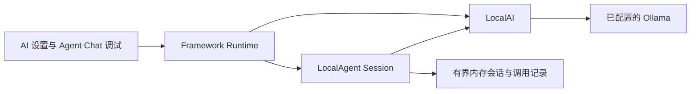
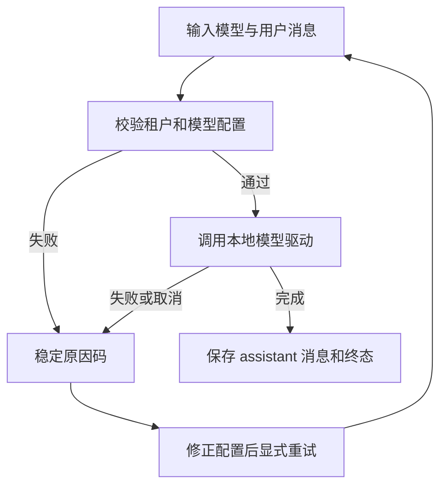
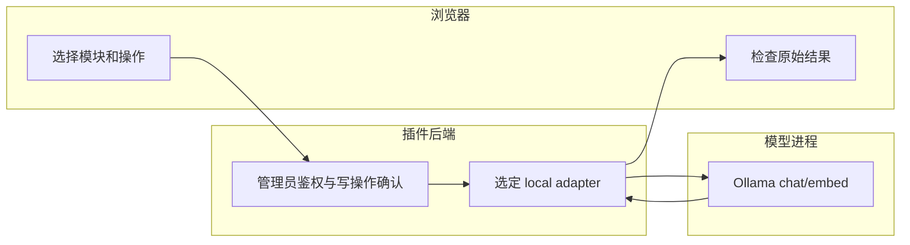

# Skeleton 本地 AI 与 Agent 执行

## 1. 功能背景与目标

Skeleton 在 local 模式使用自己的 AI 驱动与 Agent 会话存储，经过 Framework 工厂装配；不调用 PowerX Gateway。参考 Core 的 Ollama chat/embed 驱动及 `agent_session` 的 Executor、幂等和状态机设计，但不是 Core 全部实现的复制品。

本次支持 LLM 调用、流式调用、Embedding、内联图片 VLM、LLM Session，以及 Agent Session 的创建、查询、重命名、归档、删除、消息、异步执行、取消及事件订阅。

**尚未实现**：其他模型驱动、Image/Video/TTS、本地分布式 Rebalance。旧 standalone Agent Invoke/StreamSSE 明确要求使用新的 Session contract。模板 UUID 迁移与本地能力执行见 [本地能力目录与集成网关](usecase-skeleton-local-capability.md)。

## 2. 角色与适用范围

面向 Skeleton 开发与 QA；插件团队可参考 adapter 结构，但不能把内存开发存储当生产持久化。delegated 路径不受此配置影响。

## 3. 整体架构与模块关系



## 4. 核心流程



没有 Core、旧协议、非流式调用的自动降级路径。

## 5. 跨角色协作流程



## 6. 前置条件与依赖

在现有 `skeleton/backend/etc/config.yaml`（或 CONFIG_PATH 指定文件）配置 `local_ai`。保持已经使用的 `context.provider_mode: local`，不要修改 Gateway 凭证来配置本地模型。

```yaml
local_ai:
  models:
    - key: local-chat
      provider: ollama
      model: YOUR_INSTALLED_MODEL
      endpoint: http://127.0.0.1:11434
      modalities: [llm]
      timeout_seconds: 120
  agents:
    - uuid: 8c62aa3f-90a0-4d11-9de1-b10925457585
      name: 本地测试助手
      model_key: local-chat
```

`model` 必须是自己已安装的模型。Framework 不自动下载；`models: []` 是默认配置，模型查询返回空列表，调用返回 `AI_MODEL_NOT_CONFIGURED`。只有模型实际支持相应模态时才声明 `vlm`／`embedding`，声明本身不是可用性验证。

Agent UUID 由部署配置固定，不接收 numeric ID；不同租户会话隔离，服务主体绑定当前插件实例。该入口是管理员调试入口，不是客户侧聊天接口。

## 7. 操作步骤

### 页面操作

1. 按原开发方式重启 Skeleton 后端，在 AI 设置页选择本地 Profile 并执行连接测试；连接测试成功只证明所选 Provider 可达。
2. 在 Agent Chat 调试页选择已配置的 Agent，发送一条测试消息；若模型列表为空，检查 CONFIG_PATH 和 `local_ai.models`。
3. 预期回复来自所选模型；失败时检查稳定原因码和 Provider 日志，不能将启动期 adapter 装配视为推理成功。

4. Agent 使用 `session.create`，输入 `agent_uuid` 与 `title`；从返回的技术 JSON 取得 `session_uuid`。随后依次调用：

| 操作 | input |
|---|---|
| `session.message.append` | `session_uuid`、`idempotency_key`、`role: user`、`content` |
| `session.invoke` | `session_uuid`、刚返回的 `message_uuid`、新的 `idempotency_key` |
| `session.invocation.get` | `session_uuid`、`invocation_uuid` |
| `session.invocation.cancel` | `session_uuid`、`invocation_uuid` |
| `session.messages.list` | `session_uuid`，可选 `page`、`page_size` |

写操作均须确认。状态读取是手动操作；本次没有偷偷添加前端轮询。事件流通过 `Runtime.Sessions().StreamSessionEvents` 消费，页面没有新增流式展示组件。

### 本地命令

```bash
cd skeleton/backend/go-gin
go run ./cmd/plugin
```

端口已被现有后端占用时，先停止自己启动的旧后端，不要同时启动多个实例。

从仓库根执行回归：

```bash
go test -race ./skeleton/backend/go-gin/internal/services/runtimeexample \
  ./skeleton/backend/go-gin/internal/transport/http/admin/host_contract \
  ./skeleton/backend/go-gin/cmd/plugin -count=1 -timeout=60s
```

预期全部通过；测试使用临时 HTTP 模型服务，不消耗真实模型额度，也不等同于真实 Ollama 联调。

## 8. 预期结果与验收标准

- 模型返回成功才记录 Agent `succeeded`，模型错误记录 `failed`。
- 同一幂等键重复追加／调用返回同一对象；不同输入冲突。
- 跨租户 Session／Invocation 返回不存在；外部追加只接受 `user`。
- 事件订阅断开不取消任务；显式取消终态为 `cancelled`，取消传递给模型请求。
- 上游流没有结束帧时返回 `AI_STREAM_INCOMPLETE`，不当成成功。
- 未声明模态、模型缺失、旧 Agent 调用合同明确失败。

## 9. 代码实现映射

| 内容 | 文件（相对仓库根） |
|---|---|
| 配置 | `skeleton/backend/go-gin/internal/config/local_ai.go` |
| 启动单选 | `skeleton/backend/go-gin/cmd/plugin/main.go` |
| 模型驱动与 LLM Session | `skeleton/backend/go-gin/internal/services/runtimeexample/ai.go` |
| Agent 状态机 | `skeleton/backend/go-gin/internal/services/runtimeexample/agent.go` |
| 调试操作 | `skeleton/backend/go-gin/internal/transport/http/admin/host_contract/agent_session.go` |
| 测试 | 上述 runtimeexample 目录中的 `ai_test.go`、`agent_test.go` |

## 10. 常见问题与排障

- `AI_MODEL_NOT_CONFIGURED`：请求 model_key 必须匹配实际加载配置；添加配置后重启。
- `AI_UPSTREAM_DEPENDENCY`：检查 Ollama 地址、模型是否安装、服务日志；不要改为 Gateway 地址。
- `AGENT_SESSION_AGENT_NOT_FOUND`：确认 agents 配置中的 UUID。
- `AGENT_SESSION_CONFLICT`：会话已有运行任务、已归档或已冻结；先查询状态，再决定取消／恢复。
- `AI_MODALITY_UNSUPPORTED`：当前选定模型未声明该模态；Image/Video/TTS 的本地驱动仍待实现，不靠改 modalities 绕过。

## 11. 回滚与风险控制

会话与调用记录只保存在有界内存；重启丢失，不可用作生产记录。AI/Agent 各最多 64 个会话，每会话消息累计限制 256 KiB。新配置只影响 local；回滚不切换 delegated，也不修改 Core 数据或模型文件。

## 12. 变更记录

2026-09-09：新增 Skeleton 本地 Ollama 驱动、Agent Session 基线及调试操作。真实模型进程联调尚未执行；不宣称全部模块已完成。
