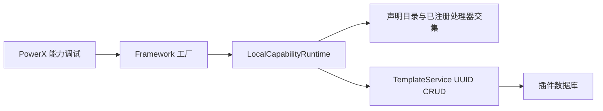
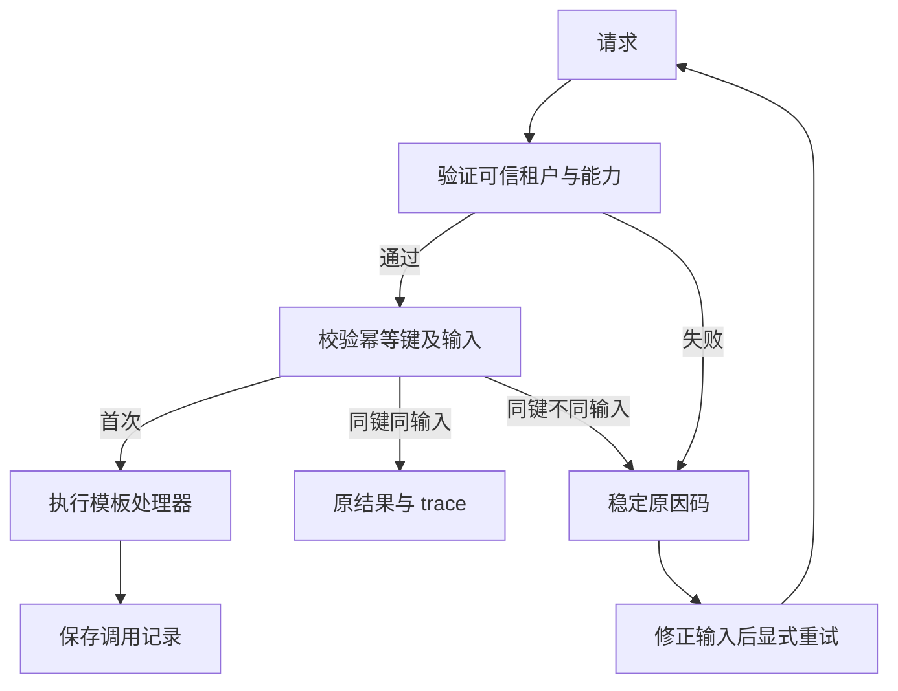
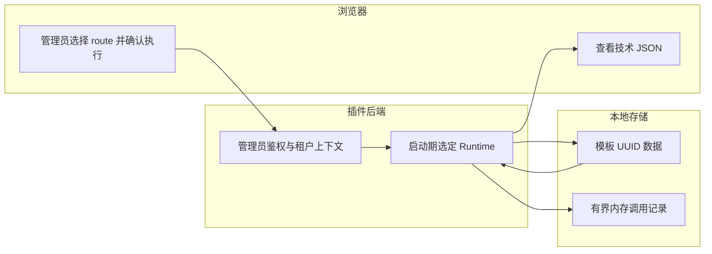

# Skeleton 本地能力目录与集成网关

## 1. 功能背景与目标

local 模式通过 Framework Registry／Gateway 接口执行 Skeleton 已声明且有真实处理器的模板能力。不会调用 Core，不会把其他插件或 Core 的能力列为本地可执行能力。

## 2. 角色与适用范围

适用于 Go-Gin Skeleton 开发和 QA，以及参考其 local adapter 的插件团队。本轮不是 Python FastAPI 模板的 UUID 迁移，也不是跨插件本地服务发现。

## 3. 整体架构与模块关系



## 4. 核心流程



无 Core、旧 Gateway 或 numeric ID 降级路径。

## 5. 跨角色协作流程



## 6. 前置条件与依赖

保持 `context.provider_mode: local`。使用本地管理员登录。目录来自现有 capabilities Manager，只有同时存在处理器的声明才对外提供。

旧数据库需要先备份，再由开发者执行仓库根 `make migrate`：模板历史记录先回填 UUID，然后 AutoMigrate 建立约束。保留已有有效 UUID；非法、零值或重复 UUID 会阻止迁移，不能删除业务数据来绕过。

本轮没有对开发者正在运行的数据库执行迁移或重启。迁移验证使用独立测试数据库。

## 7. 操作步骤

### 页面

1. 迁移成功后，按原方式启动后端：`cd skeleton/backend/go-gin && go run ./cmd/plugin`。不要重复启动占用同一端口的进程。
2. 打开“PowerX 能力调试”，读取本插件能力目录；预期只有已声明且已装配处理器的本地能力，协议为 `local`。
3. 在对应模板 CRUD 页面执行创建并检查结果，而不是通过通用 JSON 面板调用业务写操作。预期创建真实模板并可在列表中看到该记录。

```json
{"name":"验收模板","description":"本地能力验收","content":"验收内容"}
```

若失败，检查稳定原因码和后端日志，不切换为 Core 客户端。

### 代码级回归

从仓库根执行：

```bash
go test ./skeleton/backend/go-gin/internal/services/integration -count=1
go test ./skeleton/backend/go-gin/cmd/database/migrate -count=1
npm run sync:templates -- --check
```

## 8. 预期结果与验收标准

- 本地 CRUD 只输出 UUID；HTTP、gRPC、Skills 和工作流使用新字段。
- 创建、读取、幂等重放、输入冲突、租户隔离和调用记录测试通过。
- numeric 参数、Core 能力、租户覆盖明确拒绝。
- `GrantStatus` 返回 `CAPABILITY_LOCAL_GRANT_STATUS_UNAVAILABLE`，不伪造 Core 授权。
- 页面真实操作需迁移和新后端进程后验证；代码测试不等于页面验收。

## 9. 代码实现映射

| 功能 | 文件 |
|---|---|
| 启动期装配 | `skeleton/backend/go-gin/cmd/plugin/main.go` |
| Registry／Gateway | `internal/services/integration/framework_local.go` |
| 真实处理器 | `internal/services/integration/capability_invoker.go` |
| UUID 迁移 | `cmd/database/migrate/template_uuid.go` |
| UUID CRUD | `internal/entity/repository/template/template_repo.go` |
| 回归 | `internal/services/integration/framework_local_test.go` |

表中相对路径以 `skeleton/backend/go-gin` 为根。

## 10. 常见问题与排障

- **仍显示未装配**：确认使用新后端进程，而不是只刷新前端。
- **目录为空**：核对清单声明与处理器 ID 是否一致；不会默认引入 Core 目录。
- **本地 grant-status 不可用**：预期边界。Core 凭证授权只能在 delegated 验证。
- **容量不足**：最多 256 条调用记录，达到上限明确失败；开发进程重启会清空记录和幂等缓存，不清空数据库模板。

## 11. 回滚与风险控制

不提供旧 numeric API。更新前备份数据库，更新后迁移再启动。不得依靠回滚旧二进制继续写无 UUID 数据。内存幂等仅覆盖本次进程生命周期，不是生产级持久化幂等保证。

## 12. 变更记录

2026-09-09：补充 Skeleton Go-Gin 本地能力执行与 UUID 迁移说明；Framework delegated 与 Core 不变。
