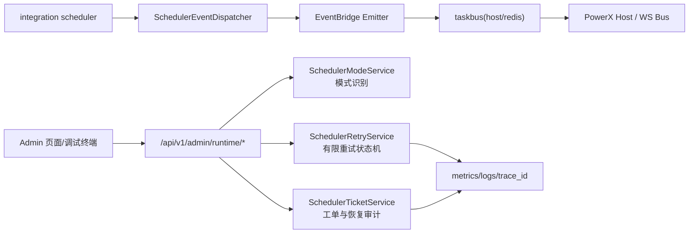
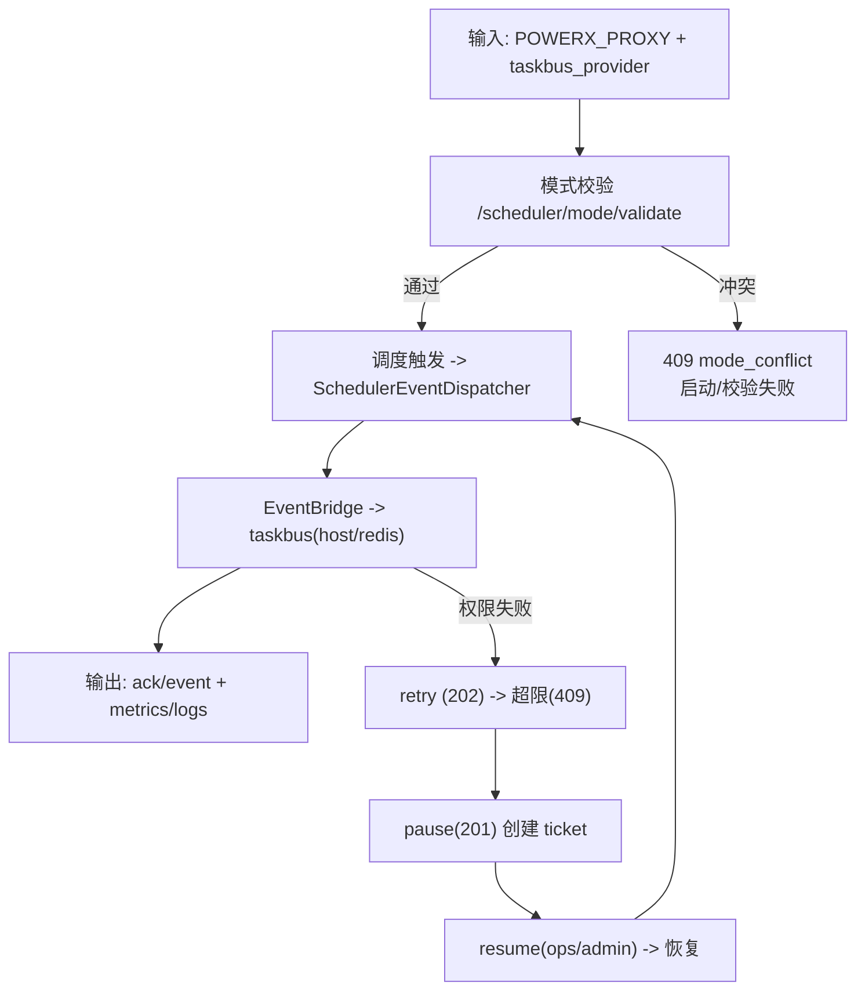
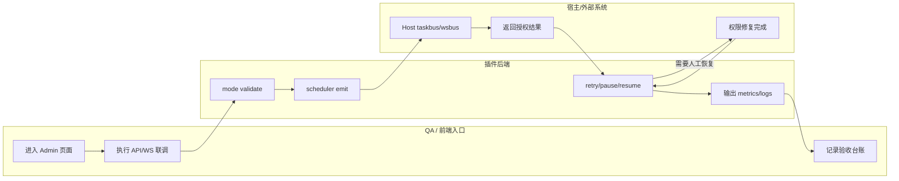

# Async Runtime Scheduler 模式切换功能指导（版本：v1.0）

## 1. 功能背景与目标

### 1.1 为什么要做
- 业务背景：插件在 `standalone local` 与 `delegated proxy` 两种模式下都要执行调度任务。
- 当前痛点：模式识别、权限失败处理、联调步骤若不统一，会出现误判与重复排障。
- 目标收益：同一套“触发-观测-判定-恢复”流程覆盖两种模式，降低交付和回归成本。

### 1.2 本文解决什么问题
- 面向角色：后端研发、QA、运维。
- 本文范围：模式识别、同链路触发语义、权限失败闭环（重试/工单/暂停/恢复）。
- 非本文范围：新增业务 topic 设计、前端页面能力开发。

## 2. 角色与适用范围

- 研发：确认启动期模式判定与调度接线是否正确。
- QA：执行双模式验收与失败闭环验证。
- 运维：处理重试超限后的恢复工单与权限问题。
- 适用环境：本地联调、测试环境、预发布环境。

## 3. 整体架构与模块关系



- 前端模块：`skeleton/web-admin/nuxt`（主要用于登录与联调入口页面）。
- 后端模块：`runtime_ops` handler/service、`cmd/plugin`、`jobs/integration`。
- 外部依赖：PowerX Host、Gateway 凭证、Redis（standalone 场景）。
- 与其他模块关系：复用 EventBridge/TaskBus/WSBus 既有链路，不引入业务层模式分支。

## 4. 核心流程



## 5. 跨角色协作流程



## 6. 前置条件与依赖

- 配置：
  - `POWERX_PROXY=0` 时建议 `taskbus_provider=redis`。
  - `POWERX_PROXY=1` 时建议 `taskbus_provider=host`。
  - `operations.scheduler.retry_max_attempts` 默认 3（范围 1-10）。
- 权限：
  - 调试接口需 admin token。
  - 恢复接口仅 `ops/admin`。
- 数据与环境：
  - proxy 模式需可用 gateway 凭证（bearer/apikey）。
  - 需可访问 `:8078` 及 `/api/ws`。

## 7. 操作步骤（按场景拆分）

### 7.1 页面操作步骤

1. 动作：打开插件后台联调入口页。  
命令/入口：浏览器访问 `/_p/<pluginId>/admin/intro`（或本地 `http://127.0.0.1:3000/intro`）。  
预期结果：页面可用、可继续执行 API/WS 联调。  
失败处理：若 401/403，先检查登录态与 token。

2. 动作：进入“接口联调”流程（手动执行本指南第 7.2/7.3 命令）。  
命令/入口：按本页 curl 与 ws 命令执行。  
预期结果：可完成 mode 校验、触发、重试与恢复。  
失败处理：跳转第 10 节排障矩阵。

### 7.2 接口调用步骤

1. 动作：校验模式匹配。  
命令/入口：
```bash
curl -sS -X POST http://127.0.0.1:8078/api/v1/admin/runtime/scheduler/mode/validate \
  -H "Authorization: Bearer $USER_TOKEN" -H "Content-Type: application/json" \
  -d '{"powerx_proxy":"1","taskbus_provider":"host"}'
```
预期结果：`200` 且 `valid=true`。  
失败处理：`409` 时修正 `POWERX_PROXY` 与 `taskbus_provider`。

2. 动作：验证失败闭环。  
命令/入口：依次执行 `retry -> pause -> resume`（详见 `usecase-us3-retry-recovery.md`）。  
预期结果：前两次 retry `202`、超限 `409`、pause `201`、非 ops/admin resume `403`、ops/admin resume `200`。  
失败处理：定位 `scheduler_retry_handler` 响应码与错误字段。

### 7.3 本地命令步骤

1. 动作：运行回归测试。  
命令/入口：
```bash
mkdir -p tmp/gocache tmp/gomodcache && cd skeleton/backend/go-gin && \
GOCACHE=$PWD/../../tmp/gocache GOMODCACHE=$PWD/../../tmp/gomodcache \
go test ./cmd/plugin ./internal/config ./internal/services/admin/runtime_ops \
  ./internal/transport/http/admin/runtime_ops ./tests/integration \
  -run 'Scheduler|TaskBusProvider|ValidateSchedulerRetryMaxAttemptsRange|DefaultSchedulerConfigValidation' \
  -count=1
```
预期结果：5 个包全部 PASS。  
失败处理：先看配置冲突错误，再看 gateway 依赖与权限配置。

## 8. 预期结果与验收标准

- 模式冲突必须 fail-fast（不可静默放行）。
- 手动触发与调度触发的 topic 与语义一致。
- proxy 权限失败必须进入有限重试并可形成工单闭环。
- 恢复权限边界正确（仅 ops/admin）。
- 日志与指标可追溯（`trace_id/topic/status` 等）。

## 9. 代码实现映射

| 文档步骤 | 代码位置 | 说明 |
|---|---|---|
| 路由入口 | `skeleton/backend/go-gin/internal/transport/http/admin/runtime_ops/routes.go` | 注册 `/scheduler/*` 端点 |
| 模式校验 handler | `skeleton/backend/go-gin/internal/transport/http/admin/runtime_ops/scheduler_mode_handler.go` | `mode/validate` 入参与冲突返回 |
| 重试闭环 handler | `skeleton/backend/go-gin/internal/transport/http/admin/runtime_ops/scheduler_retry_handler.go` | `retry/pause/resume` 状态码与权限边界 |
| 模式服务 | `skeleton/backend/go-gin/internal/services/admin/runtime_ops/scheduler_mode_service.go` | `POWERX_PROXY` 与 provider 配对规则 |
| 重试状态机 | `skeleton/backend/go-gin/internal/services/admin/runtime_ops/scheduler_retry_service.go` | 尝试次数、超限、暂停、恢复 |
| 工单与审计 | `skeleton/backend/go-gin/internal/services/admin/runtime_ops/scheduler_ticket_service.go` | `ticket` 生命周期与 resume audit |
| 启动期冲突校验 | `skeleton/backend/go-gin/cmd/plugin/taskbus_provider.go` | `validateTaskBusProviderConflict` |
| 调度统一分发 | `skeleton/backend/go-gin/internal/jobs/integration/scheduler_event_dispatcher.go` | 统一 topic `powerx.runtime.scheduler.triggered.v1` |
| 配置默认值/边界 | `skeleton/backend/go-gin/internal/config/config.go` | retry 默认值与范围校验 |
| 验证测试 | `specs/017-async-runtime-scheduler-switch/quickstart.md` + `*_test.go` | 回归命令与单测/集成测试 |

## 10. 常见问题与排障

1. 现象：`mode/validate` 返回 `409 mode_conflict`。  
排查：检查 `POWERX_PROXY` 与 `taskbus_provider` 是否按矩阵配对。  
修复：`proxy=1 -> host`；`proxy=0 -> redis`。

2. 现象：`retry` 一直 `409` 无法恢复。  
排查：是否已经执行 `pause`，是否拿到有效 `ticket_id`。  
修复：用 `ops/admin` 调用 resume，再次 retry。

3. 现象：`resume` 返回 `403`。  
排查：请求体 `operator_role` 是否为 `ops/admin`。  
修复：切换运维/管理员身份重试。

4. 现象：只有 `ack` 没有 `event`。  
排查：topic/grant 是否完成、proxy 权限快照是否更新。  
修复：按 `event_fabric` + `ws debug_playbook` 顺序重建联调。

## 11. 回滚与风险控制

- 回滚方式：
  - 配置回滚到稳定组合（`POWERX_PROXY` 与 `taskbus_provider` 对齐）。
  - 暂停自动调度，仅保留手动触发做受控验证。
- 风险控制：
  - 禁止业务层自行分支 host/redis。
  - 重试上限严格控制在 1-10。
  - 恢复动作必须保留审计记录。

## 12. 变更记录

| 版本 | 日期 | 责任人 | 变更内容 |
|---|---|---|---|
| v1.0 | 2026-03-25 | Codex | 初版总览，覆盖 US1/US2/US3 与 Phase 6 收尾口径 |

## Use Case 文档索引

| 文档 | 适用角色 | 独立验收口径 |
|---|---|---|
| `usecase-us1-mode-switch.md` | 研发/QA | 模式识别正确 + 冲突 fail-fast |
| `usecase-us2-trigger-parity.md` | 研发/QA | 手动触发与调度触发语义一致 |
| `usecase-us3-retry-recovery.md` | QA/运维 | 有限重试 -> 工单 -> 暂停 -> 恢复闭环 |
