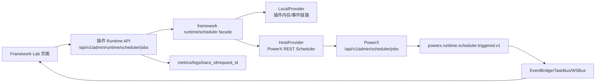
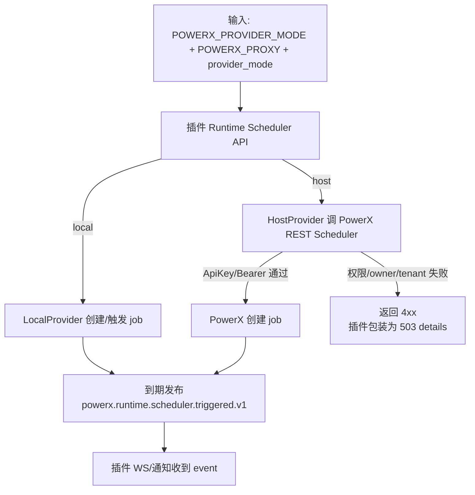
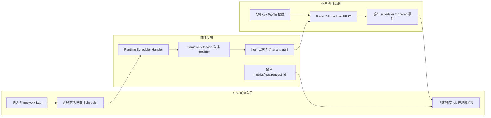

# Async Runtime Scheduler 模式切换功能指导（版本：v1.0）

## 1. 功能背景与目标

### 1.1 为什么要做
- 业务背景：插件在 `standalone local` 与 `delegated proxy` 两种模式下都要执行调度任务。
- 当前痛点：模式识别、权限失败处理、联调步骤若不统一，会出现误判与重复排障。
- 目标收益：同一套“触发-观测-判定-恢复”流程覆盖两种模式，降低交付和回归成本。

### 1.2 本文解决什么问题
- 面向角色：后端研发、QA、运维。
- 本文范围：模式识别、同链路触发语义、权限失败闭环（重试/工单/暂停/恢复）。
- 非本文范围：新增业务 topic 设计、前端页面能力开发。

## 2. 角色与适用范围

- 研发：确认启动期模式判定与调度接线是否正确。
- QA：执行双模式验收与失败闭环验证。
- 运维：处理重试超限后的恢复工单与权限问题。
- 适用环境：本地联调、测试环境、预发布环境。

## 3. 整体架构与模块关系



- 前端模块：`skeleton/web-admin/nuxt`（主要用于登录与联调入口页面）。
- 后端模块：`runtime_ops` handler/service、`cmd/plugin`、`jobs/integration`。
- 外部依赖：PowerX Host、Gateway 凭证、Redis（standalone 场景）。
- 与其他模块关系：复用 EventBridge/TaskBus/WSBus 既有链路，不引入业务层模式分支。

## 4. 核心流程



## 5. 跨角色协作流程



## 6. 前置条件与依赖

- 配置：
  - `POWERX_PROVIDER_MODE=local + POWERX_PROXY=0`：本地 Scheduler，tenant 由本地上下文/请求解析。
  - `POWERX_PROVIDER_MODE=local + POWERX_PROXY=1`：local+proxy，host Scheduler 使用 `PX_GATEWAY_AUTH_SCHEME=apikey` + `PX_GATEWAY_API_KEY`。
  - `POWERX_PROVIDER_MODE=delegated + POWERX_PROXY=0`：standalone delegated，用于本地模拟 delegated provider。
  - `POWERX_PROVIDER_MODE=delegated + POWERX_PROXY=1`：host delegated，host Scheduler 使用 Bearer/STS。
- PowerX 权限：
  - API Key Profile 需要勾选 `com.corex.scheduler.jobs` 对应 REST 权限。
  - 权限目录应包含 `admin_scheduler_jobs`、`admin_scheduler_jobs_job_id`、`pause/resume/trigger/runs`。
- 数据与环境：
  - PowerX Core 可访问：`PX_GATEWAY_BASE_URL=http://127.0.0.1:8077`。
  - 插件后端可访问：`http://127.0.0.1:8078`。
  - WS/通知链路可用，标准 topic 为 `powerx.runtime.scheduler.triggered.v1`。

## 7. 操作步骤（按场景拆分）

### 7.1 页面操作步骤

1. 动作：打开插件后台联调入口页。  
命令/入口：浏览器访问 Framework Lab 页面（本地 Nuxt 通常为 `http://127.0.0.1:<port>/templates/framework-lab`，宿主内为插件后台对应路由）。  
预期结果：可看到“本地 Scheduler”和“网关 Scheduler”两个入口。  
失败处理：若 401/403，先检查登录态与 token。

2. 动作：测试本地 Scheduler。  
命令/入口：点击“本地 Scheduler” -> “创建 Scheduler 样例”。  
预期结果：本地列表出现 job，到期或手动触发后收到 `powerx.runtime.scheduler.triggered.v1` 通知。  
失败处理：检查 `tenant_uuid`、本地 EventBridge/WS 订阅与插件日志。

3. 动作：测试网关 Scheduler。  
命令/入口：点击“网关 Scheduler” -> “创建 Scheduler 样例”。  
预期结果：插件调用 PowerX `/api/v1/admin/scheduler/jobs` 创建 job，到期后插件收到 Scheduler 通知。  
失败处理：跳转第 10 节排障矩阵。

### 7.2 接口调用步骤

1. 动作：创建 host scheduler job。  
命令/入口：
```bash
curl -sS -X POST http://127.0.0.1:8078/api/v1/admin/runtime/scheduler/jobs \
  -H "Authorization: Bearer $USER_TOKEN" \
  -H "Content-Type: application/json" \
  -d '{
    "provider_mode":"host",
    "force_host":true,
    "owner_type":"plugin",
    "owner_id":"com.powerx.plugins.base",
    "name":"framework_lab_once_manual",
    "schedule_type":"once",
    "schedule_expr":"2026-05-23T10:30:00Z",
    "topic":"powerx.runtime.scheduler.triggered.v1",
    "payload":{"business_action":"framework_lab_scheduler_probe","trace_id":"manual-trace-001"}
  }'
```
预期结果：`201`，返回 `job_id`。  
失败处理：`503` 时查看 `error.details.status_code/body/endpoint`，再用 PowerX `request_id` 查底座日志。

2. 动作：手动触发 job。  
命令/入口：
```bash
curl -sS -X POST "http://127.0.0.1:8078/api/v1/admin/runtime/scheduler/jobs/$JOB_ID/trigger?provider_mode=host" \
  -H "Authorization: Bearer $USER_TOKEN"
```
预期结果：`200`，PowerX 执行 trigger，插件侧通知链路收到事件。  
失败处理：检查 API Key Profile 是否勾选 trigger 权限。

### 7.3 本地命令步骤

1. 动作：运行回归测试。  
命令/入口：
```bash
mkdir -p tmp/gocache tmp/gomodcache && cd skeleton/backend/go-gin && \
GOCACHE=$PWD/../../tmp/gocache GOMODCACHE=$PWD/../../tmp/gomodcache \
go test ./cmd/plugin ./internal/config ./internal/services/admin/runtime_ops \
  ./internal/transport/http/admin/runtime_ops ./tests/integration \
  -run 'Scheduler|TaskBusProvider|ValidateSchedulerRetryMaxAttemptsRange|DefaultSchedulerConfigValidation' \
  -count=1
```
预期结果：5 个包全部 PASS。  
失败处理：先看配置冲突错误，再看 gateway 依赖与权限配置。

2. 动作：验证 Scheduler host client 单测。  
命令/入口：
```bash
GOCACHE=$PWD/tmp/gocache go test ./framework/backend/go/runtime/scheduler \
  ./skeleton/backend/go-gin/internal/transport/http/admin/runtime_ops \
  -run 'Test.*Scheduler|TestSchedulerJobHandler|TestHTTPHostClient' -count=1
```
预期结果：两个包 PASS。  
失败处理：重点检查 host 出站 URL、ApiKey/Bearer 选择、`tenant_uuid` 是否被透传。

## 8. 预期结果与验收标准

- host create/list/trigger/pause/resume 通过插件 runtime API 进入 framework facade。
- host 出站调用 PowerX `/api/v1/admin/scheduler/jobs`，不传 `tenant_uuid`。
- ApiKey 模式使用 `Authorization: ApiKey <key>`，Bearer 模式使用 `Authorization: Bearer <token>`。
- PowerX API Key Profile 权限控制 Scheduler REST 调用。
- 手动触发与到期触发 topic 一致：`powerx.runtime.scheduler.triggered.v1`。
- 日志与指标可追溯（`trace_id/request_id/topic/status` 等）。

## 9. 代码实现映射

| 文档步骤 | 代码位置 | 说明 |
|---|---|---|
| 路由入口 | `skeleton/backend/go-gin/internal/transport/http/admin/runtime_ops/routes.go` | 注册 `/scheduler/*` 端点 |
| Scheduler job handler | `skeleton/backend/go-gin/internal/transport/http/admin/runtime_ops/scheduler_job_handler.go` | `/runtime/scheduler/jobs` create/list/get/trigger/pause/resume |
| framework host client | `framework/backend/go/runtime/scheduler/http_host_client.go` | 调 PowerX REST Scheduler，处理 ApiKey/Bearer 与 envelope |
| host provider | `framework/backend/go/runtime/scheduler/host_provider.go` | host provider 不透传 tenant |
| scheduler types | `framework/backend/go/runtime/scheduler/types.go` | host/local 校验差异与 job DTO |
| 前端联调页 | `skeleton/web-admin/nuxt/app/pages/templates/framework-lab.vue` | 本地/网关 Scheduler 页面入口 |
| 前端 client | `skeleton/web-admin/nuxt/app/composables/api/useScheduler.ts` | scheduler runtime API 封装 |
| 模式校验 handler | `skeleton/backend/go-gin/internal/transport/http/admin/runtime_ops/scheduler_mode_handler.go` | `mode/validate` 入参与冲突返回 |
| 重试闭环 handler | `skeleton/backend/go-gin/internal/transport/http/admin/runtime_ops/scheduler_retry_handler.go` | `retry/pause/resume` 状态码与权限边界 |
| 模式服务 | `skeleton/backend/go-gin/internal/services/admin/runtime_ops/scheduler_mode_service.go` | `POWERX_PROXY` 与 provider 配对规则 |
| 重试状态机 | `skeleton/backend/go-gin/internal/services/admin/runtime_ops/scheduler_retry_service.go` | 尝试次数、超限、暂停、恢复 |
| 工单与审计 | `skeleton/backend/go-gin/internal/services/admin/runtime_ops/scheduler_ticket_service.go` | `ticket` 生命周期与 resume audit |
| 启动期冲突校验 | `skeleton/backend/go-gin/cmd/plugin/taskbus_provider.go` | `validateTaskBusProviderConflict` |
| 调度统一分发 | `skeleton/backend/go-gin/internal/jobs/integration/scheduler_event_dispatcher.go` | 统一 topic `powerx.runtime.scheduler.triggered.v1` |
| 配置默认值/边界 | `skeleton/backend/go-gin/internal/config/config.go` | retry 默认值与范围校验 |
| 验证测试 | `specs/017-async-runtime-scheduler-switch/quickstart.md` + `*_test.go` | 回归命令与单测/集成测试 |

## 10. 常见问题与排障

1. 现象：`mode/validate` 返回 `409 mode_conflict`。  
排查：检查 `POWERX_PROXY` 与 `taskbus_provider` 是否按矩阵配对。  
修复：`proxy=1 -> host`；`proxy=0 -> redis`。

2. 现象：`retry` 一直 `409` 无法恢复。  
排查：是否已经执行 `pause`，是否拿到有效 `ticket_id`。  
修复：用 `ops/admin` 调用 resume，再次 retry。

3. 现象：`resume` 返回 `403`。  
排查：请求体 `operator_role` 是否为 `ops/admin`。  
修复：切换运维/管理员身份重试。

4. 现象：只有 `ack` 没有 `event`。  
排查：topic/grant 是否完成、proxy 权限快照是否更新。  
修复：按 `event_fabric` + `ws debug_playbook` 顺序重建联调。

5. 现象：host create 返回 `SCHEDULER_TENANT_MISMATCH`。  
排查：host 请求不应带 `tenant_uuid`；PowerX 只从 ApiKey/Bearer 上下文解析租户。  
修复：确认使用当前 framework host client，并重启插件后端。

6. 现象：host create 返回 `SCHEDULER_PLUGIN_OWNER_MISMATCH`。  
排查：请求已进入 PowerX Scheduler 服务内部 owner 校验，API Key REST 权限层已经不是唯一检查点。  
修复：确认 PowerX Scheduler 已适配 API Key Profile 授权链路；用 `request_id` 查 PowerX `logs/info.log`。

7. 现象：PowerX API Key 页面看不到 Scheduler 权限。  
排查：PowerX `platform_capabilities` 是否注册 `com.corex.scheduler.jobs` 的 REST protocols。  
修复：补注册后重新 seed/刷新权限目录，并保存 Profile。

## 11. 回滚与风险控制

- 回滚方式：
  - 配置回滚到稳定组合（`POWERX_PROXY` 与 `taskbus_provider` 对齐）。
  - 暂停自动调度，仅保留手动触发做受控验证。
- 风险控制：
  - 禁止业务层自行分支 host/redis。
  - 重试上限严格控制在 1-10。
  - 恢复动作必须保留审计记录。

## 12. 变更记录

| 版本 | 日期 | 责任人 | 变更内容 |
|---|---|---|---|
| v1.0 | 2026-03-25 | Codex | 初版总览，覆盖 US1/US2/US3 与 Phase 6 收尾口径 |
| v1.1 | 2026-05-23 | Codex | 对齐 Runtime Scheduler host REST、ApiKey 权限、tenant 不透传与通知验收口径 |

## Use Case 文档索引

| 文档 | 适用角色 | 独立验收口径 |
|---|---|---|
| `usecase-us1-mode-switch.md` | 研发/QA | 模式识别正确 + 冲突 fail-fast |
| `usecase-us2-trigger-parity.md` | 研发/QA | 手动触发与调度触发语义一致 |
| `usecase-us3-retry-recovery.md` | QA/运维 | 有限重试 -> 工单 -> 暂停 -> 恢复闭环 |
