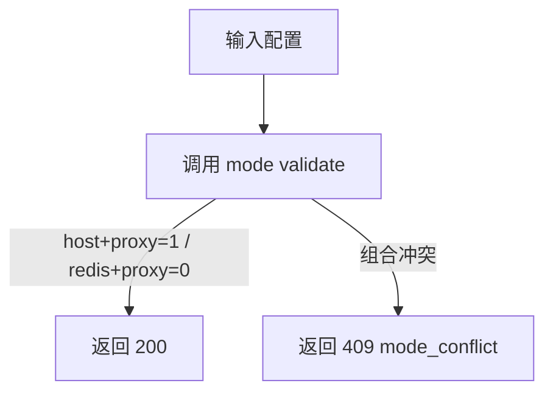
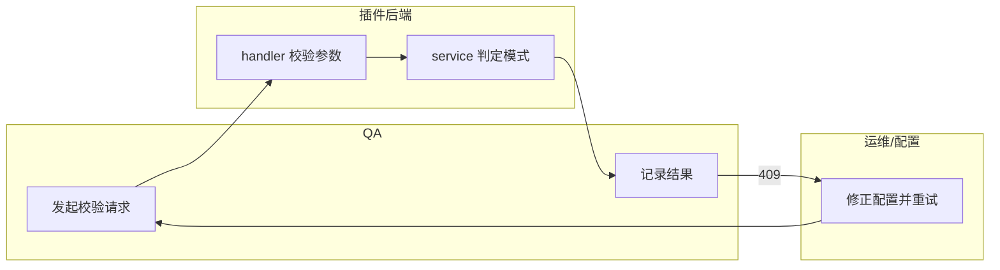

# Use Case：US1 模式识别与冲突阻断（版本：v1.0）

## 1. 功能背景与目标

- 目标结论：在启动期识别 `standalone_local/delegated_proxy`，并在冲突配置时立即失败。
- 价值：避免任务走错链路或“静默成功”。

## 2. 角色与适用范围

- 研发：验证启动配置与模式判定。
- QA：验证 `mode/validate` 的成功与冲突分支。
- 环境：本地/测试环境。

## 3. 整体架构与模块关系


## 4. 核心流程



## 5. 跨角色协作流程



## 6. 前置条件与依赖

- `POWERX_PROXY` 与 `taskbus_provider` 已配置。
- 拥有 admin token。
- 可访问 `:8078`。

## 7. 操作步骤（按场景拆分）

### 7.1 页面操作步骤

1. 动作：打开插件后台页确认环境可访问。  
命令/入口：`/_p/<pluginId>/admin/intro`。  
预期结果：页面可正常打开。  
失败处理：检查登录态与反向代理。

### 7.2 接口调用步骤

1. 动作：验证合法组合。  
命令/入口：
```bash
curl -sS -X POST http://127.0.0.1:8078/api/v1/admin/runtime/scheduler/mode/validate \
  -H "Authorization: Bearer $USER_TOKEN" -H "Content-Type: application/json" \
  -d '{"powerx_proxy":"0","taskbus_provider":"redis"}'
```
预期结果：`200` + `valid=true`。  
失败处理：若 `400`，检查请求体字段。

2. 动作：验证冲突组合。  
命令/入口：将请求改为 `{"powerx_proxy":"1","taskbus_provider":"redis"}`。  
预期结果：`409` + `mode_conflict`。  
失败处理：检查 handler/service 是否为最新版本。

### 7.3 本地命令步骤

1. 动作：运行 US1 相关测试。  
命令/入口：
```bash
cd skeleton/backend/go-gin && go test ./internal/services/admin/runtime_ops ./internal/transport/http/admin/runtime_ops ./tests/integration -run 'SchedulerMode' -count=1
```
预期结果：PASS。  
失败处理：查看 `scheduler_mode_*_test.go` 与 `taskbus_provider.go`。

## 8. 预期结果与验收标准

- 合法组合稳定返回 `200`。
- 冲突组合稳定返回 `409`。
- 启动期冲突校验不允许静默执行。

## 9. 代码实现映射

| 文档步骤 | 代码位置 | 说明 |
|---|---|---|
| 路由 | `skeleton/backend/go-gin/internal/transport/http/admin/runtime_ops/routes.go` | `/scheduler/mode/validate` |
| Handler | `skeleton/backend/go-gin/internal/transport/http/admin/runtime_ops/scheduler_mode_handler.go` | 参数与冲突响应 |
| Service | `skeleton/backend/go-gin/internal/services/admin/runtime_ops/scheduler_mode_service.go` | 模式判定规则 |
| 启动冲突校验 | `skeleton/backend/go-gin/cmd/plugin/taskbus_provider.go` | `validateTaskBusProviderConflict` |
| 测试 | `skeleton/backend/go-gin/internal/services/admin/runtime_ops/scheduler_mode_service_test.go` | 单测 |

## 10. 常见问题与排障

- Q1：为何总是 `mode_conflict`？  
排查：检查 `powerx_proxy` 与 `taskbus_provider` 的配对矩阵。  
修复：`1->host`，`0->redis`。

- Q2：请求返回 `400`。  
排查：`taskbus_provider` 是否缺失。  
修复：补齐字段并使用 `host/redis`。

## 11. 回滚与风险控制

- 回滚：恢复上一个已验证的配置文件。
- 风险控制：发布前固定执行 `mode/validate` 作为门禁。

## 12. 变更记录

| 版本 | 日期 | 责任人 | 变更 |
|---|---|---|---|
| v1.0 | 2026-03-25 | Codex | 初版 |
