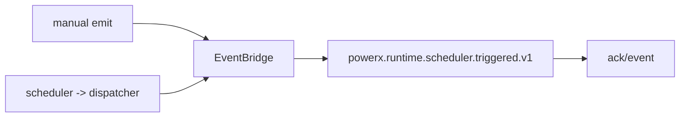
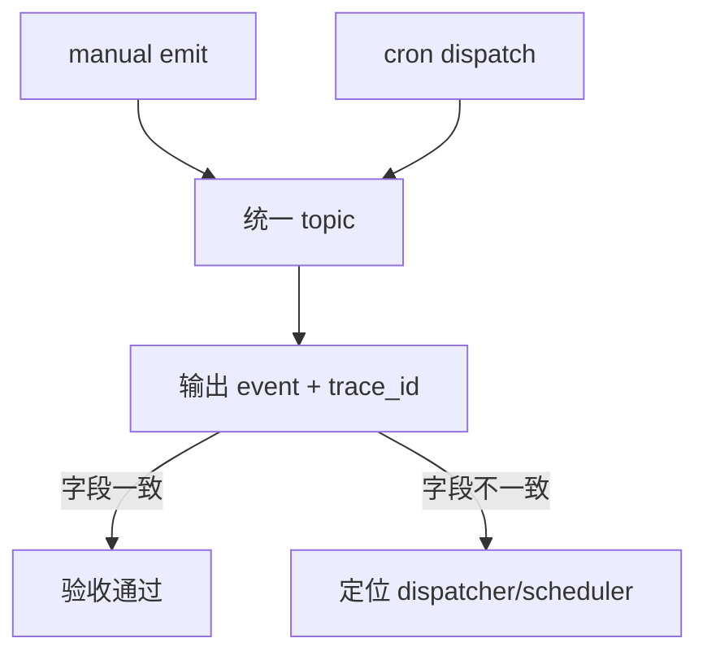
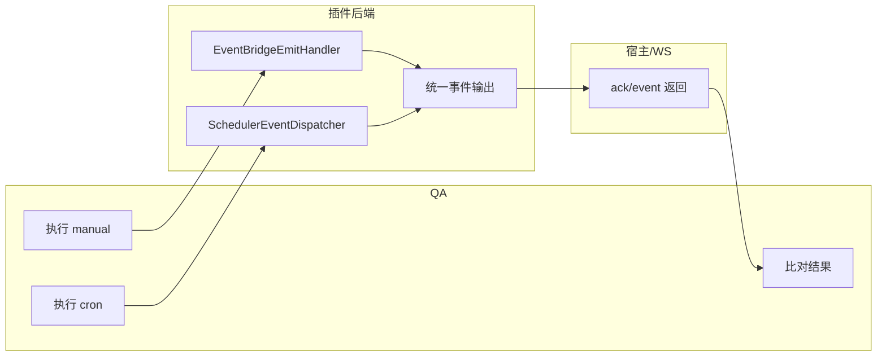

# Use Case：US2 手动触发与调度触发语义一致（版本：v1.0）

## 1. 功能背景与目标

- 目标结论：手动触发与 cron 调度触发复用同一事件语义（topic + payload 关键字段一致）。
- 价值：统一联调和排障路径，减少双轨行为。

## 2. 角色与适用范围

- 研发：保证 scheduler 只触发，不直接 publish WS。
- QA：对比 manual 与 cron 的结果语义一致性。

## 3. 整体架构与模块关系



## 4. 核心流程



## 5. 跨角色协作流程



## 6. 前置条件与依赖

- `SchedulerTriggeredTopic=powerx.runtime.scheduler.triggered.v1` 已生效。
- WS 可订阅。
- 手动触发与调度触发都可执行。

## 7. 操作步骤（按场景拆分）

### 7.1 页面操作步骤

1. 动作：打开联调入口页并准备 token。  
命令/入口：`/_p/<pluginId>/admin/intro`。  
预期结果：可继续执行 API/WS 命令。

### 7.2 接口调用步骤

1. 动作：手动触发（对照组）。  
命令/入口：
```bash
curl -sS -X POST http://127.0.0.1:8078/api/v1/admin/runtime/event-bridge/emit \
  -H "Authorization: Bearer $USER_TOKEN" -H "Content-Type: application/json" \
  -d '{"topic":"powerx.runtime.scheduler.triggered.v1","payload":{"source":"manual","business_action":"reconcile","status":"queued"}}'
```
预期结果：收到 `ack + event`。

2. 动作：调度触发（目标组）。  
命令/入口：启动 scheduler 或执行调度触发脚本。  
预期结果：同 topic、同核心语义字段。

### 7.3 本地命令步骤

```bash
cd skeleton/backend/go-gin && go test ./tests/integration ./internal/services/admin/runtime_ops -run 'SchedulerManualCronParity|SchedulerManualCronParitySeries' -count=1
```

预期结果：PASS。

## 8. 预期结果与验收标准

- 两种触发的 topic 一致。
- `business_action/status/trace_id` 可对齐。
- 允许耗时差异，不作为失败判定。

## 9. 代码实现映射

| 文档步骤 | 代码位置 | 说明 |
|---|---|---|
| 调度触发 | `skeleton/backend/go-gin/internal/jobs/integration/scheduler.go` | 调度入口 |
| 统一分发 | `skeleton/backend/go-gin/internal/jobs/integration/scheduler_event_dispatcher.go` | topic 与 trace 透传 |
| 手动触发 | `skeleton/backend/go-gin/internal/transport/http/admin/runtime_ops/event_bridge_debug_handler.go` | manual emit |
| 集成测试 | `skeleton/backend/go-gin/tests/integration/scheduler_manual_cron_parity_test.go` | 语义一致性 |

## 10. 常见问题与排障

- Q1：manual 成功但 cron 无 event。  
排查：scheduler 是否启动、dispatcher 是否注入。  
修复：检查 `main.go` 调度接线。

- Q2：trace_id 未透传。  
排查：dispatcher payload 与 meta 是否一致。  
修复：检查 `DispatchCronTrigger` 构建逻辑。

## 11. 回滚与风险控制

- 回滚：先禁用 cron，仅保留 manual 验证。
- 风险控制：发布前必须跑 parity 测试。

## 12. 变更记录

| 版本 | 日期 | 责任人 | 变更 |
|---|---|---|---|
| v1.0 | 2026-03-25 | Codex | 初版 |
