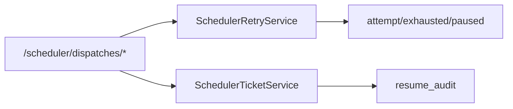
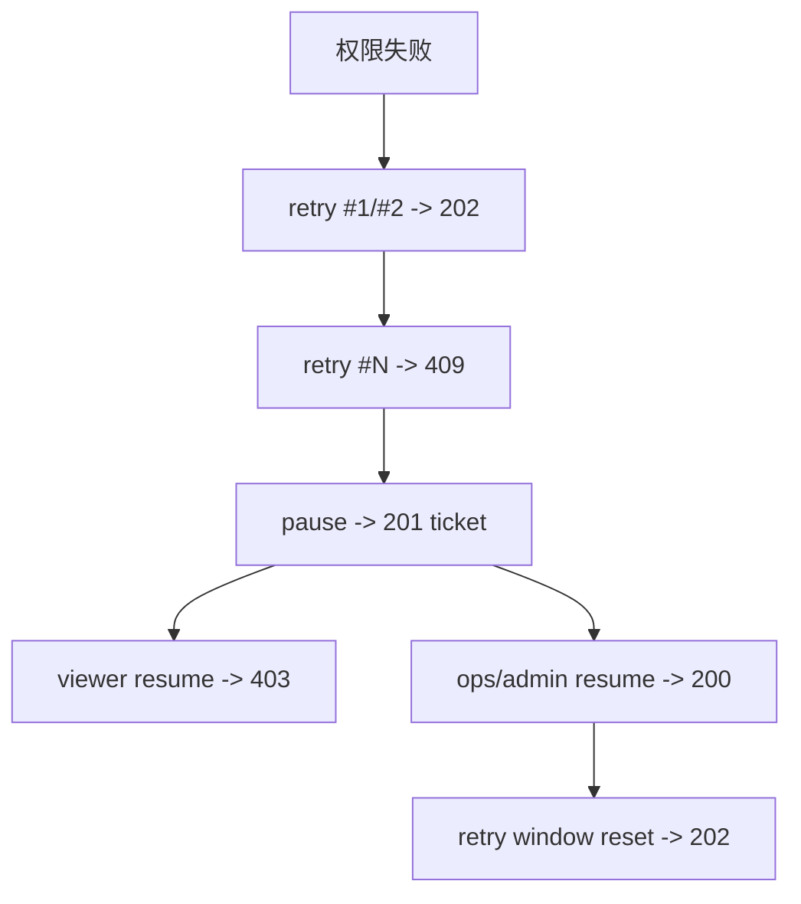
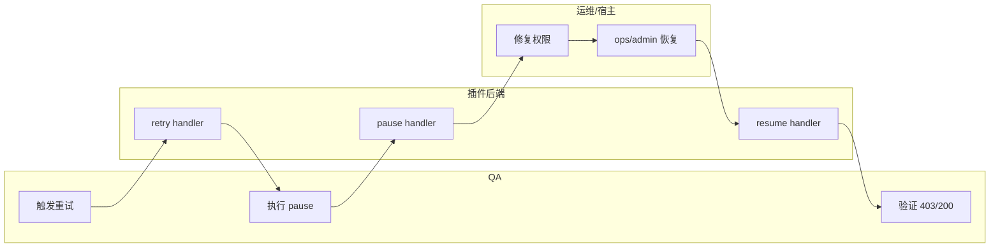

# Use Case：US3 权限失败闭环（重试/工单/暂停/恢复）（版本：v1.0）

## 1. 功能背景与目标

- 目标结论：proxy 权限失败时，走“有限重试 -> 超限工单 -> 暂停 -> 运维恢复 -> 再触发”。
- 价值：防止无限重试与静默失败，形成可审计的人机协作闭环。

## 2. 角色与适用范围

- QA：验证失败闭环路径完整。
- 运维：执行恢复动作并留痕。
- 研发：定位重试状态机与工单服务问题。

## 3. 整体架构与模块关系



## 4. 核心流程



## 5. 跨角色协作流程



## 6. 前置条件与依赖

- `operations.scheduler.retry_max_attempts` 已配置（默认 3）。
- proxy 鉴权可复现权限失败。
- 恢复角色具备 `ops/admin` 身份。

## 7. 操作步骤（按场景拆分）

### 7.1 页面操作步骤

1. 动作：进入插件后台确认联调环境。  
命令/入口：`/_p/<pluginId>/admin/intro`。  
预期结果：可继续执行 API 调试。

### 7.2 接口调用步骤

1. 动作：连续重试直至超限。  
命令/入口：
```bash
curl -sS -X POST http://127.0.0.1:8078/api/v1/admin/runtime/scheduler/dispatches/dispatch-us3-001/retry \
  -H "Authorization: Bearer $USER_TOKEN" -H "Content-Type: application/json" \
  -d '{"error_code":"AUTH_FORBIDDEN","error_message":"topic not allowed"}'
```
预期结果：前两次 `202`，第三次 `409`。

2. 动作：暂停并创建工单。  
命令/入口：
```bash
curl -sS -X POST http://127.0.0.1:8078/api/v1/admin/runtime/scheduler/dispatches/dispatch-us3-001/pause \
  -H "Authorization: Bearer $USER_TOKEN" -H "Content-Type: application/json" \
  -d '{"paused_job_id":"job-us3-001"}'
```
预期结果：`201` + 返回 `ticket_id`。

3. 动作：验证恢复权限边界。  
命令/入口：
```bash
# 非 ops/admin
curl -sS -X POST "http://127.0.0.1:8078/api/v1/admin/runtime/scheduler/tickets/$TICKET_ID/resume" \
  -H "Authorization: Bearer $USER_TOKEN" -H "Content-Type: application/json" \
  -d '{"operator_role":"viewer","operator_id":"qa-user","reason":"try"}'

# ops/admin
curl -sS -X POST "http://127.0.0.1:8078/api/v1/admin/runtime/scheduler/tickets/$TICKET_ID/resume" \
  -H "Authorization: Bearer $USER_TOKEN" -H "Content-Type: application/json" \
  -d '{"operator_role":"ops","operator_id":"ops-user","reason":"fixed"}'
```
预期结果：先 `403` 后 `200`，再次 retry 回到 `202`。

### 7.3 本地命令步骤

```bash
cd skeleton/backend/go-gin && go test ./internal/services/admin/runtime_ops ./internal/transport/http/admin/runtime_ops ./tests/integration -run 'SchedulerRetry|SchedulerRetryRecoveryFlow' -count=1
```

预期结果：PASS。

## 8. 预期结果与验收标准

- 限定重试次数有效。
- 超限后可创建工单并暂停。
- 恢复权限严格受控。
- 恢复动作留有审计记录。

## 9. 代码实现映射

| 文档步骤 | 代码位置 | 说明 |
|---|---|---|
| retry/pause/resume API | `skeleton/backend/go-gin/internal/transport/http/admin/runtime_ops/scheduler_retry_handler.go` | 状态码、权限边界 |
| 重试状态机 | `skeleton/backend/go-gin/internal/services/admin/runtime_ops/scheduler_retry_service.go` | attempt/exhausted/paused |
| 工单与审计 | `skeleton/backend/go-gin/internal/services/admin/runtime_ops/scheduler_ticket_service.go` | ticket + resume audit |
| 集成测试 | `skeleton/backend/go-gin/tests/integration/scheduler_retry_recovery_flow_test.go` | 闭环验证 |

## 10. 常见问题与排障

- Q1：pause 返回 `409`。  
排查：是否已达到重试上限。  
修复：先执行足够次数 retry。

- Q2：ops 恢复仍失败。  
排查：`operator_role/operator_id` 是否传递。  
修复：按接口示例传递并确认 ticket 存在。

- Q3：恢复后 retry 仍 `409`。  
排查：resume 是否返回 `200` 且 ticket resolved。  
修复：重新执行 resume 并检查 handler 日志。

## 11. 回滚与风险控制

- 回滚：临时停用相关调度任务，转人工触发。
- 风险控制：恢复动作必须由 ops/admin 执行并记录审计。

## 12. 变更记录

| 版本 | 日期 | 责任人 | 变更 |
|---|---|---|---|
| v1.0 | 2026-03-25 | Codex | 初版 |
