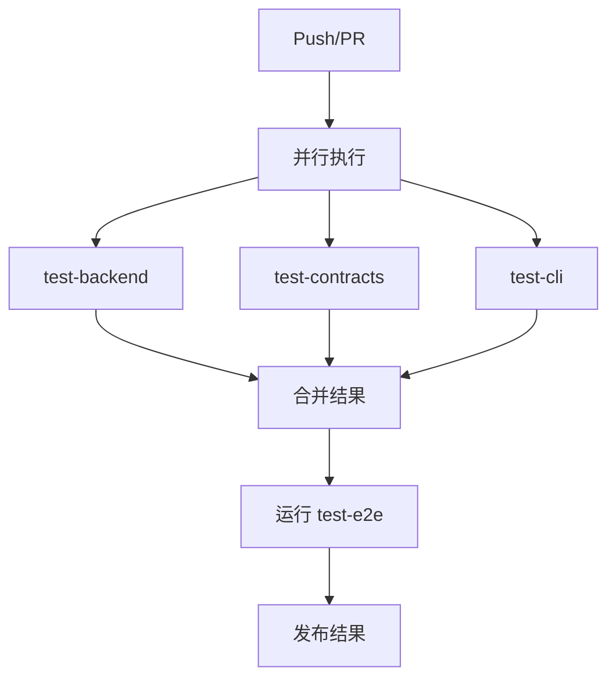
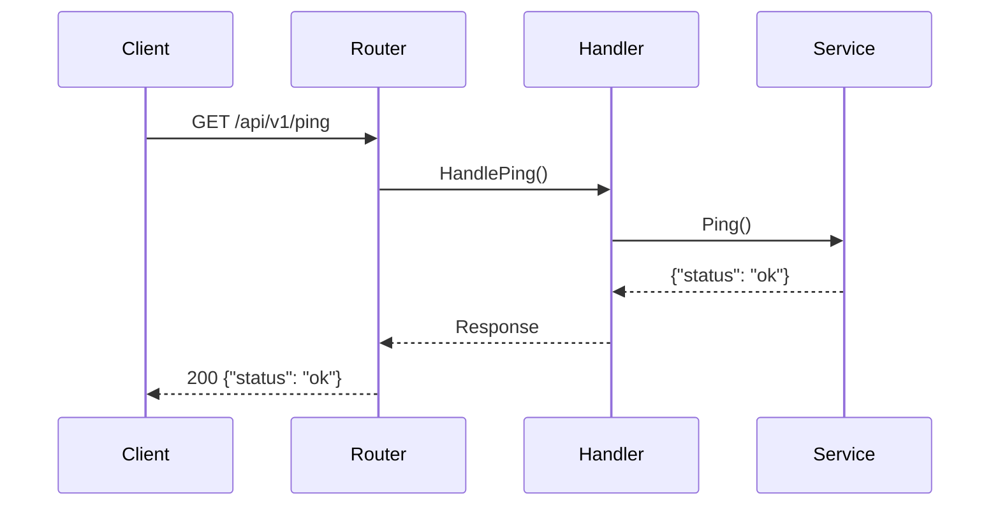
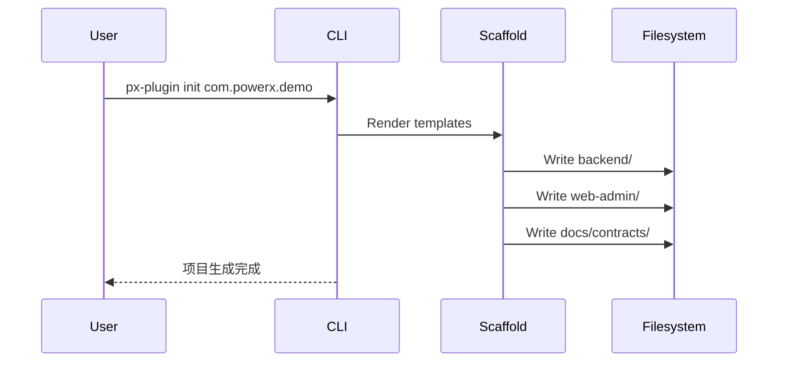
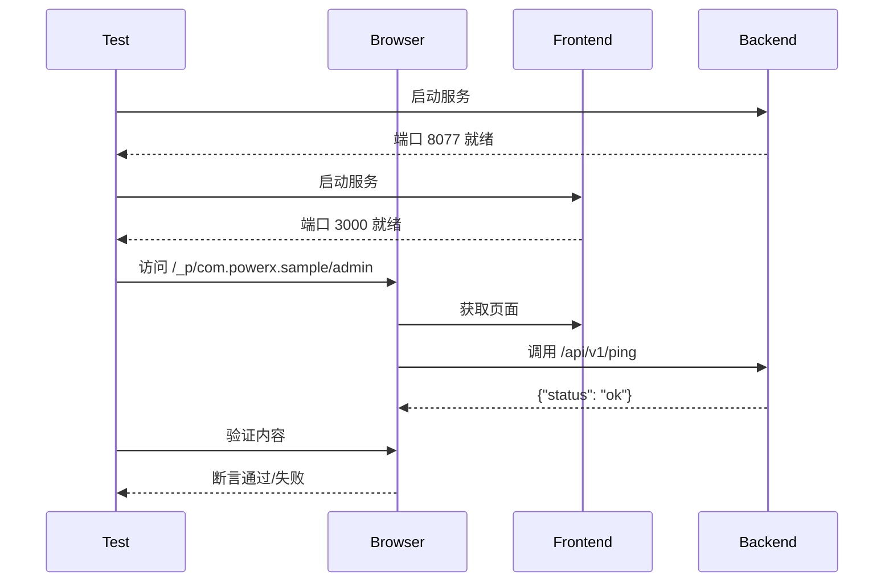

# PowerXPlugin 测试策略与实施方案

**文档版本**: v1.0  
**创建日期**: 2025-10-31  
**项目阶段**: Phase 0-7 已完成，进入稳定维护期  
**适用范围**: PowerXPlugin 仓库（Go 1.24+ / Nuxt 4.2+）

---

## 目录

- [1. 策略概述](#1-策略概述)
- [2. 四层测试架构](#2-四层测试架构)
- [3. 契约守护机制](#3-契约守护机制)
- [4. 聚合命令与自动化](#4-聚合命令与自动化)
- [5. 回归测试策略](#5-回归测试策略)
- [6. 覆盖度与报告](#6-覆盖度与报告)
- [7. CI/CD 集成](#7-cicd-集成)
- [8. 测试执行手册](#8-测试执行手册)
- [9. 附录：关键业务流](#9-附录关键业务流)

---

## 1. 策略概述

### 1.1 设计原则

**防御性测试**：通过多层防护确保代码质量和契约一致性  
**渐进式验证**：从单元 → 集成 → 端到端，逐步增加信心  
**契约驱动**：以 `docs/contracts/` 为核心，所有实现必须对齐契约  
**快速反馈**：开发者本地运行 `make test` < 30 秒，CI 完整流程 < 5 分钟  

### 1.2 质量门槛

| 层级 | 覆盖率要求 | 执行时间 | 失败处理 |
|------|------------|----------|----------|
| 单元测试 | ≥ 70% | < 10s | 阻断合并 |
| 集成测试 | 核心路径 | < 15s | 阻断合并 |
| E2E 测试 | 关键用户流 | < 60s | 警告/不阻断 |
| CLI 验证 | 生成结构正确性 | < 30s | 阻断合并 |

### 1.3 Phase 映射关系

| Phase | 任务编号 | 对应测试层级 | 关键验收点 |
|-------|----------|-------------|------------|
| Phase 0 | T001-T005 | 单元测试 | go.work、npm workspace |
| Phase 1 | T006-T018 | 契约守护 | docs/contracts/** |
| Phase 2 | T019-T028 | 集成测试 | skeleton 可独立运行 |
| Phase 3 | T029-T036 | 单元测试 | framework API 签名 |
| Phase 4 | T037-T048 | CLI 验证 | px-plugin init 输出 |
| Phase 6 | T049-T053 | 集成+契约 | examples/starter/ |
| Phase 7 | T054-T060 | 全层级 | quickstart 可用性 |

---

## 2. 四层测试架构

> **测试文件布局约定**  
> - Go 代码的测试文件与实现同目录存放，使用 `*_test.go` 命名（例如 `framework/backend/go/bootstrap/app_test.go`）。  
> - 前端 Playwright 用例集中在 `skeleton/web-admin/nuxt/tests/e2e/`。  
> - CLI/脚本级验证可在 `scripts/` 目录或独立测试包中实现，但保持与被测模块一一对应。  
> 这样可以让 `go test ./...`、`npx playwright test` 等框架原生命令自动发现全部用例。

### 2.1 Layer 1: Go 单元测试

**目标**: 验证框架层核心逻辑正确性  
**命令**: `go test ./framework/... -v -coverprofile=coverage.out`  
**当前状态**: ✅ 已实现 (8/8 通过, 62.3% 覆盖率)

#### 覆盖范围

```
framework/backend/go/
├── bootstrap/
│   ├── app.go              ✅ TestNewAppFromEnv*
│   ├── config.go           ✅ TestParseBoolEnv
│   └── manifest.go         ✅ TestRegisterManifestCopiesValue
├── router/
│   └── router.go           [TODO] 单元测试
├── manifest/
│   └── validator.go        [TODO] 单元测试
└── rbac/
    └── validator.go        [TODO] 单元测试
```

#### 改进计划

1. **新增 router 单元测试**
   ```go
   func TestRegisterFrameworkRoutes(t *testing.T)
   func TestRegisterPluginRoutes(t *testing.T)
   func TestAttachHTTPServer(t *testing.T)
   ```

2. **新增 manifest 单元测试**
   ```go
   func TestValidatePluginID(t *testing.T)
   func TestMenuPathValidation(t *testing.T)
   ```

3. **目标覆盖率**: 提升至 80%+

#### 示例测试用例

```go
func TestRegisterFrameworkRoutes(t *testing.T) {
    app := bootstrap.NewApp(nil)
    if err := router.AttachHTTPServer(app); err != nil {
        t.Fatalf("attach: %v", err)
    }

    routes := collectRoutes(app.Router)
    if _, ok := routes[router.HealthzPath]; !ok {
        t.Fatalf("expected %s to be registered", router.HealthzPath)
    }
}
```

### 2.2 Layer 2: Skeleton 集成测试

**目标**: 验证端到端业务流  
**命令**: `go test ./skeleton/backend/go-gin/... -v`  
**当前状态**: ✅ 已实现 (1/1 通过)

#### 覆盖范围

```
skeleton/backend/go-gin/internal/
├── routes/
│   ├── routes.go           ✅ TestRegisterAddsPingRoute
│   └── routes_test.go
├── handler/
│   └── ping.go             [TODO] 单元测试
├── service/
│   └── ping.go             [TODO] 单元测试
└── manifestx/
    └── manifest.go         [TODO] 单元测试
```

#### 改进计划

1. **新增 handler 测试**
   ```go
   func TestPingHandler_Success(t *testing.T)
   func TestPingHandler_JSONResponse(t *testing.T)
   ```

2. **新增服务层测试**
   ```go
   func TestPingService_Execute(t *testing.T)
   ```

3. **新增 manifest 测试**
   ```go
   func TestPluginManifest_Complete(t *testing.T)
   func TestMenuRegistration(t *testing.T)
   ```

#### 示例测试用例

```go
func TestPingHandler_Success(t *testing.T) {
    w := httptest.NewRecorder()
    r := httptest.NewRequest("GET", "/api/v1/ping", nil)
    
    handler := http.HandlerFunc(PingHandler)
    handler.ServeHTTP(w, r)
    
    assert.Equal(t, 200, w.Code)
    assert.Contains(t, w.Body.String(), "status")
}
```

### 2.3 Layer 3: 前端 E2E 测试

**目标**: 验证真实用户场景  
**命令**: `cd skeleton/web-admin/nuxt && npx playwright test`  
**当前状态**: ⚠️ 已配置但需修复（需先安装依赖并修正断言）

#### 现状问题

- ❌ 首次运行 Playwright 之前若未执行 `npm install`，`PXAdminLayout` 组件无法解析，Nuxt 控制台出现 “Failed to resolve component” 警告
- ❌ 测试用例断言曾与示例页面文案不一致（页面实际渲染 “PowerX Sample”和“欢迎使用 PowerX 插件脚手架示例页面。”）

#### 修复计划

1. **确保依赖安装与 layer 就绪**
   ```bash
   cd skeleton/web-admin/nuxt
   npm install
   npx playwright install
   npm run dev
   # 观察控制台无组件解析警告后再执行测试
   ```

2. **统一断言与页面内容**
   - 将 `tests/e2e/starter.spec.ts` 的 heading 与文案断言改为匹配当前 `app/pages/_p/com.powerx.sample/admin/index.vue` 的实际文本

3. **待拓展的流程**
   - 若未来需要在 Nuxt 中显式注册 module，可在 `nuxt.config.ts` 中引入 `modules: ['@artisan-cloud/plugin-framework-admin/module']`（当前 layer 可正常工作时无需调整）

#### 扩展测试场景

```typescript
// tests/e2e/starter.spec.ts
test.describe('Starter admin page', () => {
  test('页面渲染正确', async ({ page }) => {
    await page.goto('/_p/com.powerx.sample/admin');
    await expect(page.getByRole('heading', { name: 'PowerX Sample' })).toBeVisible();
    await expect(page.getByText('欢迎使用 PowerX 插件脚手架示例页面。')).toBeVisible();
  });

  test('框架布局可用', async ({ page }) => {
    await page.goto('/_p/com.powerx.sample/admin');
    await expect(page.locator('body')).toContainText('PowerX Sample');
  });

  test('API 调用成功', async ({ page, request }) => {
    const response = await request.get('http://localhost:8077/api/v1/ping');
    expect(response.status()).toBe(200);
  });
});
```

### 2.4 Layer 4: CLI 验证

**目标**: 验证脚手架生成物正确性  
**命令**: `make test-cli` 或 `scripts/validate-cli.sh`（建议实现）  
**当前状态**: ⚠️ 流程设计完成，脚本待落地

#### 验证流程

1. **清理环境**
   ```bash
   rm -rf /tmp/test-plugin
   mkdir -p /tmp/test-plugin
   cd /tmp/test-plugin
   ```

2. **生成项目**
   ```bash
   ../../bin/px-plugin init com.powerx.cli-test
   ```

3. **验证结构**
   ```bash
   # 检查关键文件存在
   assert file_exists "com.powerx.cli-test/plugin.yaml"
   assert file_exists "com.powerx.cli-test/backend/cmd/plugin/main.go"
   assert file_exists "com.powerx.cli-test/web-admin/nuxt.config.ts"
   assert dir_exists "com.powerx.cli-test/docs/contracts"
   ```

4. **验证可构建性**
   ```bash
   cd com.powerx.cli-test/backend
   go mod tidy
   go build ./...
   
   cd ../web-admin
   npm install --silent
   npm run build
   ```

#### 示例验证脚本

```bash
#!/bin/bash
# scripts/validate-cli.sh

set -e

TEST_DIR="/tmp/powerx-cli-test-$(date +%s)"
PLUGIN_ID="com.powerx.cli-test"

echo "=== CLI 验证测试开始 ==="

# 1. 生成项目
echo "1. 生成项目: $PLUGIN_ID"
cd "$TEST_DIR"
../../bin/px-plugin init "$PLUGIN_ID" --force

# 2. 验证目录结构
echo "2. 验证目录结构"
assert_dir_exists "$PLUGIN_ID/backend"
assert_dir_exists "$PLUGIN_ID/web-admin"
assert_dir_exists "$PLUGIN_ID/docs/contracts"
assert_file_exists "$PLUGIN_ID/plugin.yaml"
assert_file_exists "$PLUGIN_ID/README.md"

# 3. 验证可构建性
echo "3. 验证 Go 后端构建"
cd "$PLUGIN_ID/backend"
go mod tidy
go build ./cmd/plugin

# 4. 验证前端构建
echo "4. 验证前端构建"
cd ../web-admin
npm install --silent
npm run build

echo "=== CLI 验证测试通过 ==="
```

---

### 2.5 TestLayer ↔ TestWorkflow 映射示例

| Workflow | 包含 TestLayer | 代表性代码片段 |
|----------|----------------|------------------|
| Smoke (`scripts/testing/smoke.sh`) | `unit`、`cli` | ```go
// skeleton/backend/go-gin/internal/routes/routes_test.go
func TestRegisterAddsPingRoute(t *testing.T) {
    app := bootstrap.NewApp(nil)
    if err := router.AttachHTTPServer(app); err != nil {
        t.Fatalf("attach: %v", err)
    }
    router.RegisterPluginRoutes(app, Register)
    if _, ok := collectRoutes(app.Router)["/api/v1/ping"]; !ok {
        t.Fatal("/api/v1/ping should be registered")
    }
}
``` |
| Regression (`scripts/testing/regression.sh`) | `unit`、`integration`、`e2e`、`cli` | ```ts
// skeleton/web-admin/nuxt/tests/e2e/starter.spec.ts
test('starter page renders welcome message', async ({ page }) => {
  await page.goto('/_p/com.powerx.sample/admin');
  await expect(page.getByRole('heading', { name: 'PowerX Sample' })).toBeVisible();
});
``` |

> Smoke workflow 聚焦最小验证，而 Regression 在执行 Smoke 的基础上继续拉起后台/前台服务并运行 Playwright，确保四层全部覆盖。

---

## 3. 契约守护机制

### 3.1 契约文件清单

```
docs/contracts/
├── manifest.json       ✅ JSON Schema for plugin.yaml
├── rbac.json          ✅ JSON Schema for RBAC
└── openapi.yaml       ✅ OpenAPI 3.1 for /api/v1/**
```

### 3.2 自动化校验脚本

仓库提供 `scripts/testing/validate-contracts.sh` 用于一次性完成以下检查：

1. 使用 `python3 -m json.tool` 验证 `docs/contracts/manifest.json` 与 `docs/contracts/rbac.json` 的语法；
2. 如果检测到 `npx`，执行 `npx --yes @apidevtools/swagger-cli@4.0.4 validate docs/contracts/openapi.yaml`；
3. 如需临时验证 CLI 生成物，脚本会调用 `px-plugin init` 生成样例契约并再次运行 JSON 校验。

运行方式：

```bash
./scripts/testing/validate-contracts.sh
# KEEP_TEMP_DIR=1 ./scripts/testing/validate-contracts.sh  # 保留临时目录用于排查
```

脚本默认会在 `bin/px-plugin` 缺失时触发一次 `go build`，并在结束后清理临时目录（除非显式设置 `KEEP_TEMP_DIR=1`）。

### 3.3 Smoke 工作流脚本

`scripts/testing/smoke.sh` 将“后端基础测试 → 契约校验 → CLI 验证”串成单一入口，默认 5 分钟内完成：

1. 运行 `go test ./framework/backend/go/bootstrap/...`（生成 `tmp/coverage.out`）及 `go test ./skeleton/backend/go-gin/internal/routes/...`；
2. 调用 `go tool cover -html=tmp/coverage.out -o tmp/coverage.html` 生成可视化报告；
3. 执行 `./scripts/testing/validate-contracts.sh` 复用契约校验逻辑；
4. 必要时编译 `bin/px-plugin` 并在临时目录执行 `px-plugin init` 验证 CLI scaffolding。

运行方式：

```bash
./scripts/testing/smoke.sh
# 或使用 Makefile 包装（含 300s 超时与错误回显）
make test-smoke
```

脚本会输出耗时统计并默认清理临时 scaffolding 目录；设置 `KEEP_TEMP_DIR=1` 可保留排查现场。

### 3.4 Regression 工作流脚本

`scripts/testing/regression.sh` 在执行 Smoke 工作流后继续完成：

1. `go test ./framework/... ./skeleton/backend/go-gin/... -coverprofile=tmp/coverage-regression.out`（覆盖更广的包）；
2. 启动 `go run ./skeleton/backend/go-gin/cmd/plugin`（输出写入 `tmp/regression-backend.log`）；
3. 启动 `npx nuxi preview --hostname 127.0.0.1 --port ${REGRESSION_FRONTEND_PORT}`（未显式设置时脚本会自动选择空闲端口；输出写入 `tmp/regression-frontend.log`）；
4. 轮询 `http://127.0.0.1:8077/healthz` 与 `PLAYWRIGHT_BASE_URL`（默认为 `http://127.0.0.1:<port>`）；
5. 调用 `PLAYWRIGHT_BASE_URL=… npx playwright test`，失败时保留 `skeleton/web-admin/nuxt/test-results/` 供排查；
6. 结束后生成 `tmp/coverage.html` 并输出总耗时。

运行方式：

```bash
./scripts/testing/regression.sh
# make test-regression  # 含 3600s 超时、错误回显
```

> **Playwright 稳定性**：网络/渲染波动可能导致偶发失败。建议：
> - 如需重试，可使用 `npx playwright test --retries=1` 或在脚本外设置 `PLAYWRIGHT_RETRIES=1`（待进一步集成）；
> - 若服务启动缓慢，可调整 `PLAYWRIGHT_BASE_URL` 并在脚本前 export `WAIT_RETRIES`/`WAIT_INTERVAL`（后续扩展时可加入参数）。

### 3.5 测试采纳率审计

`scripts/testing/audit-test-adoption.sh` 通过 `git log` 对最近提交进行抽样（默认 10 条），统计是否包含 Go `_test.go` 或 Playwright `.spec.ts` 文件：

```bash
# 查看最近 10 个提交的测试采纳情况
./scripts/testing/audit-test-adoption.sh

# 自定义范围
AUDIT_COMMITS=20 AUDIT_BASE_REF=origin/main ./scripts/testing/audit-test-adoption.sh
```

输出示例：

```
Commit       Go       E2E      Title
--------------------------------------
1a2b3c4d     yes      no       add smoke workflow docs
...
--------------------------------------
Commits inspected: 10
Go tests added:    4
E2E tests added:   3
Combined adoption: 70%
```

该脚本为 SC-003 提供可量化的“新增功能必须附带测试”线索，建议在发布前或回顾时运行并将结果纳入报告。

### 3.3 Git Hook 集成

**pre-commit 钩子**

```bash
#!/bin/bash
# .git/hooks/pre-commit

echo "运行契约校验..."
scripts/validate-contracts.sh

if [ $? -ne 0 ]; then
    echo "契约校验失败，请检查 docs/contracts/** 文件"
    exit 1
fi

echo "契约校验通过"
```

### 3.4 变更检测

```bash
#!/bin/bash
# scripts/check-contract-changes.sh

if git diff --name-only HEAD~1 | grep -q "docs/contracts/"; then
    echo "检测到契约文件变更，运行契约守护测试..."
    scripts/validate-contracts.sh
    go test ./framework/backend/go/... -run ".*[Mm]anifest.*|.*[Rr]bac.*"
fi
```

---

## 4. 聚合命令与自动化

### 4.1 Makefile 方案

> **说明**：以下 Makefile 为建议示例，当前仓库未提交这些目标。落地产生实际文件时，请将脚本同步到 `Makefile` 或 `scripts/` 目录并在版本控制中维护。

```makefile
# Makefile

.PHONY: test test-backend test-frontend test-e2e test-cli verify-contracts clean help

# 默认测试：运行除 E2E 外的所有测试
test: test-backend test-contracts test-cli
	@echo "✅ 所有测试通过"

# Layer 1: 后端单元测试
test-backend:
	@echo "=== 运行后端单元测试 ==="
	go test ./framework/... -v -coverprofile=coverage.out
	go test ./skeleton/backend/go-gin/... -v
	@echo "✅ 后端测试通过"

# Layer 2: 契约校验
test-contracts:
	@echo "=== 验证契约文件 ==="
	scripts/validate-contracts.sh
	@echo "✅ 契约校验通过"

# Layer 3: E2E 测试
test-e2e:
	@echo "=== 运行 E2E 测试 ==="
	@echo "启动后端服务..."
	go run ./skeleton/backend/go-gin/cmd/plugin &
	@echo "$$!" > /tmp/test-backend.pid
	sleep 3
	@echo "启动前端服务..."
	cd skeleton/web-admin/nuxt && npm run dev &
	@echo "$$!" > /tmp/test-frontend.pid
	sleep 8
	@echo "运行 Playwright 测试..."
	cd skeleton/web-admin/nuxt && npx playwright test --reporter=html
	@echo "✅ E2E 测试完成"
	@kill $(cat /tmp/test-backend.pid) 2>/dev/null || true
	@kill $(cat /tmp/test-frontend.pid) 2>/dev/null || true

# Layer 4: CLI 验证
test-cli:
	@echo "=== 验证 CLI 脚手架 ==="
	scripts/validate-cli.sh
	@echo "✅ CLI 验证通过"

# 契约守护（变更时自动运行）
verify-contracts:
	@echo "=== 契约守护检查 ==="
	scripts/check-contract-changes.sh
	@echo "✅ 契约守护通过"

# 完整 CI 测试
ci: test-backend test-contracts test-cli
	@echo "=== CI 测试完成 ==="
	@echo "⚠️  E2E 测试需要手动触发或使用 'make test-e2e'"

# 清理
clean:
	@echo "=== 清理测试产物 ==="
	go clean -testcache
	rm -f coverage.out
	rm -rf test-results/
	rm -rf /tmp/powerx-cli-test-*
	@echo "✅ 清理完成"

help:
	@echo "PowerXPlugin 测试命令:"
	@echo "  make test              运行基础测试（无 E2E）"
	@echo "  make test-backend      运行后端单元测试"
	@echo "  make test-contracts    验证契约文件"
	@echo "  make test-e2e          运行前端 E2E 测试"
	@echo "  make test-cli          验证 CLI 脚手架"
	@echo "  make verify-contracts  契约守护检查"
	@echo "  make ci                运行完整 CI 测试"
	@echo "  make clean             清理测试产物"
	@echo "  make help              显示此帮助"
```

### 4.2 脚本化验证

> **说明**：以下脚本示例用于说明执行逻辑，实际运行前需在仓库 `scripts/` 目录中创建对应文件并赋予执行权限。

**快速验证脚本**

```bash
#!/bin/bash
# scripts/quick-test.sh - 本地开发快速验证（< 30s）

echo "🚀 PowerXPlugin 快速验证"
echo "预计用时: 20-30 秒"
echo ""

# 1. 后端测试
echo "1. 后端单元测试..."
go test ./framework/backend/go/bootstrap/... -v > /tmp/test-backend.log 2>&1
if [ $? -eq 0 ]; then
    echo "   ✅ 后端测试通过"
else
    echo "   ❌ 后端测试失败"
    tail -20 /tmp/test-backend.log
    exit 1
fi

# 2. 契约校验
echo "2. 契约校验..."
python3 -m json.tool docs/contracts/manifest.json > /dev/null 2>&1
if [ $? -eq 0 ]; then
    echo "   ✅ 契约文件有效"
else
    echo "   ❌ 契约文件无效"
    exit 1
fi

# 3. CLI 验证
echo "3. CLI 验证..."
go build -o /tmp/px-plugin ./tools/cli/cmd/px-plugin
TEMP_DIR=$(mktemp -d)
cd "$TEMP_DIR"
/tmp/px-plugin init com.powerx.quick-test --force > /dev/null 2>&1
if [ -f "com.powerx.quick-test/plugin.yaml" ]; then
    echo "   ✅ CLI 生成成功"
else
    echo "   ❌ CLI 生成失败"
    exit 1
fi
rm -rf "$TEMP_DIR"

echo ""
echo "🎉 快速验证完成！所有基础测试通过。"
echo "💡 运行 'make test-e2e' 进行完整 E2E 测试"
```

为了确保 Go 版 dev --watch 与 Dev API mock 行为保持一致，新增 CLI 专用回归命令：

```bash
# 运行 devwatch/devapi/watch 三个包的 mock 测试矩阵
make test-cli-devwatch
# 等价于：cd tools/cli && go test ./internal/devwatch ./internal/devapi ./internal/watch
```

---

## 5. 回归测试策略

### 5.1 关键业务流清单

| 用例编号 | 业务流名称 | 涉及层级 | 验收标准 | 自动化程度 |
|----------|------------|----------|----------|------------|
| TC-001   | Ping API 调用 | 集成+E2E | 返回 `{"status": "ok"}` | ✅ 完全自动化 |
| TC-002   | Manifest 暴露 | 单元+集成 | 包含 ID/Name/Menus | ✅ 完全自动化 |
| TC-003   | Starter 页面渲染 | E2E | 显示默认启动页 | ⚠️ 部分自动化 |
| TC-004   | CLI 项目生成 | CLI 验证 | 生成完整目录结构 | ✅ 完全自动化 |
| TC-005   | 契约一致性 | 契约守护 | 所有 JSON 有效 | ✅ 完全自动化 |

### 5.2 回归测试场景

#### 场景 1: Ping API 回归

```typescript
// tests/regression/ping-api.spec.ts
test.describe('Ping API 回归测试', () => {
  test('TC-001: API 响应正确', async ({ request }) => {
    const response = await request.get('http://localhost:8077/api/v1/ping');
    expect(response.status()).toBe(200);
    
    const body = await response.json();
    expect(body).toEqual({ status: 'ok' });
  });
});
```

#### 场景 2: Manifest 一致性

```go
// tests/regression/manifest_consistency_test.go
func TestManifestConsistency(t *testing.T) {
    // 读取骨架 manifest
    skeletonManifest := readManifest("skeleton/backend/go-gin/internal/manifestx")
    
    // 读取示例 manifest
    exampleManifest := readManifest("examples/starter/docs/contracts")
    
    // 验证字段一致性
    assert.Equal(t, skeletonManifest.ID, exampleManifest.ID)
    assert.Equal(t, skeletonManifest.Name, exampleManifest.Name)
}
```

### 5.3 变更影响分析

**自动检测脚本**

```bash
#!/bin/bash
# scripts/impact-analysis.sh

echo "=== 变更影响分析 ==="

# 获取变更文件
CHANGED_FILES=$(git diff --name-only HEAD~1)

# 分析影响
echo "变更文件:"
echo "$CHANGED_FILES"

# 后端变更 → 运行单元测试
if echo "$CHANGED_FILES" | grep -q "^framework/"; then
    echo "检测到 framework 变更，运行后端测试..."
    make test-backend
fi

# 前端变更 → 运行 E2E 测试
if echo "$CHANGED_FILES" | grep -q "^skeleton/web-admin/nuxt/"; then
    echo "检测到前端变更，运行 E2E 测试..."
    make test-e2e
fi

# 契约变更 → 运行契约守护
if echo "$CHANGED_FILES" | grep -q "^docs/contracts/"; then
    echo "检测到契约变更，运行契约校验..."
    make verify-contracts
fi

# CLI 变更 → 运行 CLI 验证
if echo "$CHANGED_FILES" | grep -q "^tools/cli/"; then
    echo "检测到 CLI 变更，运行 CLI 验证..."
    make test-cli
fi

echo "=== 影响分析完成 ==="
```

---

## 6. 覆盖度与报告

### 6.1 覆盖率目标

| 模块 | 当前覆盖率 | 目标覆盖率 | 改进计划 |
|------|------------|------------|----------|
| framework/backend/go/bootstrap | 62.3% | 80% | 新增 router 测试 |
| framework/backend/go/router | 0% | 70% | 新增单元测试 |
| skeleton/backend/go-gin | 50% | 70% | 新增 handler/service 测试 |
| **整体目标** | **~50%** | **75%** | **持续改进** |

### 6.2 覆盖率报告生成

```bash
#!/bin/bash
# scripts/generate-coverage-report.sh

echo "=== 生成覆盖率报告 ==="

# 运行测试并生成覆盖率
go test ./framework/... -coverprofile=coverage.out
mkdir -p tmp
go tool cover -html=coverage.out -o tmp/coverage.html

# 显示覆盖率摘要
go tool cover -func=coverage.out

# 生成 JSON 格式覆盖率
go tool cover -func=coverage.out -o coverage.txt

echo ""
echo "覆盖率报告已生成:"
echo "  - tmp/coverage.html (HTML 报告)"
echo "  - coverage.txt (文本摘要)"
```

### 6.3 报告自动化

**HTML 报告示例**

```bash
# GitHub Actions 中上传覆盖率报告
- name: Upload coverage to Codecov
  uses: codecov/codecov-action@v3
  with:
    file: ./coverage.out
    flags: unittests
    name: codecov-umbrella
```

**Slack 通知**

```bash
#!/bin/bash
# scripts/notify-test-results.sh

if [ "$1" = "fail" ]; then
    curl -X POST -H 'Content-type: application/json' \
        --data "{\"text\":\"❌ 测试失败: $2\"}" \
        $SLACK_WEBHOOK_URL
else
    curl -X POST -H 'Content-type: application/json' \
        --data "{\"text\":\"✅ 所有测试通过\"}" \
        $SLACK_WEBHOOK_URL
fi
```

---

## 7. CI/CD 集成

### 7.1 GitHub Actions 工作流

```yaml
# .github/workflows/test.yml

name: Test Suite

on:
  push:
    branches: [ main, develop ]
  pull_request:
    branches: [ main ]

jobs:
  test-backend:
    runs-on: ubuntu-latest
    steps:
      - uses: actions/checkout@v4
      
      - name: Setup Go
        uses: actions/setup-go@v5
        with:
          go-version: '1.24'
          
      - name: Run Go tests
        run: |
          go work sync
          go test ./framework/... -v -coverprofile=coverage.out
          
      - name: Upload coverage
        uses: codecov/codecov-action@v3
        with:
          file: ./coverage.out

  test-contracts:
    runs-on: ubuntu-latest
    steps:
      - uses: actions/checkout@v4
      
      - name: Validate contracts
        run: scripts/validate-contracts.sh

  test-cli:
    runs-on: ubuntu-latest
    steps:
      - uses: actions/checkout@v4
      
      - name: Build CLI
        run: go build -o bin/px-plugin ./tools/cli/cmd/px-plugin
        
      - name: Validate CLI
        run: scripts/validate-cli.sh

  test-e2e:
    runs-on: ubuntu-latest
    steps:
      - uses: actions/checkout@v4
      
      - name: Setup Go
        uses: actions/setup-go@v5
        with:
          go-version: '1.24'
          
      - name: Setup Node
        uses: actions/setup-node@v4
        with:
          node-version: '18'
          
      - name: Install Playwright
        run: npx playwright install --with-deps chromium
        
      - name: Run E2E tests
        run: |
          go run ./skeleton/backend/go-gin/cmd/plugin &
          cd skeleton/web-admin/nuxt && npm install && npm run dev &
          sleep 10
          npx playwright test
          
      - name: Upload test results
        uses: actions/upload-artifact@v4
        if: always()
        with:
          name: playwright-report
          path: skeleton/web-admin/nuxt/test-results/
```

### 7.2 并行执行策略



---

## 8. 测试执行手册

### 8.1 开发者本地测试

**快速验证（< 30s）**
```bash
make quick-test
# 或
./scripts/quick-test.sh
```

**完整测试（< 2min）**
```bash
make test
# 包含：test-backend + test-contracts + test-cli
```

**完整测试包括 E2E（< 3min）**
```bash
make ci
# 包含：所有测试 + E2E
```

### 8.2 PR 合并前测试

**必需检查项**
- [ ] `make test-backend` 通过
- [ ] `make test-contracts` 通过
- [ ] `make test-cli` 通过
- [ ] 覆盖率无显著下降
- [ ] 无契约文件未同步

**推荐检查项**
- [ ] `make test-e2e` 通过（如果修改了前端）
- [ ] 手动验证 quickstart 流程

### 8.3 发布前测试

**发布前检查清单**
```bash
# 1. 运行完整测试
make ci

# 2. 生成覆盖率报告
scripts/generate-coverage-report.sh

# 3. 验证 examples/starter
cd examples/starter
go run ./backend/cmd/plugin &
cd web-admin && npm run dev &
# 手动验证 Starter 页面可访问
curl http://localhost:8077/api/v1/ping

# 4. 运行 E2E 测试
cd skeleton/web-admin/nuxt
npx playwright test --reporter=html

# 5. 清理
make clean
```

---

## 9. 附录：关键业务流

### 9.1 Ping API 业务流



### 9.2 CLI 生成业务流



### 9.3 E2E 测试业务流



---

## 总结

### 实施路线图

| 阶段 | 时间 | 任务 | 交付物 |
|------|------|------|--------|
| Phase 1 | Week 1 | 修复 E2E 测试 | test-e2e 通过 |
| Phase 2 | Week 2 | 增强单元测试 | 覆盖率 75%+ |
| Phase 3 | Week 3 | 契约守护上线 | pre-commit 钩子 |
| Phase 4 | Week 4 | CI/CD 集成 | GitHub Actions |
| Phase 5 | Week 5 | 文档完善 | 开发者手册 |

### 成功指标

- [ ] 开发者本地验证 < 30 秒
- [ ] CI 完整流程 < 5 分钟
- [ ] 单元测试覆盖率 ≥ 75%
- [ ] 契约文件 100% 有效
- [ ] 零 P0/P1 测试相关故障

---

**文档维护**: 此文档应随项目演进持续更新，建议每次 Phase 发布后同步修订。  
**反馈渠道**: 如有问题，请提交 Issue 到 PowerXPlugin 仓库。
